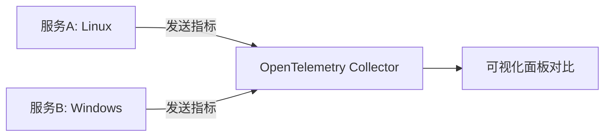

## 介绍

在分布式系统中，监控操作系统级别的指标（如 CPU 使用率、内存占用等）对于诊断性能问题至关重要。OpenTelemetry 通过**操作系统属性**（OS Attributes）标准化了这些信息的收集方式。这些属性是 OpenTelemetry 资源（Resource）的一部分，用于描述运行服务的操作系统环境。

:::note
**资源（Resource）**是 OpenTelemetry 中表示实体（如服务、主机）的不可变元数据，而**操作系统属性**是其中的一个子集。
:::

---

## 常见的操作系统属性

OpenTelemetry 定义了以下标准操作系统属性（见 [Resource Semantic Conventions](https://opentelemetry.io/docs/specs/semconv/resource/os/)）：

| 属性名                  | 描述                          | 示例值             |
|-------------------------|-----------------------------|--------------------|
| `os.type`               | 操作系统类型（如 Linux、Windows） | `linux`            |
| `os.description`        | 操作系统详细描述               | `Ubuntu 22.04 LTS` |
| `os.name`               | 操作系统名称（发行版名称）       | `Ubuntu`           |
| `os.version`            | 操作系统版本号                 | `22.04`            |
| `os.arch`               | 系统架构（如 x86_64）          | `x86_64`           |

---

## 如何设置操作系统属性

### 自动检测
OpenTelemetry SDK 通常会自动检测操作系统属性。例如，在 Node.js 中：

```javascript
const { Resource } = require('@opentelemetry/resources');
const { SemanticResourceAttributes } = require('@opentelemetry/semantic-conventions');

// 自动检测资源（包含操作系统属性）
const resource = Resource.default();
console.log(resource.attributes);
```

输出示例：
```json
{
  "os.type": "linux",
  "os.version": "5.15.0-76-generic",
  "os.arch": "x86_64"
}
```

### 手动覆盖
如果需要手动设置或补充属性：

```python
from opentelemetry.sdk.resources import Resource
from opentelemetry.semconv.resource import ResourceAttributes

resource = Resource.create({
    ResourceAttributes.OS_TYPE: "linux",
    ResourceAttributes.OS_VERSION: "3.10.0-1160.el7.x86_64",
})
```

---

## 实际应用场景

### 场景 1：跨平台性能对比
通过收集不同操作系统（如 Windows 和 Linux）的服务性能数据，可以分析系统级差异对应用的影响。



### 场景 2：故障诊断
当某台服务器出现高 CPU 使用率告警时，操作系统属性可快速定位环境特征：
```json
{
  "os.type": "windows",
  "os.version": "10.0.19045",
  "k8s.node.name": "node-xyz" 
}
```

---

## 总结

1. 操作系统属性是 OpenTelemetry 资源的关键组成部分，用于标准化环境信息。
2. 多数情况下 SDK 会自动检测属性，但支持手动覆盖。
3. 实际应用中可用于跨平台分析、故障排查等场景。

---

## 延伸练习

1. 在你的开发环境中运行自动检测代码，查看输出的操作系统属性。
2. 尝试手动设置 `os.description` 并导出到 Jaeger 或 Prometheus。
3. 思考：如果某服务在 Linux 和 Windows 上表现差异巨大，如何利用这些属性设计监控方案？

如需进一步学习，请参考：
- [OpenTelemetry 资源语义约定](https://opentelemetry.io/docs/specs/semconv/resource/os/)
- [Resource SDK 实现指南](https://github.com/open-telemetry/opentelemetry-specification/blob/main/specification/resource/sdk.md)