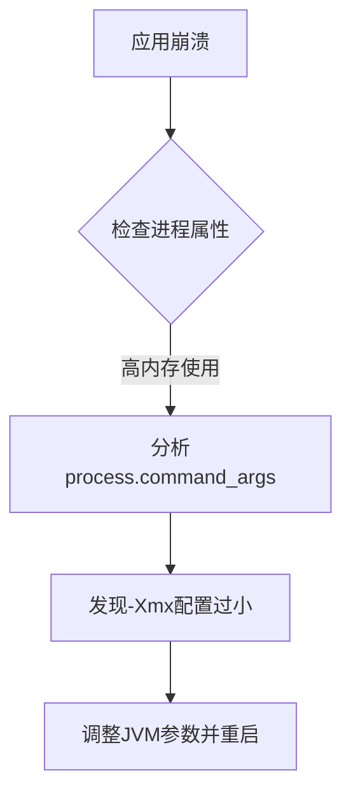

# OpenTelemetry 进程属性

## 介绍

在分布式系统中，监控应用程序的运行状态至关重要。OpenTelemetry（简称OTel）是一个开源的观测性框架，用于生成、收集和导出遥测数据（如指标、日志和跟踪）。**进程属性**是OTel资源模型的一部分，用于描述运行应用程序的进程信息（如进程ID、可执行路径等）。这些属性帮助开发者快速定位问题，尤其是在多进程或容器化环境中。

---

## 进程属性的作用

进程属性提供了以下关键信息：
- **进程标识**：如进程ID（PID）、父进程ID（PPID）。
- **运行时环境**：如可执行文件路径、命令行参数。
- **资源使用**：如进程所有者、启动时间戳。

这些数据通常附加在跟踪（Traces）或指标（Metrics）中，形成上下文信息。

---

## 核心进程属性

OpenTelemetry定义了[标准进程属性](https://github.com/open-telemetry/opentelemetry-specification/blob/main/specification/resource/semantic_conventions/process.md)，包括：

| 属性名                  | 示例值              | 描述                          |
|-------------------------|---------------------|-----------------------------|
| `process.pid`           | `1234`              | 进程ID                      |
| `process.executable.name` | `node`            | 可执行文件名                |
| `process.command_args`  | `["--port=3000"]`   | 启动命令参数                |
| `process.runtime.name`  | `OpenJDK`           | 运行时环境（如JVM、Node.js）|

---

## 代码示例

### 1. 手动设置进程属性（Python）
```python
from opentelemetry.sdk.resources import Resource
from opentelemetry.semconv.resource import ResourceAttributes

resource = Resource.create({
    ResourceAttributes.PROCESS_PID: 1234,
    ResourceAttributes.PROCESS_EXECUTABLE_NAME: "python",
    ResourceAttributes.PROCESS_COMMAND_ARGS: ["app.py", "--debug"],
})

# 输出：{'process.pid': 1234, 'process.executable.name': 'python', ...}
print(resource.attributes)
```

### 2. 自动检测（Node.js）
```javascript
const { NodeSDK } = require('@opentelemetry/sdk-node');
const { Resource } = require('@opentelemetry/resources');
const { SEMRESATTRS_PROCESS_PID } = require('@opentelemetry/semantic-conventions');

const sdk = new NodeSDK({
  resource: new Resource({
    [SEMRESATTRS_PROCESS_PID]: process.pid,
  }),
});

// 启动后会自动附加进程属性到遥测数据
sdk.start();
```

---

## 实际应用场景

### 场景：诊断内存泄漏
假设一个Java应用频繁崩溃，通过OTel收集的进程属性可快速定位：
1. 检查 `process.runtime.name` 确认是JVM进程。
2. 分析 `process.command_args` 发现配置了不合理的堆内存参数（如 `-Xmx512m`）。
3. 结合内存指标，确认泄漏发生在特定PID的进程中。



---

## 总结

进程属性是OpenTelemetry中描述应用程序运行时环境的重要元数据。它们帮助开发者：
- 快速定位问题进程。
- 关联不同信号（跟踪、指标、日志）。
- 在复杂环境中区分多个实例。

:::tip 练习
尝试在你的项目中集成OTel SDK，并导出包含进程属性的资源信息。观察这些属性如何出现在Jaeger或Prometheus中。
:::

**进一步阅读**：
- [OpenTelemetry资源规范](https://opentelemetry.io/docs/reference/specification/resource/semantic_conventions/process/)
- [进程监控最佳实践](https://opentelemetry.io/docs/concepts/observability-primer/)