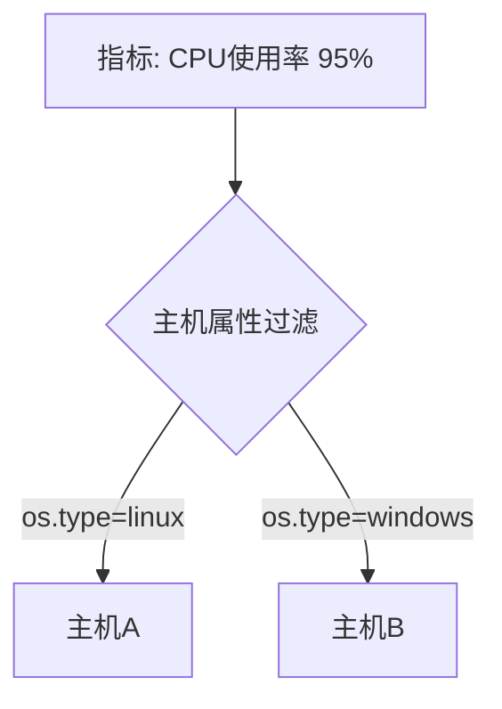

# OpenTelemetry 主机属性

## 介绍

在分布式系统中，**主机属性（Host Attributes）**是描述运行服务的基础设施（如虚拟机、容器或物理服务器）的关键元数据。OpenTelemetry通过标准化方式自动采集这些属性（例如主机名、操作系统类型、IP地址等），帮助开发者快速定位性能问题或故障根源。本文将介绍主机属性的核心概念、采集方法及实际应用。

---

## 什么是主机属性？

主机属性是描述服务运行环境的静态或半静态数据，通常包括：
- **主机标识**：主机名、唯一ID
- **资源信息**：CPU核数、内存大小
- **环境信息**：云提供商、区域、可用区
- **网络配置**：IP地址、域名

:::tip 为什么需要主机属性？
当你的服务部署在多个节点上时，主机属性可帮助你：
- 区分不同节点上的日志/指标/追踪数据
- 关联系统资源使用情况（如CPU飙升）与具体主机
- 在云环境中识别故障区域
:::

---

## 自动采集主机属性

OpenTelemetry的**Resource SDK**会自动检测并添加主机属性。以下是一个Node.js示例：

```javascript
const { Resource } = require('@opentelemetry/resources');
const { SemanticResourceAttributes } = require('@opentelemetry/semantic-conventions');

// 自动检测主机属性
const resource = new Resource({
  [SemanticResourceAttributes.HOST_NAME]: 'api-server-1',
  [SemanticResourceAttributes.HOST_TYPE]: 'AWS EC2',
  [SemanticResourceAttributes.OS_TYPE]: 'linux',
});

console.log(resource.attributes);
```

**输出示例**：
```json
{
  "host.name": "api-server-1",
  "host.type": "AWS EC2",
  "os.type": "linux"
}
```

:::note
常用属性键名定义在`@opentelemetry/semantic-conventions`包中，推荐使用这些标准化名称而非自定义键。
:::

---

## 核心主机属性列表

OpenTelemetry定义的标准主机属性包括：

| 属性键                          | 示例值          | 描述                     |
|---------------------------------|-----------------|--------------------------|
| `host.name`                     | `web-server-01` | 主机名                   |
| `host.id`                       | `i-0a1b2c3d4e5` | 云提供商实例ID           |
| `host.type`                     | `AWS EC2`       | 主机类型                 |
| `host.arch`                     | `x86_64`        | CPU架构                  |
| `os.type`                       | `linux`         | 操作系统类型             |
| `os.version`                    | `5.4.0-1045`    | 内核版本                 |
| `os.description`                | `Ubuntu 20.04`  | 操作系统描述             |

---

## 实际应用场景

### 场景1：定位高负载主机
通过将主机属性附加到指标数据，可以在Grafana中快速筛选出特定区域的异常主机：



### 场景2：错误追踪
当某个容器频繁崩溃时，通过关联追踪数据和主机属性发现所有问题实例都运行在特定内核版本上：
```python
# Python示例：添加主机属性到追踪
from opentelemetry import trace
from opentelemetry.sdk.resources import Resource

tracer_provider = TracerProvider(
    resource=Resource.create({
        "host.name": "payment-service",
        "os.version": "5.4.0-1045"
    })
)
```

---

## 手动补充主机属性

如果自动检测不满足需求，可以手动添加属性：

```go
// Go示例
import (
	"go.opentelemetry.io/otel/sdk/resource"
	semconv "go.opentelemetry.io/otel/semconv/v1.17.0"
)

res := resource.NewWithAttributes(
	semconv.SchemaURL,
	semconv.HostName("db-primary"),
	semconv.HostArch("arm64"),
	semconv.K8SPodName("mysql-0"),
)
```

:::caution 注意事项
- 避免添加敏感信息（如密码、密钥）
- 高频变化的属性（如CPU温度）更适合作为指标而非资源属性
:::

---

## 总结

主机属性是OpenTelemetry可观测性数据的重要上下文，它们帮助你：
1. **快速定位问题**：通过主机维度过滤数据
2. **资源分析**：关联系统指标与硬件配置
3. **环境管理**：识别特定环境中的异常模式

---

## 扩展练习
1. 在你的OpenTelemetry项目中打印当前检测到的主机属性
2. 尝试在Grafana/Loki中按主机名过滤日志
3. 添加自定义属性（如`department=finance`）

## 进一步学习
- [OpenTelemetry资源规范](https://opentelemetry.io/docs/reference/specification/resource/semantic_conventions/host/)
- [使用OpenTelemetry Collector处理主机属性](https://opentelemetry.io/docs/collector/configuration/#processors)