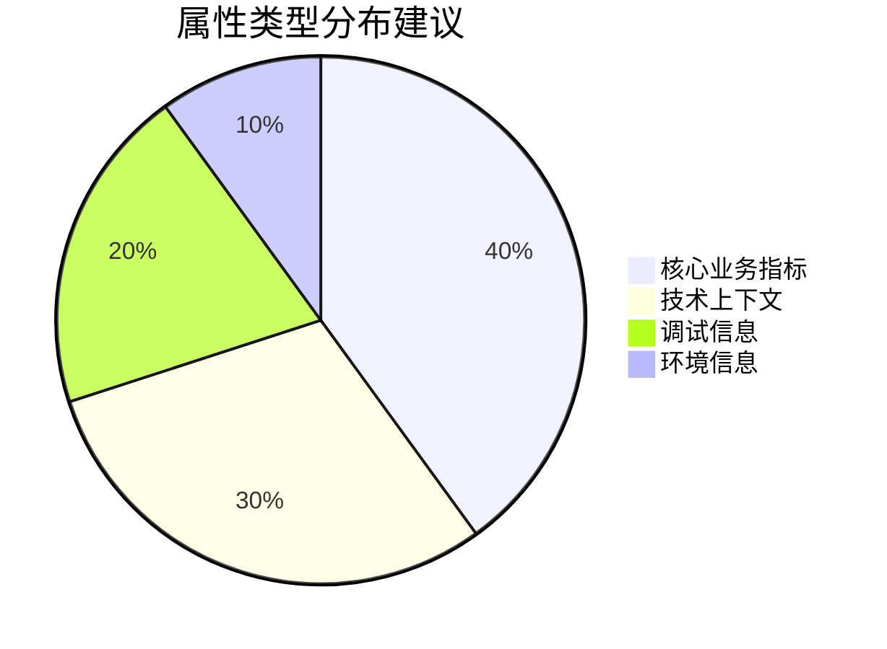

# OpenTelemetry 属性最佳实践

## 介绍

OpenTelemetry属性（Attributes）是为遥测数据（如追踪、指标和日志）添加上下文的关键元数据。它们帮助回答"为什么这个错误会发生？"或"哪个用户遇到了延迟？"等问题。本文将指导您如何通过最佳实践最大化属性的价值。

:::note 什么是属性？
属性是键值对（例如 `http.method="GET"`），用于描述遥测数据的特征。它们不同于资源（Resource），后者描述的是数据来源（如主机名、服务名）。
:::

## 核心原则

### 1. 命名规范
- **使用小写蛇形命名法**：`user.id` 优于 `userId`
- **避免冗余前缀**：用 `status.code` 而非 `http.status.code`（如果上下文明确）
- **保持一致性**：在整个代码库中使用相同的键名表示相同含义

```python
# 反例 - 不一致命名
span.set_attribute("HTTPMethod", "GET")
span.set_attribute("user_id", 123)

# 正例
span.set_attribute("http.method", "GET")
span.set_attribute("user.id", 123)
```

### 2. 值类型选择
OpenTelemetry支持以下值类型：
- 字符串（`"completed"`）
- 布尔值（`true`）
- 数值（`42` 或 `3.14`）
- 字符串数组（`["US", "EU"]`）

:::caution 避免
- 复杂嵌套对象（将其展平为多个属性）
- 敏感信息（如密码、API密钥）
:::

## 结构化实践

### 分层命名法
使用点号表示层级关系，但不超过3级：

```
user.account.id ✅
user.account.contact.details.phone ❌（过于复杂）
```

### 实际案例：电商应用
```javascript
// 记录订单处理span
const span = tracer.startSpan('process_order');
span.setAttributes({
  'order.id': 'ORD-789',
  'payment.method': 'credit_card',
  'user.tier': 'premium',
  'cart.items.count': 5,
  'shipping.region': 'EU'
});
```

## 性能优化

### 1. 属性数量控制
每个span建议不超过20个属性。关键策略：



### 2. 采样敏感属性
对高频数据使用采样：

```go
if rand.Intn(100) < 10 { // 10%采样率
    span.SetAttributes(attribute.String("debug.full_request", payload))
}
```

## 安全实践

### 数据脱敏
在SDK层自动过滤敏感信息：

```java
// 使用SpanProcessor过滤
public class SensitiveDataFilter implements SpanProcessor {
    @Override
    public void onStart(Context context, ReadWriteSpan span) {
        String email = span.getAttribute("user.email");
        if (email != null) {
            span.setAttribute("user.email", maskEmail(email));
        }
    }
}
```

## 调试与生产

### 环境差异化
```python
# 开发环境添加详细调试属性
if env == "development":
    span.set_attribute("sql.query", query)
    span.set_attribute("request.headers", headers)
```

:::warning 生产环境
避免记录完整请求体等可能包含PII（个人身份信息）或高基数字段
:::

## 总结

关键要点：
- 命名遵循`lower_snake_case`并保持一致性
- 限制属性数量和复杂度
- 始终考虑安全性和性能影响
- 根据环境调整详细程度

## 扩展练习

1. 审查现有项目，找出不符合命名规范的属性
2. 为登录流程设计一组关键属性
3. 实现一个简单的属性采样策略

## 附加资源

- [OpenTelemetry语义约定](https://opentelemetry.io/docs/reference/specification/resource/semantic_conventions/)
- [属性与资源区别](https://opentelemetry.io/docs/concepts/glossary/#attributes)