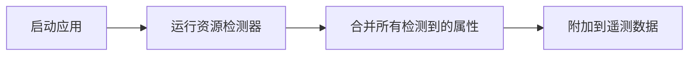

# OpenTelemetry 资源检测

## 介绍

OpenTelemetry资源（Resource）是描述生成遥测数据的实体（如服务、主机或容器）的元信息集合。资源检测（Resource Detection）是自动识别这些元信息（如主机名、云提供商标签、Kubernetes属性等）并附加到遥测数据的过程。通过资源检测，您可以轻松关联不同系统的监控数据，无需手动配置。

:::note 为什么需要资源检测？
- **自动化**：避免手动为每个服务/实例硬编码环境信息。
- **一致性**：确保所有遥测数据使用统一的资源标识。
- **可观测性**：在分布式系统中快速定位问题来源。
:::

## 资源检测的工作原理

资源检测通过**检测器（Detectors）**实现。每个检测器负责从特定环境（如主机、云平台、容器）收集信息。常见的检测器包括：

1. **系统检测器**：收集主机名、操作系统、进程ID等。
2. **环境变量检测器**：从`OTEL_RESOURCE_ATTRIBUTES`等变量中读取信息。
3. **云提供商检测器**：自动识别AWS、GCP、Azure等云环境属性。
4. **容器检测器**：获取Docker或Kubernetes的容器/集群信息。

### 示例：资源检测流程


## 代码示例

以下是一个使用Node.js SDK的示例，展示如何手动和自动检测资源：

### 1. 手动定义资源
```javascript
const { Resource } = require('@opentelemetry/resources');
const { SemanticResourceAttributes } = require('@opentelemetry/semantic-conventions');

const resource = new Resource({
  [SemanticResourceAttributes.SERVICE_NAME]: 'my-service',
  [SemanticResourceAttributes.HOST_NAME]: 'example.com',
});

console.log(resource.attributes);
```
**输出**：
```json
{
  "service.name": "my-service",
  "host.name": "example.com"
}
```

### 2. 自动检测资源（使用环境变量）
```bash
# 设置环境变量
export OTEL_RESOURCE_ATTRIBUTES="service.name=my-service,deployment.environment=prod"
```
```javascript
const { detectResources } = require('@opentelemetry/resources');
const { envDetector } = require('@opentelemetry/resources');

async function setupResource() {
  const resource = await detectResources({
    detectors: [envDetector],
  });
  console.log(resource.attributes);
}

setupResource();
```
**输出**：
```json
{
  "service.name": "my-service",
  "deployment.environment": "prod"
}
```

## 实际应用场景

### 场景：Kubernetes中的服务监控
在K8s集群中，资源检测可以自动附加以下信息到所有Span和Metrics：
- 容器ID (`container.id`)
- 命名空间 (`k8s.namespace.name`)
- Pod名称 (`k8s.pod.name`)

**优势**：
- 当某个Pod的CPU使用率异常时，可直接关联到具体的服务版本和部署环境。
- 无需为每个服务手动添加K8s标签。

## 总结

资源检测是OpenTelemetry中实现自动化元数据管理的核心功能。通过组合多种检测器，您可以轻松为分布式系统中的每个组件添加上下文信息，大幅提升可观测性数据的价值。

:::tip 最佳实践
- **优先使用自动检测**：如云平台或K8s检测器。
- **谨慎处理敏感信息**：避免将密钥或IP地址暴露为资源属性。
- **覆盖默认属性**：通过`OTEL_RESOURCE_ATTRIBUTES`添加业务相关标签（如`team=backend`）。
:::

## 扩展练习
1. 在本地运行一个服务，尝试通过环境变量添加自定义资源属性。
2. 部署一个K8s应用，观察自动附加的资源属性。
3. 比较手动定义资源和自动检测资源的优缺点。

## 附加资源
- [OpenTelemetry资源规范](https://opentelemetry.io/docs/reference/specification/resource/)
- [语义约定（Semantic Conventions）](https://opentelemetry.io/docs/reference/specification/resource/semantic_conventions/)