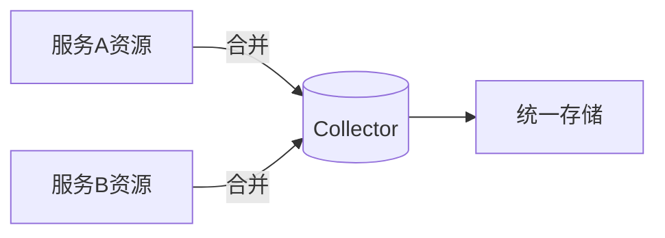

# OpenTelemetry 资源合并

## 介绍
在分布式系统中，多个组件可能各自生成带有资源属性的OpenTelemetry数据。**资源合并（Resource Merging）**是将这些分散的资源信息整合为统一视图的过程。合并后的资源能够更全面地描述观测对象的上下文（如服务名称、版本、主机信息等），是链路追踪和指标收集的关键基础。

## 资源合并基础
OpenTelemetry资源由键值对（Attributes）组成，例如：
```go
Resource1: {"service.name": "auth", "host.name": "server-1"}
Resource2: {"service.version": "v1.2", "host.name": "server-1"}
```

合并时需处理以下情况：
1. **唯一键**：直接合并（如 `service.name` + `service.version`）
2. **重复键**：根据策略解决冲突（如 `host.name` 重复）

## 合并策略
OpenTelemetry SDK默认采用 **"最后一次写入优先"** 策略。可通过 `resource.Merge()` 实现（以Go为例）：

```go
import "go.opentelemetry.io/otel/sdk/resource"

func mergeResources() {
    res1 := resource.NewWithAttributes(
        semconv.SchemaURL,
        attribute.String("service.name", "auth"),
        attribute.String("host.name", "server-1"),
    )
    res2 := resource.NewWithAttributes(
        semconv.SchemaURL,
        attribute.String("service.version", "v1.2"),
        attribute.String("host.name", "server-1-backup"),
    )

    mergedRes := resource.Merge(res1, res2)
    // 输出：service.name=auth, service.version=v1.2, host.name=server-1-backup
}
```

:::note 冲突解决
当键冲突时，`resource.Merge()` 会保留第二个资源的属性值。可通过自定义合并逻辑覆盖此行为。
:::

## 实际案例
### 场景：微服务链路追踪
1. **服务A**（资源）：`service.name=frontend, k8s.pod.id=pod-123`
2. **服务B**（资源）：`service.name=backend, cloud.region=us-east`
3. **合并结果**：`service.name=backend, k8s.pod.id=pod-123, cloud.region=us-east`



:::tip 最佳实践
- 明确资源属性的所有权（如基础设施 vs 应用层）
- 使用 `schemaURL` 确保语义一致性
- 在Collector层统一处理合并逻辑
:::

## 总结
资源合并能消除观测数据的碎片化，但需注意：
- 冲突处理策略需与团队达成一致
- 避免合并敏感信息（如不同环境的资源）
- 测试合并后的属性是否符合预期

## 扩展练习
1. 尝试用OpenTelemetry Collector的 `resourceprocessor` 实现合并
2. 编写测试用例验证自定义合并逻辑
3. 对比不同语言SDK的合并行为差异

## 附加资源
- [OpenTelemetry资源规范](https://opentelemetry.io/docs/reference/specification/resource/)
- [资源SDK文档](https://pkg.go.dev/go.opentelemetry.io/otel/sdk/resource)