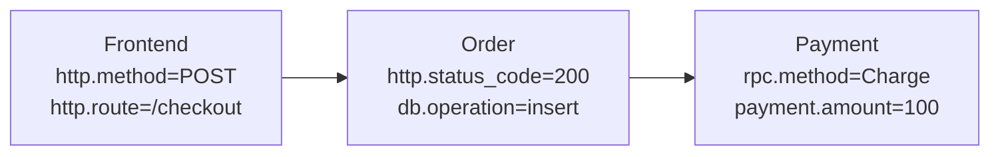

# OpenTelemetry 标准属性

## 介绍

OpenTelemetry标准属性（Semantic Conventions）是一组预定义的键值对，用于统一描述分布式系统中的资源（Resources）、跨度（Spans）、指标（Metrics）和日志（Logs）。这些属性遵循语义化约定，确保不同团队和工具生成的数据具有一致的格式和含义，从而简化数据的聚合与分析。

:::tip 为什么需要标准属性？
- **跨工具兼容性**：不同监控工具可以理解相同的数据字段。<br />
- **减少重复工作**：避免开发者重复定义相似的属性名称（如 `http.status_code` vs `status`）。<br />
- **更好的可观测性**：标准化数据便于生成统一的仪表盘和告警规则。
:::

## 核心标准属性分类

OpenTelemetry标准属性分为以下几类：

1. **通用属性**：适用于所有信号类型（如 `service.name`）。<br />
2. **资源属性**：描述生成数据的实体（如主机、容器）。<br />
3. **Span属性**：描述请求链路中的操作（如HTTP、数据库调用）。<br />
4. **指标属性**：定义指标维度（如 `http.method`）。<br />

### 1. 通用属性示例
```python
from opentelemetry import trace

tracer = trace.get_tracer(__name__)
with tracer.start_as_current_span("example") as span:
    span.set_attribute("service.name", "payment-service")  # 标准资源属性
    span.set_attribute("custom.tag", "debug")              # 自定义属性
```

### 2. 资源属性
定义生成数据的服务或基础设施：
```yaml
# 资源定义示例
attributes:
  - key: "service.name"
    value: "user-service"
  - key: "service.version"
    value: "1.0.0"
  - key: "host.type"
    value: "AWS EC2"
```

### 3. Span属性（HTTP请求示例）
```python
from opentelemetry.semconv.trace import SpanAttributes

span.set_attributes({
    SpanAttributes.HTTP_METHOD: "GET",
    SpanAttributes.HTTP_URL: "https://api.example.com/users",
    SpanAttributes.HTTP_STATUS_CODE: 200
})
```

## 实际应用场景

### 案例：电商系统订单追踪
假设一个订单请求经过以下服务：
1. **前端服务** → 2. **订单服务** → 3. **支付服务**

通过标准属性，可以在链路中统一标记：


:::note 关键属性
- `http.method`: 标识请求类型（GET/POST）。<br />
- `db.operation`: 区分数据库操作（insert/query）。<br />
- `rpc.method`: 标记远程调用方法名称。
:::

## 总结

OpenTelemetry标准属性通过语义化约定，帮助开发者生成一致的可观测性数据。关键要点：
- 使用预定义属性（如 `http.*`、`db.*`）而非自定义字段。<br />
- 资源属性描述“谁”生成数据，Span属性描述“发生了什么”。<br />
- 标准化数据便于与Prometheus、Jaeger等工具集成。

## 扩展练习
1. 在本地OpenTelemetry项目中，尝试为数据库查询添加 `db.system` 和 `db.statement` 属性。<br />
2. 对比自定义属性 `error.message` 和标准属性 `exception.message` 在Jaeger中的显示差异。

## 附加资源
- [OpenTelemetry官方语义约定文档](https://opentelemetry.io/docs/specs/semconv/)
- GitHub: `opentelemetry-specification/semantic_conventions` 目录