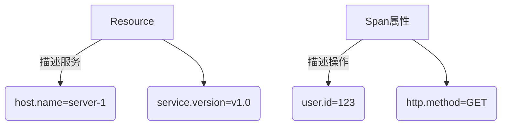

# OpenTelemetry 自定义属性

## 介绍

OpenTelemetry是一个开源的可观测性框架，用于生成、收集和导出遥测数据（如指标、日志和追踪）。**自定义属性**是附加到这些数据上的键值对，它们为数据提供了额外的上下文信息，帮助开发者更好地理解系统的行为。例如，你可以为HTTP请求添加一个 `user_id` 属性，或者在数据库查询中添加 `query_type` 属性。

本指南将介绍如何在OpenTelemetry中定义和使用自定义属性，并通过实际案例展示其应用场景。

---

## 基本概念

### 什么是属性？
属性（Attributes）是键值对形式的元数据，可以附加到OpenTelemetry的**Span**（追踪中的一个操作单元）、**Metric**（指标）或**Log**（日志）上。属性通常用于描述操作的上下文，例如：

- `http.method = "GET"`
- `db.query = "SELECT * FROM users"`

### 自定义属性的作用
自定义属性允许你：
1. **增强上下文**：为操作添加业务相关的信息（如用户ID、交易类型）。
2. **过滤和分析**：在查询或可视化工具中按属性筛选数据。
3. **调试问题**：通过属性快速定位异常请求的上下文。

---

## 如何添加自定义属性

### 在Span中添加属性
以下是一个Python示例，展示如何在Span中添加自定义属性：

```python
from opentelemetry import trace

tracer = trace.get_tracer("my.tracer")

with tracer.start_as_current_span("example-span") as span:
    # 添加自定义属性
    span.set_attribute("user.id", "12345")
    span.set_attribute("transaction.type", "payment")
    span.set_attribute("environment", "production")

    # 模拟一个操作
    print("Processing transaction...")
```

**输出结果**：
在Jaeger或Zipkin等追踪系统中，你会看到这些属性附加到Span上：

```json
{
  "name": "example-span",
  "attributes": {
    "user.id": "12345",
    "transaction.type": "payment",
    "environment": "production"
  }
}
```

:::tip
属性键通常使用**小写字母+点分隔符**的命名约定（如 `user.id`），但也可以根据团队规范调整。
:::

---

### 在日志中添加属性
以下是一个Go示例，展示如何在日志记录中添加自定义属性：

```go
import (
	"go.opentelemetry.io/otel"
	"go.opentelemetry.io/otel/attribute"
)

func main() {
	logger := otel.GetLoggerProvider().Logger("my.logger")

	// 记录日志并添加属性
	logger.Info(
		"User login attempt",
		attribute.String("user.id", "user-123"),
		attribute.String("auth.method", "jwt"),
	)
}
```

---

## 实际案例

### 案例1：电商订单追踪
假设你正在开发一个电商平台，需要追踪订单处理流程。你可以添加以下自定义属性：

```python
with tracer.start_as_current_span("process-order") as span:
    span.set_attribute("order.id", order_id)
    span.set_attribute("order.total", order_total)
    span.set_attribute("payment.method", payment_method)
    span.set_attribute("user.tier", "premium")
```

这些属性可以帮助你：
- 分析高价值订单的处理时间。
- 统计不同支付方式的使用频率。
- 识别VIP用户的请求延迟问题。

---

### 案例2：微服务错误诊断
在微服务架构中，当某个服务失败时，自定义属性可以快速定位问题根源：

```java
import io.opentelemetry.api.trace.Span;

Span.current()
    .setAttribute("service.name", "inventory-service")
    .setAttribute("error.code", "stock_out")
    .setAttribute("retry.attempt", 3);
```

---

## 属性与资源的区别
:::caution
不要混淆**属性**和**资源**（Resource）：
- **属性**：附加到单个Span/Log/Metric的动态上下文。
- **资源**：描述整个服务实例的静态信息（如主机名、服务版本）。
:::



---

## 总结

1. 自定义属性是OpenTelemetry中增强数据上下文的键值对。
2. 可以附加到Span、Metric或Log上。
3. 命名建议使用小写字母和点分隔符（如 `user.id`）。
4. 实际应用包括业务分析、错误诊断和性能优化。

---

## 延伸练习

1. 在你的项目中为一个HTTP请求Span添加 `request.source`（如 `mobile` 或 `web`）属性。
2. 尝试在日志中记录用户的地理位置（如 `user.location=EU`）。
3. 使用属性过滤Jaeger中的特定请求（如 `environment=staging`）。

## 附加资源
- [OpenTelemetry官方文档](https://opentelemetry.io/docs/)
- [语义约定（属性命名规范）](https://github.com/open-telemetry/semantic-conventions)