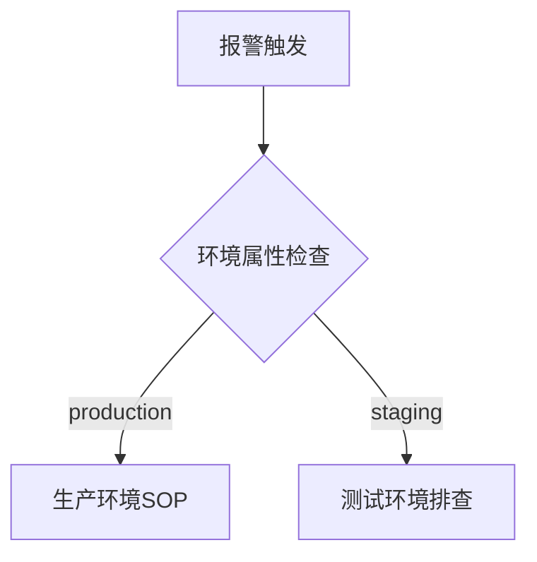

# OpenTelemetry 环境属性

## 介绍

OpenTelemetry环境属性（Environment Attributes）是附加在遥测数据（如追踪、指标、日志）上的键值对，用于描述应用程序运行的环境信息。这些属性帮助开发者快速识别数据的来源环境（如开发、测试、生产），从而更高效地诊断问题。

环境属性的典型用途包括：
- 区分不同部署阶段（如 `environment=production`）
- 标记基础设施信息（如 `region=us-east-1`）
- 标识服务版本（如 `service.version=1.2.0`）

## 核心概念

### 1. 属性与资源的区别
| 特性          | 环境属性                    | 资源(Resource)               |
|---------------|----------------------------|------------------------------|
| 作用范围      | 单个遥测数据点             | 整个服务实例                 |
| 典型用例      | 请求级别的上下文           | 服务级别的静态信息           |
| 修改频率      | 高频（随请求变化）         | 低频（服务启动时设置）       |

### 2. 标准环境属性
OpenTelemetry定义了一些[标准属性](https://opentelemetry.io/docs/specs/semconv/resource/)，例如：

```plaintext
deployment.environment = "production"
service.name = "checkout-service"
service.version = "1.3.4"
```

## 代码实践

### 设置环境属性（Python示例）

```python
from opentelemetry import trace
from opentelemetry.sdk.resources import Resource

# 创建包含环境属性的资源
resource = Resource.create({
    "service.name": "payment-service",
    "deployment.environment": "staging",
    "service.version": "2.1.0"
})

# 初始化TracerProvider时传入资源
tracer_provider = TracerProvider(resource=resource)
trace.set_tracer_provider(tracer_provider)

# 使用时会自动携带环境属性
tracer = trace.get_tracer(__name__)
with tracer.start_as_current_span("process_payment"):
    # 业务逻辑...
```

### 输出结果示例
在Jaeger UI中看到的Span将包含：

```json
{
  "resource": {
    "service.name": "payment-service",
    "deployment.environment": "staging",
    "service.version": "2.1.0"
  },
  "spans": [
    {
      "name": "process_payment",
      "attributes": {
        "http.method": "POST"
      }
    }
  ]
}
```

## 实际应用场景

### 场景1：多环境问题诊断
当生产环境出现异常时，通过 `deployment.environment=production` 属性快速过滤相关日志和指标。



### 场景2：金丝雀发布监控
比较不同版本的服务指标：

```python
Resource.create({
    "service.name": "user-service",
    "service.version": "1.9.0-canary"  # 金丝雀版本标识
})
```

## 最佳实践

:::tip 环境命名规范
- 使用小写字母（`dev`/`staging`/`production`）
- 避免使用特殊字符
- 全公司统一命名方案
:::

:::caution 敏感信息
不要在环境属性中包含：
- 密码/API密钥
- 个人身份信息（PII）
- 内部IP地址
:::

## 总结

OpenTelemetry环境属性通过为遥测数据添加上下文，显著提升了分布式系统的可观测性。关键要点：

1. 使用标准语义化属性（semconv）
2. 在服务初始化时设置资源属性
3. 避免在属性中暴露敏感信息

## 扩展练习

1. 在本地OpenTelemetry Collector配置中添加环境过滤器
2. 创建一个根据 `deployment.environment` 自动路由日志的Pipeline
3. 尝试在Grafana中基于环境属性创建不同的监控面板

## 延伸阅读

- [OpenTelemetry资源模型规范](https://opentelemetry.io/docs/specs/otel/resource/)
- [语义约定文档](https://opentelemetry.io/docs/specs/semconv/)
- [多环境部署策略](https://opentelemetry.io/docs/concepts/deployment/)