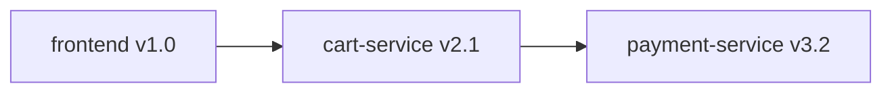

## 介绍

在分布式系统中，**服务属性（Service Attributes）**是OpenTelemetry资源模型的核心组成部分，用于唯一标识和描述服务的元数据。它们帮助监控工具（如Prometheus、Jaeger）区分不同服务的遥测数据（Traces、Metrics、Logs），是实现可观测性的基础。

:::note
服务属性属于OpenTelemetry的**资源（Resource）**概念，资源代表生成遥测数据的实体（如服务、主机、容器）。
:::

---

## 关键服务属性

OpenTelemetry定义了以下标准服务属性（通过[语义约定](https://opentelemetry.io/docs/specs/semconv/resource/)）：

| 属性名                  | 描述                          | 示例值              |
|-------------------------|-----------------------------|--------------------|
| `service.name`          | 服务名称（必填）               | `checkout-service` |
| `service.namespace`     | 服务分组命名空间               | `shop`             |
| `service.instance.id`   | 服务实例的唯一标识符           | `pod-1234`         |
| `service.version`       | 服务版本号                    | `v1.2.0`           |

---

## 代码示例

### 1. 通过代码设置服务属性（Python）

```python
from opentelemetry.sdk.resources import Resource
from opentelemetry.semconv.resource import ResourceAttributes

# 创建资源对象
resource = Resource.create({
    ResourceAttributes.SERVICE_NAME: "payment-service",
    ResourceAttributes.SERVICE_NAMESPACE: "ecommerce",
    ResourceAttributes.SERVICE_VERSION: "2.3.1",
    ResourceAttributes.SERVICE_INSTANCE_ID: "payment-pod-5678"
})

# 初始化TracerProvider时附加资源
from opentelemetry import trace
from opentelemetry.sdk.trace import TracerProvider

provider = TracerProvider(resource=resource)
trace.set_tracer_provider(provider)
```

### 2. 通过环境变量设置

```bash
export OTEL_RESOURCE_ATTRIBUTES="service.name=inventory,service.version=1.0.0"
```

---

## 实际应用场景

### 场景：微服务链路追踪

假设一个电商系统包含以下服务：
1. `frontend` (v1.0)
2. `cart-service` (v2.1)
3. `payment-service` (v3.2)

通过Jaeger UI查看链路追踪时，服务属性会显示为：



:::tip
在Kubernetes中，可以自动注入服务属性：
```yaml
# OpenTelemetry Collector配置
receivers:
  otlp:
    protocols:
      grpc:
exporters:
  logging:
    logLevel: debug
service:
  pipelines:
    traces:
      receivers: [otlp]
      exporters: [logging]
```
:::

---

## 验证服务属性

使用OpenTelemetry Collector的日志导出器检查属性是否正确：

```text
Resource attributes:
    -> service.name: Str(payment-service)
    -> service.namespace: Str(ecommerce)
    -> service.version: Str(2.3.1)
```

---

## 总结

- 服务属性是**资源的子集**，用于标识遥测数据的来源服务
- 至少需要设置`service.name`，其他属性可选但推荐
- 可通过代码或环境变量配置
- 在分布式追踪中至关重要，帮助区分不同服务的跨度（Spans）

---

## 延伸学习

1. [OpenTelemetry资源官方文档](https://opentelemetry.io/docs/concepts/resources/)
2. 练习：尝试在本地启动两个服务，分别设置不同的`service.name`，观察Jaeger中的显示差异
3. 进阶：研究如何通过Kubernetes Downward API自动注入`service.instance.id`