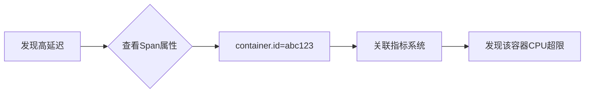

# OpenTelemetry 容器属性

## 介绍
在分布式系统中，容器（如Docker或Kubernetes Pod）是部署应用的基本单元。OpenTelemetry通过**容器属性**（Container Attributes）记录容器的元数据（如容器ID、镜像名称、主机名等），这些属性对于追踪和监控容器化应用至关重要。它们会自动附加到遥测数据（如Span、Metric）中，帮助您快速定位问题来源。

:::tip 为什么需要容器属性？
- 区分同一服务的多个实例
- 关联日志、指标和追踪数据
- 识别异常容器或节点
:::

## 核心容器属性
OpenTelemetry定义了[标准容器属性](https://opentelemetry.io/docs/specs/semconv/resource/container/)，以下是关键字段：

| 属性名                     | 示例值                          | 描述                          |
|---------------------------|---------------------------------|-----------------------------|
| `container.id`            | `a3bf4e5b1c2d`                 | 容器运行时生成的唯一ID         |
| `container.name`          | `my-app-container`             | 用户定义的容器名称             |
| `container.image.name`    | `nginx:latest`                 | 容器镜像名称（含标签）         |
| `container.command`       | `["nginx", "-g", "daemon..."]` | 容器启动命令                   |

## 代码示例
### 1. 手动设置容器属性（Go示例）
```go
import (
	"go.opentelemetry.io/otel/sdk/resource"
	semconv "go.opentelemetry.io/otel/semconv/v1.21.0"
)

func initResource() *resource.Resource {
	return resource.NewWithAttributes(
		semconv.SchemaURL,
		semconv.ContainerID("a3bf4e5b1c2d"),
		semconv.ContainerName("payment-service"),
		semconv.ContainerImageName("myrepo/payment:v1.2"),
	)
}
```

### 2. 自动检测（Python示例）
```python
from opentelemetry.sdk.resources import Resource
from opentelemetry.semconv.resource import ResourceAttributes

# 自动检测容器属性（需安装opentelemetry-resourcedetector-docker）
resource = Resource.create(attributes={
    ResourceAttributes.CONTAINER_NAME: "auto-detected-name",
    ResourceAttributes.CONTAINER_ID: "auto-detected-id"
})
```

## 实际应用场景
### 场景1：Kubernetes故障排查
当某个Pod出现高延迟时，通过容器属性可以：
1. 在Jaeger中过滤 `container.name=frontend-pod-123`
2. 关联该容器的指标（CPU/内存）
3. 快速定位到是镜像版本 `container.image.name=frontend:v2.1` 的问题



### 场景2：多租户隔离
在共享集群中，通过 `container.image.name` 区分不同团队的容器，实现资源计费。

## 总结
容器属性是OpenTelemetry资源模型的重要组成部分，它们：
- 提供容器环境的上下文信息
- 支持自动或手动配置
- 增强跨信号（日志/指标/追踪）的关联性

## 延伸学习
1. 实践：尝试在Docker环境中运行自动检测示例
2. 扩展阅读：[OpenTelemetry资源语义约定](https://opentelemetry.io/docs/specs/semconv/)
3. 挑战：编写一个脚本，收集本机所有Docker容器的属性并导出为Resource

:::caution 注意事项
- 部分属性（如`container.id`）可能因运行时不同而变化
- 在Kubernetes中，建议同时添加`k8s.pod`相关属性
:::