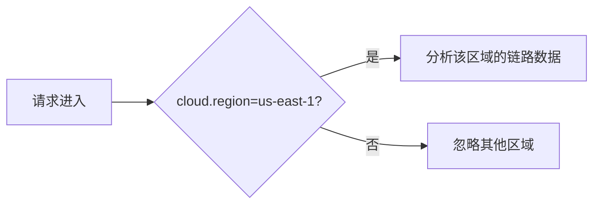

## 介绍

OpenTelemetry 是一个开源的观测性框架，用于生成、收集和导出遥测数据（如指标、日志和追踪）。在云原生环境中，**云属性（Cloud Attributes）** 是 OpenTelemetry 资源模型的一部分，用于描述运行服务的云环境信息。这些属性帮助开发者快速定位问题来源，例如区分不同云提供商（AWS、Azure、GCP）的资源，或识别特定的云区域/实例。

云属性通常包括：
- 云提供商名称（如 `aws`、`gcp`）
- 云账户ID
- 云区域（如 `us-west-1`）
- 虚拟机实例ID等

---

## 核心云属性

OpenTelemetry 定义了标准的云属性键名，以下是最常见的字段：

| 属性键名                  | 描述                          | 示例值              |
|---------------------------|-------------------------------|---------------------|
| `cloud.provider`          | 云提供商名称                  | `aws`               |
| `cloud.account.id`        | 云账户的唯一标识符            | `123456789012`      |
| `cloud.region`            | 资源所在的云区域              | `us-east-1`         |
| `cloud.availability_zone` | 资源所在的可用区              | `us-east-1a`        |
| `cloud.platform`          | 云平台服务类型（如EC2、Lambda）| `aws_ec2`           |

---

## 代码示例

### 1. 在资源中设置云属性（Python）
以下示例展示如何在OpenTelemetry Python SDK中配置云属性：

```python
from opentelemetry.sdk.resources import Resource
from opentelemetry.semconv.resource import ResourceAttributes

# 定义云属性
resource = Resource.create({
    ResourceAttributes.CLOUD_PROVIDER: "aws",
    ResourceAttributes.CLOUD_ACCOUNT_ID: "123456789012",
    ResourceAttributes.CLOUD_REGION: "us-west-2",
    ResourceAttributes.CLOUD_PLATFORM: "aws_ec2",
})

# 初始化TracerProvider时附加资源
from opentelemetry import trace
from opentelemetry.sdk.trace import TracerProvider

trace.set_tracer_provider(TracerProvider(resource=resource))
```

### 2. 输出结果
导出的追踪数据中会包含如下资源信息：
```json
{
  "resource": {
    "cloud.provider": "aws",
    "cloud.account.id": "123456789012",
    "cloud.region": "us-west-2",
    "cloud.platform": "aws_ec2"
  }
}
```

---

## 实际应用场景

### 场景：跨云故障诊断
假设你的服务部署在AWS的多个区域（如 `us-east-1` 和 `eu-west-1`），当出现延迟问题时，通过云属性可以快速过滤出特定区域的追踪数据：



:::tip 实际工具中的应用
在Jaeger或Grafana Tempo中，你可以直接通过 `cloud.region` 字段筛选追踪数据：
```sql
-- 在Grafana Explore中查询us-east-1的延迟
{cloud_region="us-east-1"} | latency > 500ms
```
:::

---

## 总结

1. **云属性**是OpenTelemetry资源模型的关键部分，用于标识云环境信息。
2. 标准化字段（如 `cloud.provider`）确保跨工具的一致性。
3. 实际场景中，云属性可帮助快速定位跨云或跨区域的性能问题。

---

## 扩展练习

1. **动手实验**：尝试在本地OpenTelemetry Collector配置中添加云属性，并导出到Jaeger查看效果。
2. **思考题**：如果你的服务同时运行在AWS和Azure上，如何通过云属性区分它们的追踪数据？

## 附加资源

- [OpenTelemetry云属性官方文档](https://opentelemetry.io/docs/reference/specification/resource/semantic_conventions/cloud/)
- [Semantic Conventions for Cloud Providers](https://github.com/open-telemetry/semantic-conventions/blob/main/docs/cloud/cloud.md)