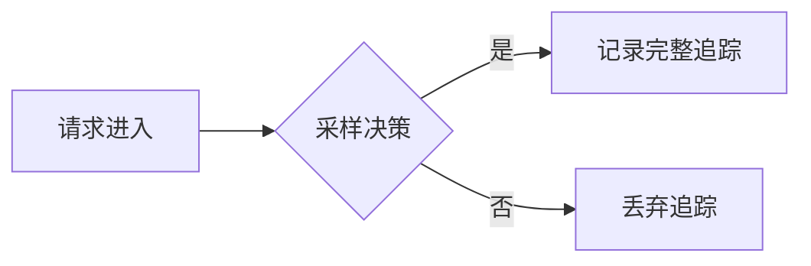

# OpenTelemetry 采样概述

## 介绍

OpenTelemetry采样（Sampling）是控制分布式追踪数据量的关键技术。在微服务架构中，每个请求可能生成大量追踪数据，全量收集会导致存储和分析成本激增。采样通过智能筛选部分请求的追踪数据，平衡了观测需求与系统开销。

## 为什么需要采样？

- **成本控制**：减少存储和传输开销<br />
- **性能优化**：降低对应用的影响<br />
- **聚焦重点**：优先保留有诊断价值的数据

## 采样类型

### 1. 头部采样（Head-based Sampling）
在请求开始时决定是否采样，所有相关Span共享同一决策。



### 2. 尾部采样（Tail-based Sampling）
收集所有Span后基于整体特征（如延迟、错误）决定保留哪些追踪。

```go
// 示例：基于错误率的尾部采样配置
sampler := tailsampling.NewComposite(
    tailsampling.NewErrorRate(0.5),  // 错误率>50%时保留
    tailsampling.NewAlwaysSample(), // 默认采样
)
```

## 常见采样策略

| 策略 | 描述 | 适用场景 |
|------|------|----------|
| 固定比率 | 按固定比例采样（如10%） | 常规监控 |
| 速率限制 | 每秒最多采样N个请求 | 高流量系统 |
| 动态采样 | 根据系统负载调整比率 | 弹性云环境 |

## 实际案例

**电商网站采样方案**：
```yaml
# OpenTelemetry Collector配置示例
processors:
  probabilistic_sampler:
    sampling_percentage: 20  # 20%基础采样率
  tail_sampling:
    policies:
      - name: high-value-orders
        type: numeric_attribute
        numeric_attribute:
          key: "order.total"
          min_value: 1000  # 订单金额>$1000全采样
      - name: error-traces
        type: status_code
        status_code:
          status_codes: ["ERROR"]
```

## 配置建议

:::tip 初学者建议
1. 开发环境使用 `AlwaysOn` 采样器
2. 生产环境从 `Probabilistic` 开始（如5%）
3. 逐步添加业务规则（如错误全采样）
:::

## 总结

采样是OpenTelemetry实现高效可观测性的关键。通过合理配置：
- 保留有价值的诊断数据
- 控制运维成本
- 适应不同业务场景

## 扩展学习

1. 官方文档：[OpenTelemetry Sampling Specification](https://opentelemetry.io/docs/concepts/sampling/)
2. 实践练习：在本地环境比较不同采样率对追踪数据的影响
3. 进阶话题：尝试组合头部采样和尾部采样策略