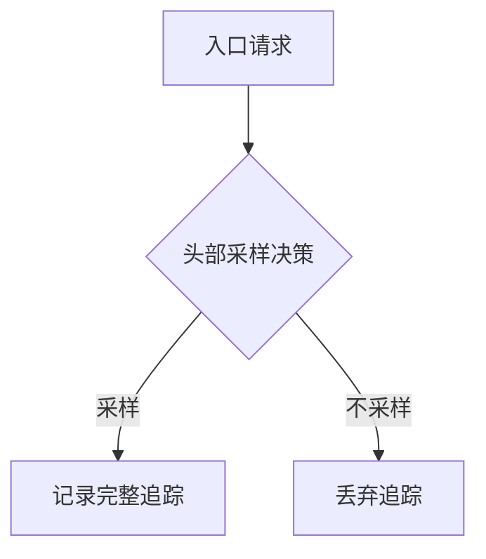

# OpenTelemetry 头部采样

## 介绍

头部采样（Head Sampling）是OpenTelemetry中一种**在追踪开始时决定是否采样的策略**。与尾部采样（Tail Sampling）不同，头部采样会在请求链路的第一个节点（通常是入口服务）做出采样决策，后续所有相关span都会继承这个决策结果。

这种方法的优势在于：
- 减少整个分布式系统中的计算开销
- 保持完整事务链路的上下文一致性
- 简化采样决策逻辑

## 基础原理

头部采样通过检查请求的特定属性（如HTTP头）在追踪开始时立即做出决策。常见的决策依据包括：

- 固定采样率（如10%的请求）
- 特定请求头（如`X-Sample: true`）
- 请求属性（如只采样`/api`路径）



## 代码示例

以下是在Node.js中实现头部采样的示例：

```javascript
const { NodeTracerProvider } = require('@opentelemetry/sdk-trace-node');
const { SimpleSpanProcessor } = require('@opentelemetry/sdk-trace-base');
const { ParentBasedSampler, TraceIdRatioBasedSampler } = require('@opentelemetry/core');

// 创建采样率为30%的头部采样器
const sampler = new ParentBasedSampler({
  root: new TraceIdRatioBasedSampler(0.3), // 30%采样率
});

const provider = new NodeTracerProvider({
  sampler: sampler
});

provider.addSpanProcessor(new SimpleSpanProcessor(new ConsoleSpanExporter()));
provider.register();
```

当运行上述代码时，你会看到约30%的请求会在控制台输出追踪信息。

## 采样策略类型

OpenTelemetry提供多种内置头部采样器：

1. **AlwaysOnSampler** - 采样所有请求
   ```javascript
   const { AlwaysOnSampler } = require('@opentelemetry/core');
   new AlwaysOnSampler();
   ```

2. **AlwaysOffSampler** - 不采样任何请求
   ```javascript
   const { AlwaysOffSampler } = require('@opentelemetry/core');
   new AlwaysOffSampler();
   ```

3. **TraceIdRatioBasedSampler** - 按比例采样
   ```javascript
   // 采样20%的请求
   new TraceIdRatioBasedSampler(0.2);
   ```

4. **ParentBasedSampler** - 根据父span的采样决策
   ```javascript
   new ParentBasedSampler({
     root: new AlwaysOnSampler(), // 无父span时的策略
     remoteParentSampled: new AlwaysOnSampler(), // 远程父span已采样
     remoteParentNotSampled: new AlwaysOffSampler(), // 远程父span未采样
     localParentSampled: new AlwaysOnSampler(), // 本地父span已采样
     localParentNotSampled: new AlwaysOffSampler(), // 本地父span未采样
   });
   ```

## 实际应用场景

### 场景1：生产环境监控

:::note 典型配置
生产环境通常使用低采样率（如1-10%）结合重要路径的强制采样：
```javascript
const { Sampler } = require('@opentelemetry/api');

class ProductionSampler extends Sampler {
  shouldSample(context, traceId, spanName) {
    // 重要API强制采样
    if (spanName.startsWith('/payment')) return { decision: SamplingDecision.RECORD_AND_SAMPLED };
    
    // 其他请求按5%采样
    return traceId % 100 < 5 ? 
      { decision: SamplingDecision.RECORD_AND_SAMPLED } :
      { decision: SamplingDecision.NOT_RECORD };
  }
}
```
:::

### 场景2：调试模式

开发环境可以配置为采样所有请求，同时标记测试流量：

```javascript
const debugSampler = new ParentBasedSampler({
  root: new AlwaysOnSampler(),
  // 添加测试标记
  attributes: { 'env': 'dev' }
});
```

## 性能考量

:::caution 注意采样开销
虽然头部采样能减少后端处理负担，但采样决策本身也有成本：
- TraceIdRatioBasedSampler需要生成随机数
- 复杂业务逻辑采样器会增加延迟
:::

推荐做法：
- 在负载均衡器或API网关层做初步采样
- 对高流量服务使用简单采样策略
- 将采样决策结果缓存在请求上下文中

## 总结

头部采样是OpenTelemetry中优化追踪数据收集的重要机制，通过早期决策可以有效控制数据量，同时保持分布式事务的完整性。关键要点：

- 适合大多数常规监控场景
- 决策应尽可能简单高效
- 可组合不同采样策略满足业务需求

## 延伸学习

1. 尝试实现一个基于用户ID的采样器（如只采样VIP用户）
2. 比较头部采样与尾部采样的性能差异
3. 研究如何将采样决策传递给下游服务

:::tip 练习建议
创建一个Express中间件，实现：
- 对`/admin`路径100%采样
- 对其他路径按5%采样
- 在响应头中添加`X-Trace-Sampled`标记
:::