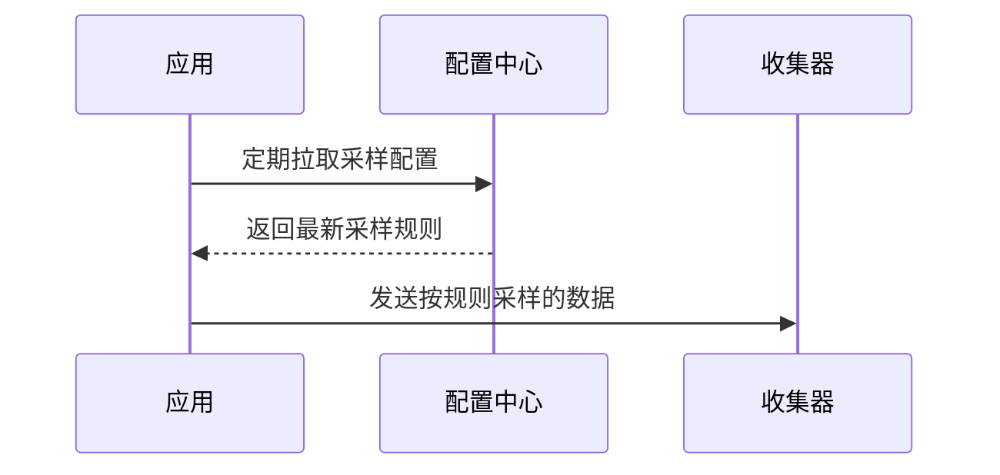

# OpenTelemetry 远程控制采样

## 介绍

OpenTelemetry的**远程控制采样**允许运维团队在不重启应用的情况下，动态调整采样策略（如采样率或采样规则）。这对于平衡观测数据量和系统开销至关重要，尤其在流量突增或故障排查场景中。

## 核心概念

### 1. 采样器类型
OpenTelemetry支持以下采样器：
- `AlwaysOnSampler`：记录所有Span
- `AlwaysOffSampler`：不记录任何Span
- `TraceIdRatioBasedSampler`：按比例采样（如10%的请求）

### 2. 远程配置流程


## 实现步骤

### 1. 配置远程采样器
通过环境变量或代码初始化远程采样器：

```go
// Go示例
import (
    "go.opentelemetry.io/otel/sdk/trace"
    "go.opentelemetry.io/otel/sdk/trace/tracetest"
)

func initTracer() *trace.TracerProvider {
    // 创建远程采样器客户端（伪代码）
    remoteSampler := trace.NewRemoteSampler(
        trace.WithSamplingServerURL("http://config-server:8080"),
        trace.WithUpdateInterval(5*time.Minute),
    )
    return trace.NewTracerProvider(trace.WithSampler(remoteSampler))
}
```

### 2. 配置中心示例
配置服务器返回的JSON格式规则：
```json
{
  "sampling_rules": [
    {
      "service": "payment-service",
      "sample_rate": 0.5,
      "attributes": {"env": "prod"}
    }
  ]
}
```

## 实际案例

### 电商平台场景
**需求**：黑色星期五期间，需要：
- 对`checkout-service`保持100%采样（关键路径）
- 其他服务降至5%采样（节省成本）

**实现**：
1. 配置中心推送新规则
2. 所有应用在5分钟内自动更新采样策略
3. 监控系统确认数据量变化

:::tip 最佳实践
- 生产环境建议使用`TraceIdRatioBasedSampler`而非固定采样
- 为不同环境（dev/staging/prod）设置差异化采样率
:::

## 总结

远程控制采样解决了传统静态采样的痛点：
- **动态调整**：响应系统状态变化
- **精细控制**：按服务/环境差异化采样
- **零停机**：无需重新部署应用

## 扩展练习

1. 使用[OpenTelemetry Collector](https://opentelemetry.io/docs/collector/)配置远程采样
2. 尝试在Kubernetes中通过ConfigMap更新采样规则
3. 模拟流量激增场景，观察采样策略对存储成本的影响

## 附加资源

- [官方采样文档](https://opentelemetry.io/docs/concepts/sampling/)
- [Jaeger远程采样配置示例](https://www.jaegertracing.io/docs/sampling/)