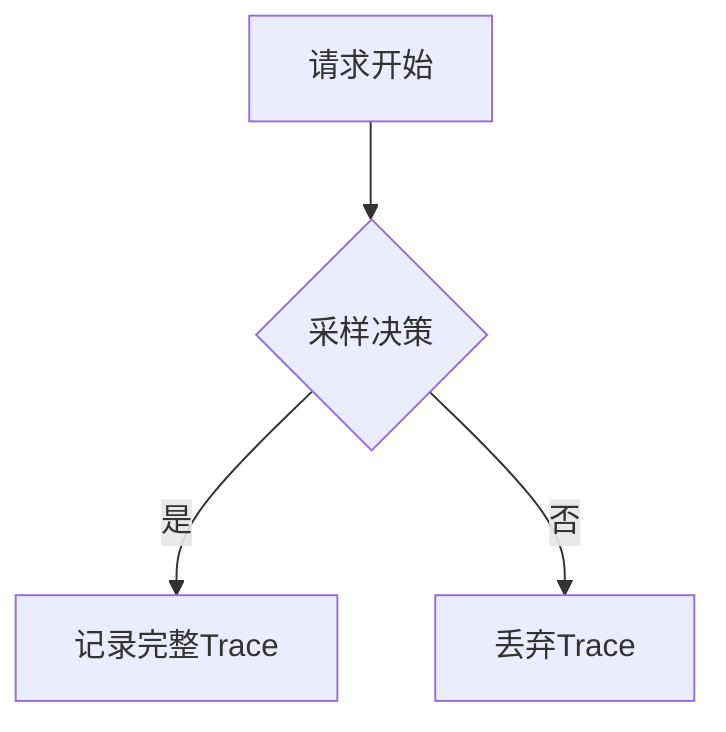
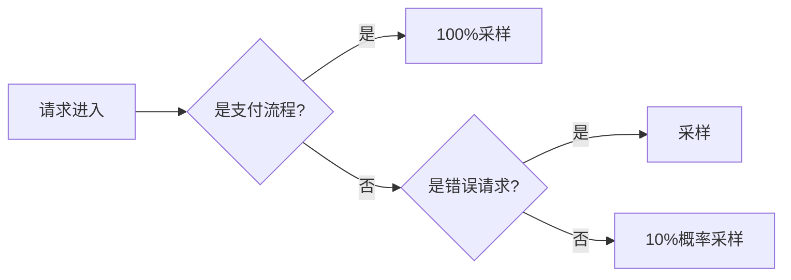

# OpenTelemetry 采样配置

## 介绍

采样（Sampling）是OpenTelemetry中的核心概念，它决定哪些追踪（Traces）和指标（Metrics）数据会被收集并传输到后端系统。合理的采样配置能有效降低系统开销，同时保留关键观测数据。本文将介绍常见的采样策略及其配置方法。

:::note 为什么需要采样？
- 减少网络带宽和存储成本
- 避免高负载应用因观测数据过多而崩溃
- 聚焦关键业务路径的数据
:::

## 采样策略类型

OpenTelemetry支持多种采样策略，以下是主要类型：

### 1. 头部采样（Head-based Sampling）
在请求开始时立即决定是否采样，通常基于概率或特定规则。



### 2. 尾部采样（Tail-based Sampling）
收集所有请求的初始数据，在请求完成后根据整体特征（如延迟、错误）决定是否保留。

## 配置示例

### 概率采样（最简单的方式）

```javascript
const { NodeTracerProvider } = require('@opentelemetry/sdk-node');
const { SimpleSpanProcessor } = require('@opentelemetry/sdk-trace-node');
const { ParentBasedSampler, TraceIdRatioBasedSampler } = require('@opentelemetry/core');

// 配置采样率为10%
const sampler = new ParentBasedSampler({
  root: new TraceIdRatioBasedSampler(0.1) // 10%的请求会被采样
});

const provider = new NodeTracerProvider({
  sampler: sampler
});

provider.addSpanProcessor(new SimpleSpanProcessor(new ConsoleSpanExporter()));
provider.register();
```

:::tip 概率采样的特点
- 配置简单，开销低
- 可能错过重要错误请求
- 适合低流量或测试环境
:::

### 动态采样（基于规则）

```javascript
const { AlwaysOnSampler, AlwaysOffSampler } = require('@opentelemetry/core');

const dynamicSampler = (params) => {
  // 对特定路径强制采样
  if (params.attributes['http.target']?.includes('/payment')) {
    return new AlwaysOnSampler();
  }
  // 对其他请求使用10%采样率
  return new TraceIdRatioBasedSampler(0.1);
};

const provider = new NodeTracerProvider({
  sampler: dynamicSampler
});
```

## 实际案例

### 电商网站采样策略

1. **关键路径**：支付流程（100%采样）
2. **商品浏览**：10%概率采样
3. **错误请求**：自动采样（通过尾部采样器实现）



## 高级配置技巧

### 组合多个采样器

```javascript
const { CompositeSampler } = require('@opentelemetry/core');

const sampler = new CompositeSampler({
  samplers: [
    new RuleBasedSampler(rules),
    new RateLimitingSampler(100) // 每秒最多100个采样
  ]
});
```

### 环境感知配置

```yaml
# opentelemetry-config.yaml
sampling:
  production:
    rate: 0.05
  staging:
    rate: 0.5
  development:
    rate: 1.0
```

:::caution 注意事项
1. 采样率过高会导致系统负载增加
2. 采样率过低可能丢失关键问题线索
3. 生产环境建议结合头部和尾部采样
:::

## 总结

OpenTelemetry采样配置是平衡系统开销与观测需求的关键。初学者应从简单概率采样开始，逐步探索更复杂的规则采样和动态采样策略。

## 延伸学习

1. 官方文档：[OpenTelemetry Sampling](https://opentelemetry.io/docs/concepts/sampling/)
2. 实践练习：
   - 配置一个开发环境100%采样，生产环境5%采样的应用
   - 实现针对`/login`路径的强制采样
3. 进阶阅读：分布式追踪中的[一致性采样](https://opentelemetry.io/blog/2022/sampling/)概念