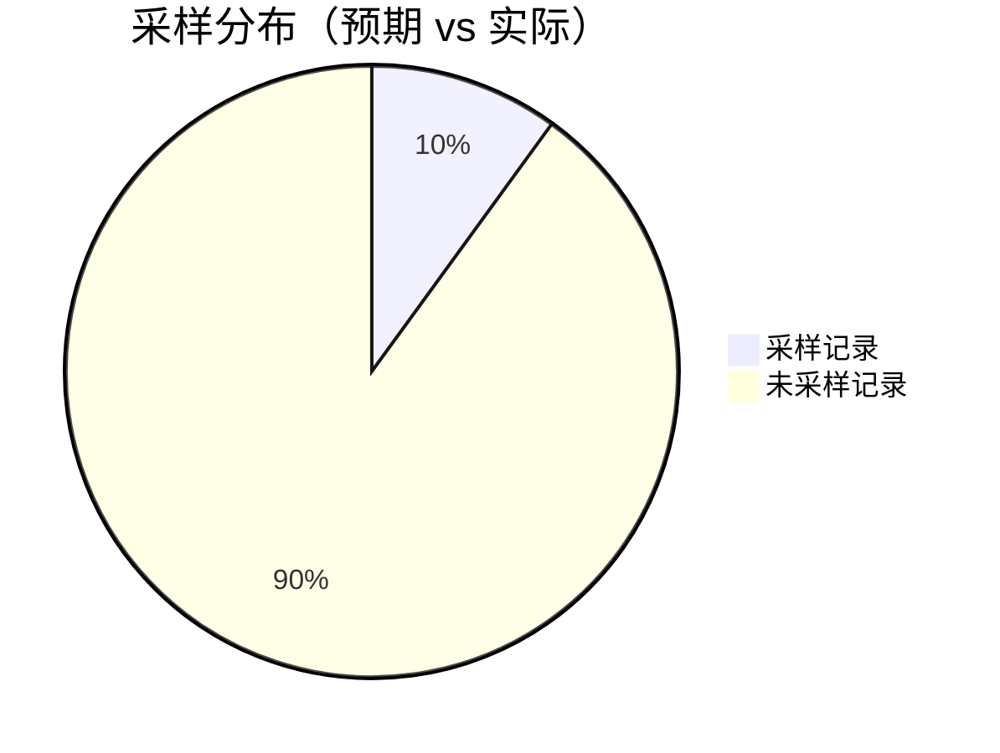

# OpenTelemetry 采样调试

## 介绍

OpenTelemetry采样是控制分布式追踪数据量的关键技术。通过采样，开发者可以平衡系统开销与数据完整性，只收集对分析最有价值的追踪信息。调试采样配置是确保系统按预期运行的关键步骤，本文将详细介绍调试方法、常见问题及解决方案。

---

## 采样基础概念

采样决定是否记录特定追踪（Trace）或跨度（Span）。OpenTelemetry提供以下常见采样策略：
- **头部采样（Head-based）**：在追踪开始时决定是否采样。
- **尾部采样（Tail-based）**：根据完整追踪数据动态决策。

:::tip 为什么需要调试采样？
错误的采样配置可能导致：
- 数据过载（采样率过高）
- 关键信息丢失（采样率过低）
- 不一致的采样决策（如服务间配置不匹配）
:::

---

## 调试采样配置

### 1. 验证采样器类型
检查代码中是否正确定义采样器。例如，以下代码设置了一个概率采样器（Probability Sampler）：

```javascript
const { NodeTracerProvider } = require('@opentelemetry/sdk-trace-node');
const { SimpleSpanProcessor } = require('@opentelemetry/sdk-trace-base');
const { ProbabilitySampler } = require('@opentelemetry/core');

const provider = new NodeTracerProvider({
  sampler: new ProbabilitySampler(0.1) // 10%采样率
});
provider.register();
```

**预期输出**：大约10%的请求会生成追踪数据。

---

### 2. 检查采样率影响
通过日志或监控工具验证实际采样率是否符合预期。例如：



如果实际比例偏差较大，可能说明：
- 采样器未正确应用
- 存在多个冲突的采样配置

---

### 3. 跨服务采样一致性调试
在分布式系统中，确保所有服务使用相同的采样决策。使用 `ParentBasedSampler` 保持一致性：

```python
from opentelemetry import trace
from opentelemetry.sdk.trace import TracerProvider
from opentelemetry.sdk.trace.export import BatchSpanProcessor
from opentelemetry.sdk.trace.sampling import ParentBasedSampler, ProbabilitySampler

provider = TracerProvider(
    sampler=ParentBasedSampler(ProbabilitySampler(0.2))
trace.set_tracer_provider(provider)
```

:::warning 常见问题
服务A采样率=0.5，服务B采样率=0.1 → 导致追踪链断裂。解决方案：统一配置或使用动态采样。
:::

---

## 实际案例：电商平台采样调试

**场景**：用户下单流程追踪丢失关键支付阶段数据。

**调试过程**：
1. 发现支付服务采样率=0.05（其他服务=0.2）
2. 使用OpenTelemetry Collector的`tail_sampling`处理器动态补全：
   ```yaml
   processors:
     tail_sampling:
       policies:
         - name: important-operation
           type: always_sample
           spans:
             - Key: operation
               Value: "payment.process"
   ```
3. 验证后关键操作采样率提升至100%，其他保持20%。

---

## 总结

调试OpenTelemetry采样的关键步骤：
1. 确认采样器类型和参数
2. 验证实际采样率
3. 确保跨服务一致性
4. 使用动态采样处理特殊情况

---

## 延伸练习
1. 在本地环境中设置一个概率采样器（0.3），并用Jaeger验证采样比例。
2. 模拟两个服务间的调用链，测试`ParentBasedSampler`的效果。

## 附加资源
- [OpenTelemetry采样官方文档](https://opentelemetry.io/docs/concepts/sampling/)
- [分布式追踪采样策略白皮书](https://arxiv.org/abs/2107.07703)