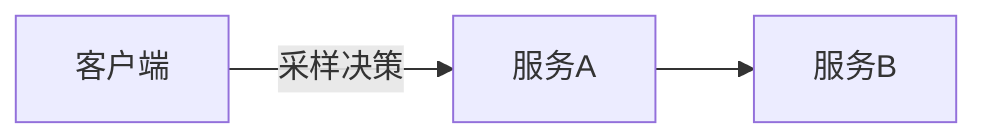
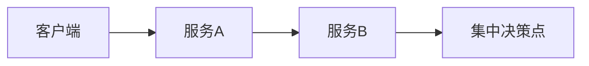
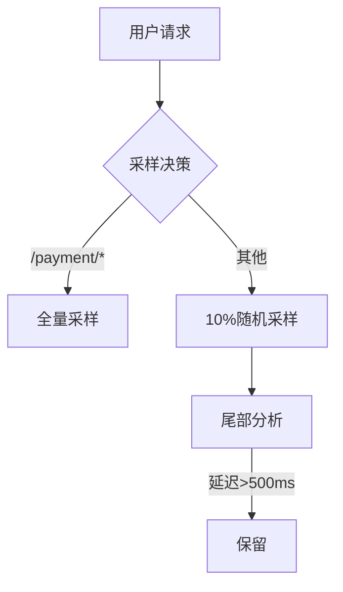

# OpenTelemetry 采样最佳实践

## 介绍

OpenTelemetry采样（Sampling）是控制分布式追踪数据量的关键技术。在高流量的生产环境中，记录所有请求的追踪数据会带来巨大的存储和分析开销。采样允许你**智能地选择哪些请求需要记录**，从而平衡观测成本与数据完整性。

## 为什么需要采样？

- **成本控制**：减少存储和传输的数据量<br />
- **性能优化**：降低对应用性能的影响<br />
- **聚焦关键数据**：确保记录高价值请求（如错误或慢请求）

## 采样类型

### 1. 头部采样（Head-based Sampling）
在请求开始时决定是否采样，通常由客户端或第一跳服务决定。



### 2. 尾部采样（Tail-based Sampling）
收集所有请求的追踪数据，最后根据规则（如错误率或延迟）决定保留哪些。



## 代码示例

### 基础采样配置（Node.js）

```javascript
const { NodeTracerProvider } = require('@opentelemetry/sdk-trace-node');
const { ParentBasedSampler, AlwaysOnSampler } = require('@opentelemetry/core');

const provider = new NodeTracerProvider({
  sampler: new ParentBasedSampler({
    // 如果父Span存在则跟随父Span的采样决策
    root: new AlwaysOnSampler() // 否则全部采样
  })
});
```

### 动态采样（基于请求属性）

```python
from opentelemetry.sdk.trace.sampling import Sampler, SamplingResult

class CustomSampler(Sampler):
    def should_sample(self, context, trace_id, name, attributes, links):
        if attributes.get("http.target") == "/checkout":
            return SamplingResult(Decision.RECORD_AND_SAMPLE)
        return SamplingResult(Decision.DROP)
```

## 最佳实践

:::tip 生产环境推荐
1. **组合使用采样策略**：头部采样+尾部采样
2. **关键路径全采样**：如支付、登录等核心流程
3. **错误优先**：确保所有错误请求都被记录
:::

### 实际案例：电商平台



## 常见问题

:::caution 注意陷阱
- **采样偏差**：随机采样可能遗漏重要模式
- **跨服务一致性**：确保分布式追踪的完整链
- **采样率调整**：需要根据业务负载动态变化
:::

## 总结

OpenTelemetry采样是观测系统的重要组成部分。通过合理配置：
- 降低30-70%的观测成本
- 保持关键业务可见性
- 支持高效的故障排查

## 扩展资源

1. [OpenTelemetry官方采样文档](https://opentelemetry.io/docs/concepts/sampling/)
2. 练习：为你的Web服务配置错误优先采样器
3. 高级话题：自适应采样（Adaptive Sampling）