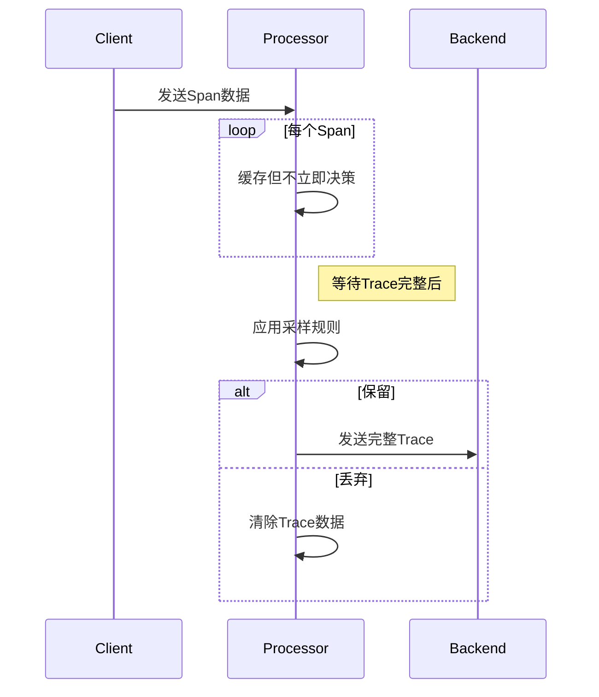
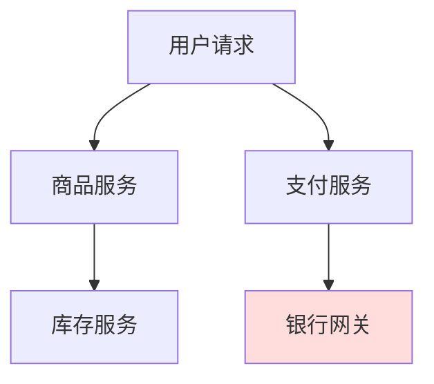

# OpenTelemetry 尾部采样

## 介绍

在分布式系统中，**尾部采样（Tail Sampling）**是一种延迟决策的采样策略，它会在所有Span数据收集完成后（即"尾部"）再决定是否保留整条追踪链路。与头部采样（在请求开始时决定）相比，尾部采样能更灵活地基于完整链路信息（如错误状态、延迟等）做出决策。

:::tip 为什么需要尾部采样？
- **保留关键数据**：仅存储包含错误或高延迟的完整链路。
- **降低成本**：避免存储大量低价值追踪数据。
- **提高分析效率**：确保存储的追踪数据具有分析价值。
:::

## 核心概念

### 1. 采样决策时机


### 2. 常见采样策略
- **基于错误率**：保留包含错误状态的Trace
- **基于延迟**：保留超过阈值的慢请求
- **随机采样**：按比例随机保留
- **组合策略**：混合上述条件

## 实现示例

以下是通过OpenTelemetry Collector配置尾部采样的示例：

```yaml
# otel-collector-config.yaml
processors:
  tail_sampling:
    decision_wait: 10s # 等待Trace完整的时间
    num_traces: 1000   # 内存中保留的最大Trace数
    expected_new_traces_per_sec: 100
    policies:
      [
          {
              name: error-policy,
              type: status_code,
              status_code: {status_codes: [ERROR]}
          },
          {
              name: slow-traces-policy,
              type: latency,
              latency: {threshold_ms: 5000}
          },
          {
              name: random-policy,
              type: probabilistic,
              probabilistic: {sampling_percentage: 10}
          }
      ]

service:
  pipelines:
    traces:
      processors: [tail_sampling]
      exporters: [logging]
```

:::note 配置说明
1. `decision_wait`：等待Trace完成的最大时间
2. `policies`：可以定义多个采样策略
3. 此示例组合了三种策略：错误状态、慢请求和随机采样
:::

## 实际应用场景

### 电商平台案例


**采样策略**：
1. 保留所有支付失败的订单（状态码=ERROR）
2. 保留响应时间>3秒的请求
3. 随机采样10%的正常请求

**结果**：
- 100%的错误交易被记录
- 所有性能问题可追溯
- 存储成本降低70%

## 总结

尾部采样通过延迟决策机制，在保证关键数据不丢失的同时显著降低存储成本。关键要点：

- **优势**：基于完整链路信息决策，比头部采样更精准
- **代价**：需要缓存Trace数据，增加内存消耗
- **适用场景**：错误分析、性能调优等需要完整链路的场景

## 延伸学习

1. 官方文档：[OpenTelemetry Sampling](https://opentelemetry.io/docs/concepts/sampling/)
2. 实践练习：尝试在本地环境配置组合采样策略
3. 进阶话题：研究如何自定义采样策略（如基于特定Tag）

:::warning 注意事项
尾部采样会导致：
- 内存消耗增加（需缓存未完成的Trace）
- 轻微延迟（需等待Trace完成）
在资源受限环境中需谨慎配置参数。
:::