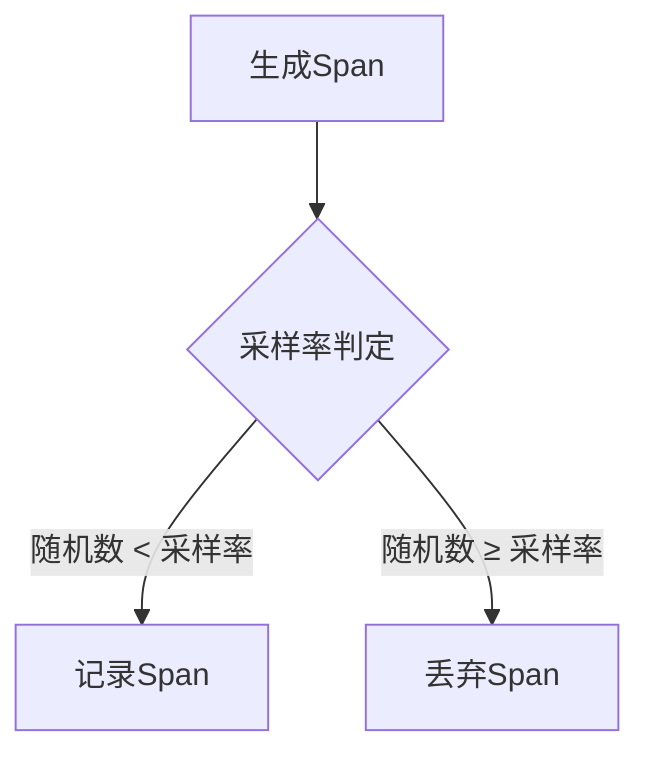

## 简介

在分布式系统中，OpenTelemetry 用于生成大量遥测数据（如 traces、metrics、logs）。如果全量收集这些数据，可能导致存储成本过高或系统过载。**概率采样**（Probability Sampling）是一种通过预定义采样率（如 10%）随机决定是否收集数据的轻量级方案，它能有效控制数据量，同时保留代表性的系统行为样本。

## 核心概念

### 采样率（Sampling Rate）
采样率是一个介于 0 和 1 之间的值，表示数据被采集的概率。例如：
- `0.1`：10% 的数据会被采集
- `1.0`：全量采集（无采样）

### 采样决策流程


## 代码示例

### 配置概率采样器（Python）
以下示例展示如何在 Python 中设置概率采样器：

```python
from opentelemetry import trace
from opentelemetry.sdk.trace import TracerProvider
from opentelemetry.sdk.trace.sampling import TraceIdRatioBased

# 设置采样率为 30%
sampler = TraceIdRatioBased(0.3)
provider = TracerProvider(sampler=sampler)
trace.set_tracer_provider(provider)

tracer = trace.get_tracer(__name__)
with tracer.start_as_current_span("sample_span"):
    print("Span 可能被采样（30% 概率）")
```

### 输出结果
运行多次后，大约 30% 的 Span 会被导出到后端系统（如 Jaeger）。

## 实际应用场景

### 案例：电商平台流量监控
假设一个电商平台的订单服务日均处理 100 万次请求：
- **全量采集**：存储所有 traces 需要 1TB/天，成本高昂。
- **概率采样（5%）**：只需存储 5 万次请求的 traces，仍能捕捉到错误率和延迟趋势。

:::tip 采样率选择建议
- 高流量生产环境：0.1~0.3（10%~30%）
- 调试阶段：1.0（全量）
- 低流量服务：0.5~1.0
:::

## 注意事项

1. **数据一致性**：同一 Trace 的所有 Span 应共享采样决策（通过 `TraceId` 实现）。
2. **动态调整**：可通过配置中心动态更新采样率，无需重启服务。
3. **补充策略**：可组合使用概率采样和[基于条件的采样](https://opentelemetry.io/docs/concepts/sampling/)（如错误请求全采样）。

## 总结

概率采样是 OpenTelemetry 中平衡数据量与精度的关键工具。通过合理设置采样率，开发者可以：
- 降低存储和分析成本
- 避免采集冗余数据
- 保持对系统健康度的可见性

## 扩展练习

1. 修改上述代码示例，尝试不同的采样率（如 0.5、0.8），观察导出结果的变化。
2. 在分布式链路中，验证同一个 Trace 的 Span 是否全部被采样或丢弃。

## 参考资源
- [OpenTelemetry 官方采样文档](https://opentelemetry.io/docs/concepts/sampling/)
- [采样策略设计模式](https://github.com/open-telemetry/opentelemetry-specification/blob/main/specification/trace/sampling.md)