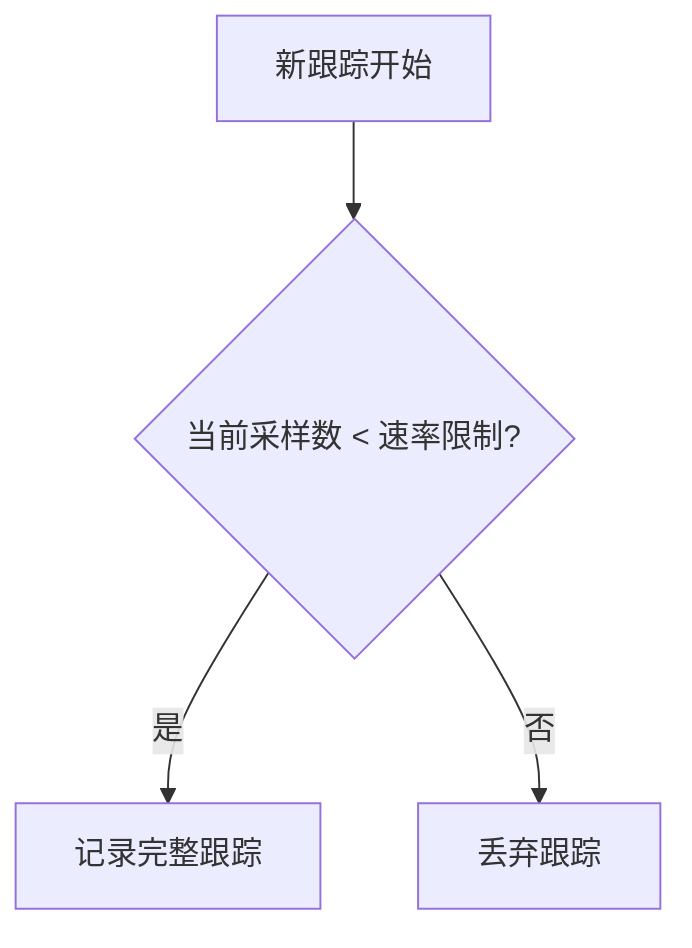

# OpenTelemetry 基于速率采样

## 介绍
基于速率采样（Rate-based Sampling）是OpenTelemetry中一种常见的采样策略，它通过限制单位时间内采集的跟踪数据量（如每秒最多采集N条跟踪）来平衡系统开销与观测需求。这种采样方式特别适用于高流量场景，既能减少资源消耗，又能保留有代表性的数据样本。

## 工作原理
基于速率采样的核心逻辑是：
1. 设定一个采样率（如每秒5个跟踪）。
2. 当新跟踪到达时，检查当前时间窗口内已采样的数量。
3. 如果未超过阈值，则采样；否则丢弃。



## 配置示例
以下是通过OpenTelemetry SDK配置基于速率采样的代码示例（以Node.js为例）：

```javascript
const { NodeTracerProvider } = require('@opentelemetry/sdk-trace-node');
const { RateLimitingSampler } = require('@opentelemetry/core');

// 配置每秒最多采样2个跟踪
const sampler = new RateLimitingSampler(2);

const provider = new NodeTracerProvider({
  sampler: sampler
});

provider.register();
```

**输入说明**：
- `RateLimitingSampler(2)` 中的数字表示每秒允许的最大跟踪数

**输出效果**：
- 当系统在1秒内产生5个跟踪时，只有前2个会被记录
- 下一秒的计数器会重置

## 关键参数
| 参数 | 说明 | 推荐值 |
|------|------|--------|
| 速率限制 | 每秒最大跟踪数 | 根据系统负载调整（通常1-10） |
| 时间窗口 | 计数重置间隔 | 固定为1秒（不可配置） |

## 实际应用场景

### 场景1：电商大促监控
某电商在双十一期间流量增长10倍，通过设置`RateLimitingSampler(5)`：
- 保证核心交易链路监控不中断
- 避免观测系统因数据激增崩溃
- 采样后的数据仍能反映延迟异常

### 场景2：微服务调试
开发环境配置`RateLimitingSampler(1)`：
- 限制调试期间的跟踪数据量
- 仍能捕获典型请求路径
- 降低存储成本

:::tip 最佳实践
1. 生产环境建议结合[动态采样](https://opentelemetry.io/docs/concepts/sampling/#dynamic-sampling)策略
2. 对关键路径（如支付）可设置更高采样率
3. 始终监控采样后的数据覆盖率
:::

## 注意事项
1. **时钟同步问题**：分布式系统中各节点时钟不同步可能导致采样不均匀
2. **突发流量**：固定速率可能无法应对瞬时流量高峰
3. **数据关联**：被丢弃的跟踪会导致部分跨度缺失

## 总结
基于速率采样是OpenTelemetry中最简单直接的采样策略，适合需要严格控制数据量的场景。虽然它缺乏智能过滤能力，但配置简单且资源消耗可预测。

## 扩展学习
- 对比其他采样策略：[头部采样](https://opentelemetry.io/docs/concepts/sampling/#head-sampling) vs [尾部采样](https://opentelemetry.io/docs/concepts/sampling/#tail-sampling)
- 实践练习：在本地环境尝试不同速率限制（1/5/10），观察控制台输出差异
- 进阶阅读：[OpenTelemetry采样官方文档](https://opentelemetry.io/docs/concepts/sampling/)