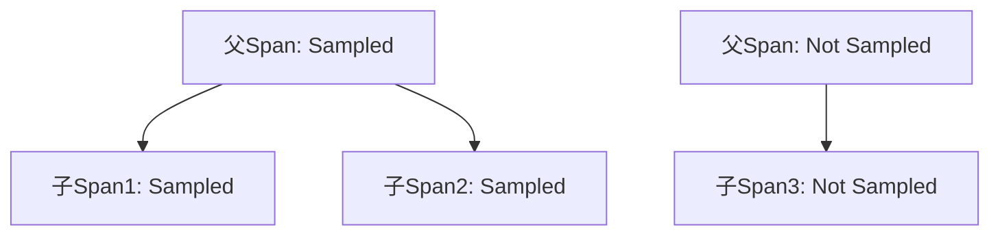

# OpenTelemetry 父级采样

## 介绍

在分布式系统中，追踪（Tracing）会产生大量数据，而**父级采样**（Parent-Based Sampling）是OpenTelemetry中一种关键的采样策略，它通过**继承父级Span的采样决策**来控制数据量。这种机制确保了一个请求的完整调用链要么全部被采样，要么全部被丢弃，避免出现“断链”现象。

:::tip 为什么需要父级采样？
- 保持调用链的完整性
- 减少存储和分析成本
- 确保关键请求的完整追踪
:::

## 基本概念

### 采样决策的传播

当父级Span做出采样决策后，子Span会**自动继承**这个决策。这种传播行为可以通过以下mermaid图表示：



### 采样器类型

OpenTelemetry提供几种内置采样器：
- `AlwaysOnSampler`：采样所有Span
- `AlwaysOffSampler`：不采样任何Span
- `TraceIdRatioBased`：按比例采样
- `ParentBasedSampler`：本文重点介绍的父级采样器

## 代码示例

### 基本配置

以下是如何在Node.js中配置父级采样器：

```javascript
const { NodeTracerProvider } = require('@opentelemetry/sdk-trace-node');
const { ParentBasedSampler, TraceIdRatioBasedSampler } = require('@opentelemetry/core');

const provider = new NodeTracerProvider({
  sampler: new ParentBasedSampler({
    // 当没有父级时的默认采样器
    root: new TraceIdRatioBasedSampler(0.5),
    // 其他情况的采样策略（可选）
    remoteParentSampled: new AlwaysOnSampler(),
    remoteParentNotSampled: new AlwaysOffSampler(),
    localParentSampled: new AlwaysOnSampler(),
    localParentNotSampled: new AlwaysOffSampler()
  })
});
```

### 决策流程

父级采样器的工作流程如下：

1. 检查当前Span是否有父级
2. 如果有父级，继承父级的采样决策
3. 如果没有父级（根Span），使用`root`采样器

## 实际应用场景

### 案例：电商订单系统

假设有一个订单处理流程：

```
用户请求 → API网关 → 订单服务 → 支付服务 → 库存服务
```

使用父级采样后：
- 如果API网关决定采样，后续所有服务Span都会被记录
- 如果API网关决定不采样，整个调用链都不会产生追踪数据

:::note 实际配置建议
生产环境中通常组合使用多种策略：
```javascript
new ParentBasedSampler({
  root: new TraceIdRatioBasedSampler(0.1), // 10%的根请求被采样
  remoteParentSampled: new AlwaysOnSampler() // 确保采样决策传播
})
```
:::

## 高级主题

### 自定义采样逻辑

你可以实现自己的采样器：

```javascript
const { SamplingResult, SamplingDecision } = require('@opentelemetry/sdk-trace-base');

class CustomSampler {
  shouldSample(context, traceId, spanName, spanKind, attributes, links) {
    if (attributes['http.target']?.includes('/health')) {
      return { decision: SamplingDecision.NOT_RECORD };
    }
    return { decision: SamplingDecision.RECORD_AND_SAMPLED };
  }
}
```

### 与上下文传播的关系

采样决策通过`traceflags`在服务间传播，这是W3C TraceContext规范的一部分：

```
Header: traceparent: 00-4bf92f3577b34da6a3ce929d0e0e4736-00f067aa0ba902b7-01
                                                         ^^ 采样标志位(01=采样)
```

## 总结

关键要点：
- 父级采样确保分布式追踪的完整性
- 采样决策通过上下文自动传播
- 可以组合多种采样策略满足不同需求
- 根Span使用独立采样策略

## 延伸学习

推荐练习：
1. 尝试修改采样比例观察追踪数据变化
2. 实现一个基于HTTP方法的采样器
3. 测试跨服务边界的采样传播

附加资源：
- [OpenTelemetry采样规范](https://github.com/open-telemetry/opentelemetry-specification/blob/main/specification/trace/sdk.md#sampling)
- [W3C TraceContext标准](https://www.w3.org/TR/trace-context/)