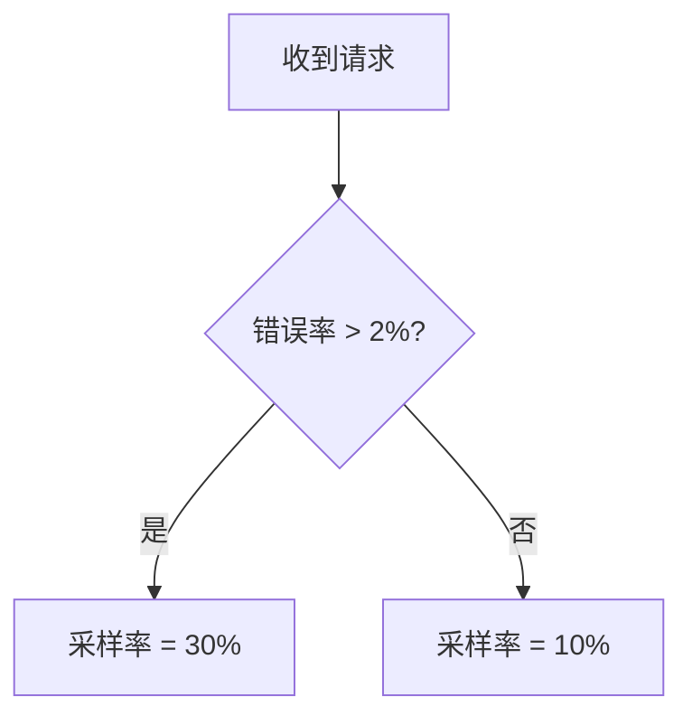

# OpenTelemetry 自适应采样

## 简介
OpenTelemetry的自适应采样（Adaptive Sampling）是一种动态调整采样率的机制，它根据系统负载、错误率或其他自定义指标自动决定收集哪些追踪数据。与固定采样率相比，自适应采样能更高效地平衡系统开销与观测数据质量，尤其适合高流量或资源敏感的应用场景。

---

## 为什么需要自适应采样？
固定采样率（如始终采样10%的请求）可能导致：
1. **低流量时**：采样数据不足，难以分析问题。
2. **高流量时**：产生过多冗余数据，增加存储和分析成本。
3. **关键错误丢失**：固定采样可能遗漏低频率但高重要性的错误。

自适应采样通过动态规则解决这些问题，例如：
- 当错误率升高时，自动提高采样率。
- 当系统负载过高时，降低采样率以减轻压力。

---

## 核心概念

### 1. 采样决策器（Sampler）
OpenTelemetry通过`Sampler`接口实现采样逻辑。自适应采样通常需要自定义实现，例如：

```go
type AdaptiveSampler struct {
    baseSampler    Sampler
    errorRateThreshold float64
}

func (s *AdaptiveSampler) ShouldSample(p SamplingParameters) SamplingResult {
    if p.ParentContext.IsSampled() {
        return SamplingResult{Decision: RecordAndSample}
    }
    if calculateErrorRate() > s.errorRateThreshold {
        return SamplingResult{Decision: RecordAndSample}
    }
    return s.baseSampler.ShouldSample(p)
}
```

### 2. 动态调整策略
常见的自适应策略包括：
- **基于错误率**：错误率超过阈值时提高采样。
- **基于延迟**：慢请求（如P99延迟）优先采样。
- **基于流量**：根据QPS动态调整采样率。

---

## 实现示例
以下是一个基于Prometheus指标的自适应采样器示例（Python）：

```python
from opentelemetry.sdk.trace.sampling import SamplingResult
from prometheus_client import Gauge

error_rate_gauge = Gauge("app_error_rate", "Current error rate")

class AdaptiveSampler:
    def __init__(self, base_rate=0.1, max_rate=0.5):
        self.base_rate = base_rate
        self.max_rate = max_rate

    def should_sample(self, context):
        current_error_rate = error_rate_gauge.get()
        dynamic_rate = min(
            self.base_rate * (1 + current_error_rate * 10), 
            self.max_rate
        )
        return SamplingResult(
            decision=RecordAndSample if random() < dynamic_rate else Drop
        )
```

**输入/输出说明**：
- 当`error_rate=0`时，使用基础采样率（10%）。
- 当`error_rate=0.1`（10%错误率）时，采样率提升至20%。

---

## 实际案例：电商平台

### 场景
一个电商网站在促销期间：
1. 正常流量：1000 QPS，错误率0.5%
2. 高峰流量：5000 QPS，错误率升至5%

### 自适应规则


### 效果
- 正常时期：保留10%的请求数据，节省资源。
- 高峰时期：自动捕获更多错误数据（30%），便于快速定位问题。

---

## 总结

自适应采样的关键优势：
- **资源高效**：避免收集低价值数据。
- **问题敏感**：自动聚焦关键异常。
- **动态平衡**：适应流量波动。

:::tip 最佳实践
1. 从简单规则开始（如仅监控错误率）。
2. 通过指标（如CPU使用率）验证采样策略影响。
3. 避免频繁调整采样率（建议设置最小间隔5分钟）。
:::

---

## 扩展练习
1. 尝试在本地OpenTelemetry Collector中实现一个基于请求延迟的自适应采样器。
2. 使用Jaeger或Zipkin观察不同采样策略下的追踪数据差异。

## 附加资源
- [OpenTelemetry采样规范](https://opentelemetry.io/docs/concepts/sampling/)
- [自适应采样论文《Adaptive Sampling for Tracking》](https://dl.acm.org/doi/10.1145/956750.956764)