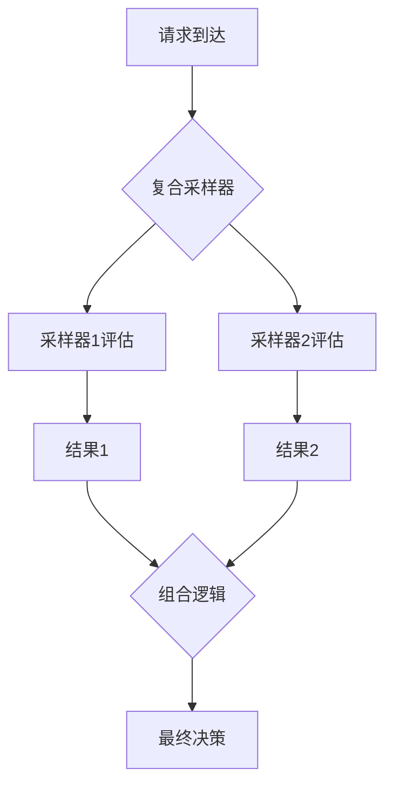

## 介绍

复合采样（Composite Sampling）是OpenTelemetry中一种高级采样策略，它允许你将多个采样器组合使用，根据不同的条件决定是否记录或丢弃遥测数据（traces、metrics、logs）。这种策略特别适合需要根据不同场景动态调整采样率的复杂系统。

:::tip 为什么需要复合采样？
- 混合使用头采样（head-based）和尾采样（tail-based）策略
- 对不同优先级的请求应用不同采样率
- 在保证关键业务数据完整性的同时减少低优先级数据的存储成本
:::

## 基本概念

### 采样器类型
OpenTelemetry提供了几种基础采样器：

1. **总是采样（AlwaysOn）**：记录所有数据
2. **从不采样（AlwaysOff）**：丢弃所有数据
3. **概率采样（TraceIdRatioBased）**：按固定比例采样
4. **父采样（ParentBased）**：继承父span的采样决策

### 复合采样原理
复合采样器通过逻辑组合这些基础采样器，形成更复杂的决策逻辑：



## 实现方式

### 基础代码示例

以下展示如何在Go中创建复合采样器：

```go
import (
    "go.opentelemetry.io/otel/sdk/trace"
    "go.opentelemetry.io/otel/sdk/trace/tracetest"
)

func createCompositeSampler() trace.Sampler {
    // 创建两个基础采样器
    highPrioritySampler := trace.TraceIDRatioBased(1.0) // 100%采样关键业务
    lowPrioritySampler := trace.TraceIDRatioBased(0.1)  // 10%采样普通业务
    
    // 创建复合采样器
    return trace.CompositeSampler(
        // 第一个采样器：检查是否为关键业务
        trace.SamplerFunc(func(p trace.SamplingParameters) trace.SamplingResult {
            if isHighPriority(p) {
                return highPrioritySampler.ShouldSample(p)
            }
            return trace.SamplingDecisionDrop // 非关键业务交由下一个采样器处理
        }),
        // 第二个采样器：处理剩余请求
        lowPrioritySampler,
    )
}

func isHighPriority(p trace.SamplingParameters) bool {
    // 实际业务中可能检查HTTP头或RPC属性
    return p.Attributes.HasValue("priority", "high")
}
```

### 决策流程说明

1. 当请求到达时，首先检查是否是高优先级请求
2. 如果是高优先级，则100%采样
3. 如果不是，则交给第二个采样器处理，按10%概率采样
4. 如果所有采样器都拒绝，则最终丢弃该trace

## 实际应用案例

### 电商平台采样策略

假设一个电商平台需要：

- 保证支付流程的完整追踪（100%采样）
- 记录部分商品浏览行为（5%采样）
- 忽略健康检查请求（0%采样）

```go
func createEcommerceSampler() trace.Sampler {
    return trace.CompositeSampler(
        // 第一层：忽略健康检查
        trace.SamplerFunc(func(p trace.SamplingParameters) trace.SamplingResult {
            if isHealthCheck(p) {
                return trace.SamplingDecisionDrop
            }
            return trace.UnspecifiedSamplingResult // 交由下一层处理
        }),
        // 第二层：支付相关采样
        trace.SamplerFunc(func(p trace.SamplingParameters) trace.SamplingResult {
            if isPaymentFlow(p) {
                return trace.SamplingDecisionRecord
            }
            return trace.UnspecifiedSamplingResult
        }),
        // 第三层：默认采样率
        trace.TraceIDRatioBased(0.05),
    )
}
```

:::caution 性能考虑
复合采样器会按顺序执行所有子采样器，直到得到明确决策。过多的层级会影响性能，建议：
- 将最可能匹配的条件放在前面
- 避免深层嵌套
- 对高频路径进行优化
:::

## 总结

复合采样提供了极大的灵活性，通过组合多个简单采样器，可以实现：

✓ 分业务优先级采样<br />
✓ 混合头/尾采样策略<br />
✓ 基于属性的动态决策<br />
✓ 多层过滤机制

## 延伸学习

推荐练习：
1. 实现一个三层复合采样器，分别处理：
   - 错误请求（100%采样）
   - 慢请求（50%采样）
   - 普通请求（1%采样）
2. 测试不同排序对性能的影响

官方资源：
- [OpenTelemetry采样规范](https://opentelemetry.io/docs/specs/otel/trace/sdk/#sampling)
- [SDK实现示例](https://github.com/open-telemetry/opentelemetry-go/tree/main/sdk/trace)