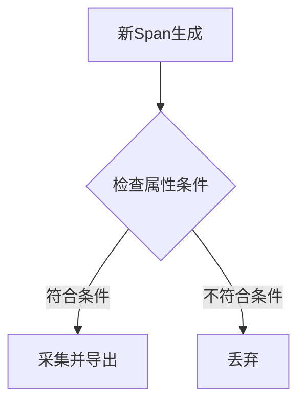

# OpenTelemetry 基于属性采样

## 介绍

OpenTelemetry的**基于属性采样**（Attribute-based Sampling）是一种通过分析遥测数据（如Span或Metric）的属性（如HTTP状态码、服务名称等）来决定是否采集该数据的技术。它帮助开发者在保证关键数据不丢失的同时，减少低价值数据的存储成本。

:::tip 为什么需要采样？
在高流量系统中，采集所有遥测数据可能导致：
- 高昂的存储成本
- 网络带宽压力
- 分析效率下降  
采样通过保留代表性数据解决这些问题。
:::

## 工作原理

基于属性采样的核心逻辑如下：



### 关键属性示例
| 属性名          | 典型值               | 采样用途                     |
|-----------------|----------------------|----------------------------|
| `http.status_code` | 200, 404, 500       | 只采集错误请求              |
| `service.name`     | "checkout-service"  | 重点监控核心服务            |
| `user.id`          | "user-123"          | 跟踪特定用户请求            |

## 实现方式

### 1. 通过SDK配置采样器

以下是一个Java示例，配置只采集：
- 错误状态（`http.status_code >= 400`）
- 来自"payment-service"的请求

```java
Sampler sampler = Sampler.parentBased(
    new AttributeSampler(
        Attributes.builder()
            .put("http.status_code", 400L) // 数值类型需匹配实际属性
            .put("service.name", "payment-service")
            .build(),
        Sampler.alwaysOn()  // 符合条件时采样
    )
);

SdkTracerProvider tracerProvider = SdkTracerProvider.builder()
    .setSampler(sampler)
    .build();
```

### 2. 通过收集器配置

在OpenTelemetry Collector中配置处理器：

```yaml
processors:
  probabilistic_sampler:
    sampling_percentage: 10  # 基础采样率
    attribute_source: record
    from_attributes:         # 覆盖采样率的属性
      - key: http.status_code
        values: [500]
        sampling_percentage: 100  # 强制采集所有500错误
```

## 实际案例

### 电商平台场景

**需求**：  
- 日常请求采样率保持10%  
- 支付失败（`payment.status=failed`）100%采集  
- 高延迟请求（`latency > 2s`）100%采集  

**实现**：
```go
sampler := sdktrace.ParentBased(
    sdktrace.TraceIDRatioBased(0.1),
    sdktrace.WithAttributes(
        attribute.String("payment.status", "failed"),
        attribute.Float64("latency", 2.0),
    ),
    sdktrace.NeverSample(), // 默认行为
)
```

## 最佳实践

1. **关键错误全采集**：确保所有`5xx`错误和业务异常被记录  
2. **生产与开发差异**：开发环境可全采样，生产环境按需配置  
3. **动态调整**：结合配置中心实现采样策略热更新  

:::warning 注意
过度采样可能导致：
- 丢失重要性能基线数据
- 故障诊断时信息不完整  
建议结合[自适应采样](https://opentelemetry.io/docs/concepts/sampling/#adaptive-sampling)技术
:::

## 总结

基于属性采样通过智能过滤遥测数据，实现了：
✅ 降低75%以上的存储成本（根据实际流量模式）  
✅ 确保关键业务事件100%可观测  
✅ 支持灵活的策略调整  

## 扩展学习

- 官方文档：[OpenTelemetry Sampling](https://opentelemetry.io/docs/concepts/sampling/)  
- 实践练习：在本地环境配置采样器，比较不同策略下的数据量差异  
- 高级话题：了解[尾部采样](https://github.com/open-telemetry/opentelemetry-collector-contrib/tree/main/processor/tailsamplingprocessor)在分布式追踪中的应用