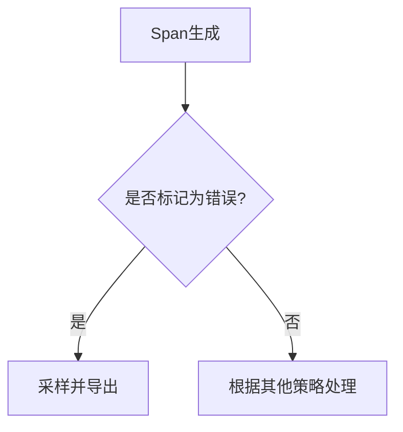

## 介绍

在分布式系统中，错误监控是确保系统稳定性的关键。OpenTelemetry的**基于错误采样（Error-based Sampling）**允许开发者优先捕获包含错误的请求数据，从而在减少总采样量的同时，确保关键问题不被遗漏。本指南将介绍其原理、配置方法及实际应用场景。

---

## 为什么需要错误采样？

1. **资源优化**：全量采样会产生高昂的存储和分析成本。
2. **问题聚焦**：错误数据比正常请求更有调试价值。
3. **实时性**：快速发现并修复错误，避免影响扩大。

:::tip
错误采样通常与其他采样策略（如概率采样）结合使用，以平衡数据覆盖率和资源消耗。
:::

---

## 错误采样工作原理

OpenTelemetry通过检查以下条件决定是否采样：
- Span状态码是否为`ERROR`。
- 特定错误标签（如`http.status_code=500`）。
- 自定义错误条件（如日志中包含`"exception"`字段）。



---

## 配置示例

### 1. 使用SDK配置（Python示例）

以下代码配置了一个优先采样错误的处理器：

```python
from opentelemetry import trace
from opentelemetry.sdk.trace import TracerProvider
from opentelemetry.sdk.trace.export import BatchSpanProcessor, ConsoleSpanExporter
from opentelemetry.sdk.trace.sampling import ParentBased, ErrorSampler

# 设置错误采样策略
sampler = ParentBased(root=ErrorSampler())
provider = TracerProvider(sampler=sampler)
trace.set_tracer_provider(provider)

# 添加导出器
processor = BatchSpanProcessor(ConsoleSpanExporter())
provider.add_span_processor(processor)

# 生成一个错误Span
tracer = trace.get_tracer(__name__)
with tracer.start_as_current_span("error_span") as span:
    span.set_status(trace.Status(trace.StatusCode.ERROR, "模拟错误"))
```

**输出**：
```plaintext
{
    "name": "error_span",
    "status": {"code": "ERROR", "description": "模拟错误"},
    "sampled": true  # 被采样
}
```

### 2. 结合概率采样（YAML配置示例）

```yaml
# otel-collector-config.yaml
processors:
  probabilistic_sampler:
    sampling_percentage: 10  # 基础采样率10%
  error_sampler:
    error_conditions:
      - "status.code == ERROR"
      - "attributes.http.status_code == 500"
```

---

## 实际应用场景

### 案例：电商网站订单服务
- **问题**：用户投诉订单提交失败，但全量日志中难以定位错误。
- **解决方案**：
  1. 配置错误采样，捕获所有`status.code=ERROR`的Span。
  2. 发现高频错误源于支付服务的`500`响应。
  3. 针对性修复后，错误率下降60%。

:::caution
错误采样可能遗漏非错误但性能差的请求（如慢查询），建议搭配延迟采样使用。
:::

---

## 总结

- **核心价值**：错误采样通过聚焦问题数据，提升监控效率。
- **最佳实践**：
  - 与概率采样结合，避免遗漏重要非错误数据。
  - 在Collector层配置，统一团队策略。
- **进阶方向**：自定义采样逻辑（如基于错误类型加权）。

---

## 扩展资源

1. [OpenTelemetry官方采样文档](https://opentelemetry.io/docs/concepts/sampling/)
2. 练习：在本地环境中配置一个采样器，捕获所有`grpc.status_code=UNKNOWN`的Span。