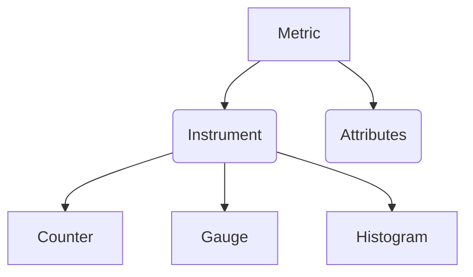
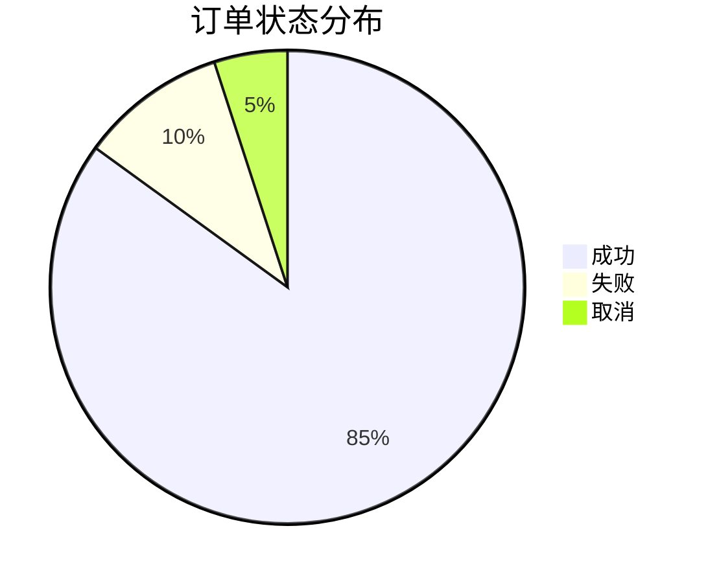

# OpenTelemetry 指标概述

## 介绍

OpenTelemetry指标（Metrics）是用于量化系统行为的数值数据，例如请求速率、错误计数或资源利用率。它们帮助开发者理解系统的**长期趋势**和**实时状态**，是云原生应用中可观测性的三大支柱之一（与日志、追踪并列）。

:::tip 关键特点
- **时间序列数据**：按时间记录的值序列
- **轻量级**：相比追踪，采集开销更低
- **聚合友好**：适合统计分析和告警
:::

## 核心概念

### 1. 指标模型

OpenTelemetry指标由以下基本元素组成：



#### 指标类型
| 类型        | 描述                          | 示例                |
|-------------|-----------------------------|---------------------|
| Counter     | 单调递增的累计值               | 请求总数            |
| Gauge       | 瞬时测量值                    | CPU使用率           |
| Histogram   | 统计分布测量（分桶计数）        | 请求延迟分布        |

### 2. 属性（Attributes）

指标可以附加键值对属性用于分类：
```go
counter.Add(ctx, 1, attribute.String("http.method", "GET"))
```

### 3. 聚合与导出

原始测量值经过聚合后才会导出：
```
原始测量 → 时间窗口聚合 → 导出到后端系统
```

## 代码示例

### Go语言基础使用

```go
package main

import (
    "context"
    "go.opentelemetry.io/otel"
    "go.opentelemetry.io/otel/metric"
)

func main() {
    meter := otel.GetMeterProvider().Meter("myapp")

    // 创建Counter
    requestCounter, _ := meter.Int64Counter(
        "http.requests.total",
        metric.WithDescription("Total HTTP requests"),
    )

    // 记录指标（带属性）
    ctx := context.Background()
    requestCounter.Add(ctx, 1, metric.WithAttributes(
        attribute.String("method", "GET"),
        attribute.Int("status", 200),
    ))
}
```

**输出示例**（在Prometheus中的表现形式）：
```
http_requests_total{method="GET", status="200"} 42
```

## 实际应用场景

### 微服务监控
1. **服务健康度**：记录错误率、请求延迟
2. **资源管理**：监控内存/CPU使用量
3. **业务指标**：跟踪用户注册数、支付成功率

:::note 电商系统案例

:::

## 总结

OpenTelemetry指标提供了：
- 标准化的指标采集方式
- 多语言SDK支持
- 与主流监控后端的集成能力

## 扩展学习

### 推荐练习
1. 在示例代码中添加Gauge测量内存使用量
2. 配置指标导出到Prometheus
3. 创建基于指标的告警规则

### 进阶主题
- 指标视图（Views）配置
- 自动检测（Auto-instrumentation）
- 与追踪数据的关联

:::caution 注意
生产环境中应考虑：
- 指标基数问题（避免高维度属性）
- 采样策略
- 长期存储成本
:::