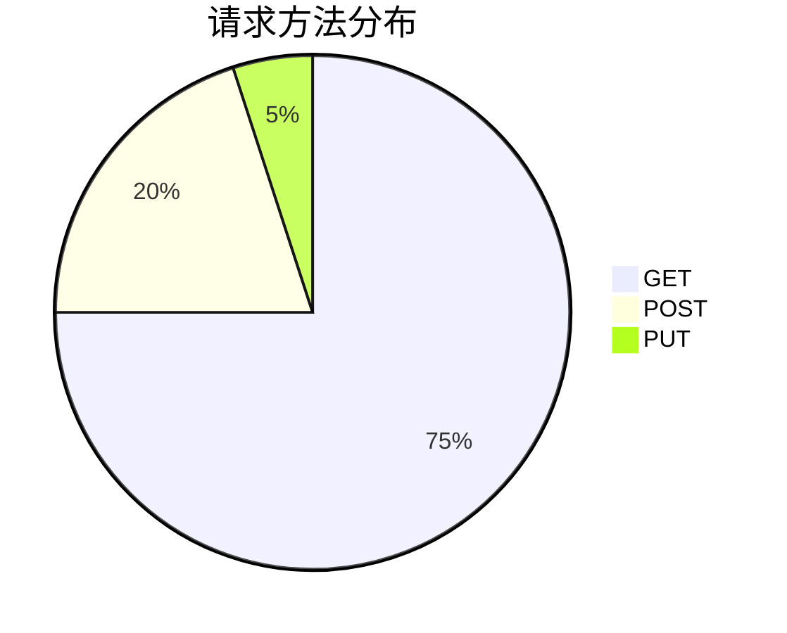

# OpenTelemetry 计数器

## 介绍

OpenTelemetry计数器（Counter）是一种**单调递增的指标类型**，用于记录系统中只能增加不能减少的数值。它常用于统计请求次数、错误发生次数或任务完成次数等场景。计数器是OpenTelemetry指标API中最基础的组件之一，适合初学者理解指标监控的核心概念。

:::tip 关键特性
- 值只能增加（或保持不变），不能减少
- 适合统计累积事件（如总请求数）
- 支持标签（Attributes）进行多维分析
:::

## 基本用法

### 创建计数器

首先需要创建`MeterProvider`和`Meter`实例，然后定义计数器：

```javascript
const { MeterProvider } = require('@opentelemetry/metrics');
const meter = new MeterProvider().getMeter('my-service-meter');

// 创建计数器
const requestCounter = meter.createCounter('requests.total', {
  description: '统计总请求次数'
});
```

### 记录数值

计数器通过`add()`方法递增数值：

```javascript
// 每次请求时增加计数器
app.get('/api', (req, res) => {
  requestCounter.add(1, { route: '/api', method: 'GET' });
  res.send('OK');
});
```

### 带标签的计数

可以通过Attributes（标签）实现多维分析：

```javascript
function processOrder(userType) {
  // 记录不同类型的用户订单
  requestCounter.add(1, { user_type: userType, operation: 'create_order' });
}
```

## 实际案例

### Web服务器请求监控

```javascript
const http = require('http');
const { MeterProvider } = require('@opentelemetry/metrics');

const meter = new MeterProvider().getMeter('web-server');
const requestCounter = meter.createCounter('http.requests.total');

const server = http.createServer((req, res) => {
  // 记录请求
  requestCounter.add(1, {
    method: req.method,
    path: req.url,
    status: res.statusCode
  });
  
  res.end('Hello World');
});

server.listen(8080);
```

### 输出示例

收集的指标数据可能呈现为：

```plaintext
http.requests.total{method="GET",path="/",status=200} 42
http.requests.total{method="POST",path="/submit",status=201} 15
```

## 可视化分析



## 高级主题

### 避免计数器滥用

:::caution 注意事项
1. 不要用计数器记录可能减少的值（如当前内存使用量）
2. 避免创建过多唯一标签组合（可能导致基数爆炸）
3. 优先使用有明确业务含义的命名（如`login.attempts`而非`counter1`）
:::

### 与Views结合

通过定义Views可以聚合或过滤计数器数据：

```javascript
const { View, Aggregation } = require('@opentelemetry/metrics');

meter.addView(
  new View({
    instrumentName: 'requests.total',
    aggregation: new Aggregation.Sum()
  })
);
```

## 总结

OpenTelemetry计数器是监控系统中**累积指标**的理想选择。通过本指南，您已经学会了：

✓ 计数器的基本特性和适用场景<br />
✓ 如何创建和递增计数器<br />
✓ 使用标签实现多维分析<br />
✓ 实际应用案例和最佳实践

## 延伸学习

- 尝试在您的项目中实现请求计数器
- 探索OpenTelemetry的[异步计数器](https://opentelemetry.io/docs/concepts/instrumentation/)概念
- 学习如何将计数器数据导出到Prometheus或Jaeger

:::note 练习建议
1. 创建一个记录用户登录次数的计数器
2. 为不同登录方式（邮箱/手机号）添加标签区分
3. 实现简单的指标导出功能
:::