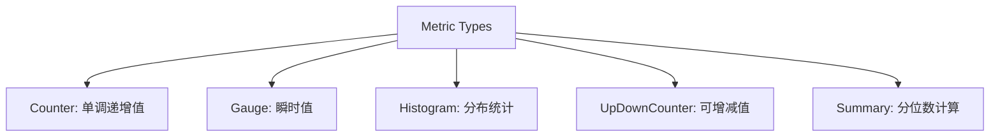
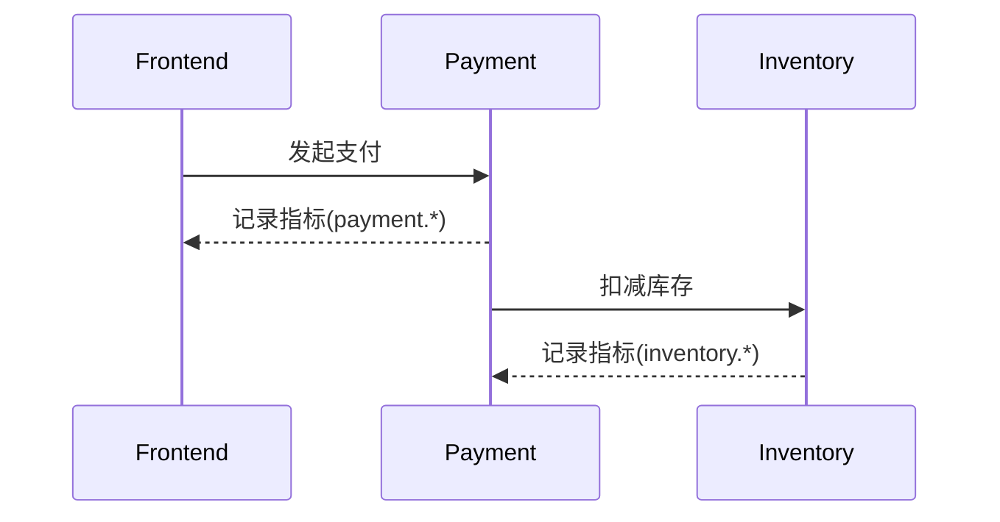

## 介绍

OpenTelemetry指标（Metrics）是分布式系统中用于量化系统行为的关键数据，例如请求速率、错误率或资源利用率。**指标标准化**是指通过统一的命名、单位和语义约定，确保不同团队和工具收集的指标能够无缝集成与分析。OpenTelemetry通过规范化的指标模型和SDK实现跨语言、跨平台的一致性。

## 为什么需要指标标准化？

在没有标准化的环境中，不同服务可能使用不同的名称记录相同指标（如 `http_requests_total` vs `http.request.count`），导致：
1. 数据聚合困难
2. 仪表盘配置复杂化
3. 跨团队协作障碍

OpenTelemetry的标准化方案解决了这些问题。

## 核心标准化要素

### 1. 指标命名规范
OpenTelemetry采用**三段式命名法**：
```
<namespace>.<instrument_name>.<unit>
```
- `namespace`（可选）：防止命名冲突（如公司名）
- `instrument_name`：描述测量对象（如 `http.request.duration`）
- `unit`：明确单位（如 `ms`, `bytes`）

:::note 示例
`service.http.request.duration.ms` 比模糊的 `latency` 更清晰
:::

### 2. 指标类型标准化
OpenTelemetry定义五种核心类型：



### 3. 属性（Attributes）规范
属性是键值对形式的元数据，用于细分指标。例如：
```go
counter.Add(ctx, 1, attribute.String("http.method", "GET"))
```
应避免高基数属性（如用户ID），防止存储爆炸。

## 代码示例

### Go SDK 实现
```go
import (
    "go.opentelemetry.io/otel/metric"
    "go.opentelemetry.io/otel/attribute"
)

func setupMetrics() {
    meter := global.Meter("service.name")

    // 标准化计数器
    requestCounter, _ := meter.Int64Counter(
        "http.server.requests.count",
        metric.WithDescription("Total HTTP requests"),
        metric.WithUnit("1"), // 无单位
    )

    // 记录指标（带属性）
    attrs := []attribute.KeyValue{
        attribute.String("http.method", "POST"),
        attribute.Int("http.status_code", 200),
    }
    requestCounter.Add(ctx, 1, attrs...)
}
```

### 输出示例
标准化后的指标在Prometheus中呈现为：
```
http_server_requests_count_total{http_method="POST", http_status_code="200"} 1
```

## 实际应用场景

### 场景：微服务链路监控
假设电商系统需要监控订单流程：
1. **支付服务**记录 `payment.process.duration.ms`
2. **库存服务**记录 `inventory.checkout.count`
3. 通过统一的属性 `order_id` 和 `user_type` 关联分析



## 总结

OpenTelemetry指标标准化的关键优势：
- **跨语言一致性**：Java/Python/Go等SDK遵循相同规范
- **工具兼容性**：适配Prometheus、Grafana等主流工具
- **协作效率**：减少命名歧义，提升团队协作效率

## 延伸学习

1. **官方文档**：[OpenTelemetry Metrics Specification](https://opentelemetry.io/docs/specs/otel/metrics/)
2. **实践练习**：
   - 在本地环境部署OpenTelemetry Collector
   - 尝试将现有服务的自定义指标转换为标准化格式
3. **进阶话题**：
   - 指标聚合策略
   - 与日志（Logs）、追踪（Traces）的关联