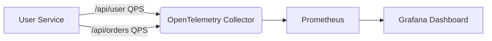

# OpenTelemetry 指标QPS计算

## 介绍
QPS（Queries Per Second，每秒查询数）是衡量系统吞吐量的关键指标之一。在分布式系统中，通过OpenTelemetry收集和计算QPS指标，可以帮助开发者监控服务性能、识别瓶颈并进行容量规划。本文将介绍如何在OpenTelemetry中实现QPS计算，包括基础概念、代码示例和实际案例。

---

## 基础概念
### 1. 什么是QPS？
QPS表示系统在1秒内处理的请求数量，通常用于评估服务的负载能力。例如，一个API服务的QPS为100，表示该服务每秒能处理100次请求。

### 2. OpenTelemetry指标模型
OpenTelemetry提供了以下核心组件用于指标计算：
- **MeterProvider**：创建和管理`Meter`实例。
- **Meter**：用于创建指标（如计数器、直方图）。
- **Counter**：一种累加型指标，适合记录QPS。

:::tip
QPS通常通过计数器（Counter）实现，定期（如每秒）统计增量值。
:::

---

## 代码实现
### 步骤1：初始化OpenTelemetry指标
以下示例使用Python SDK创建一个计数器并记录QPS：

```python
from opentelemetry import metrics
from opentelemetry.sdk.metrics import MeterProvider
from opentelemetry.sdk.metrics.export import ConsoleMetricExporter, PeriodicExportingMetricReader

# 初始化MeterProvider
metric_reader = PeriodicExportingMetricReader(ConsoleMetricExporter(), export_interval_millis=1000)
provider = MeterProvider(metric_readers=[metric_reader])
metrics.set_meter_provider(provider)

# 创建Meter和Counter
meter = metrics.get_meter("qps.demo")
request_counter = meter.create_counter(
    name="http_requests_total",
    description="Total number of HTTP requests",
    unit="1",
)
```

### 步骤2：记录请求
在每次请求处理时调用计数器：

```python
# 模拟请求处理
def handle_request():
    request_counter.add(1, attributes={"endpoint": "/api/user"})

# 模拟5次请求
for _ in range(5):
    handle_request()
```

### 输出示例
控制台输出的指标数据可能如下：
```
{
  "name": "http_requests_total",
  "description": "Total number of HTTP requests",
  "unit": "1",
  "data": {
    "data_points": [{"value": 5, "attributes": {"endpoint": "/api/user"}}]
  }
}
```

:::note
实际场景中需结合时间窗口计算QPS（如1秒内的增量值）。
:::

---

## 实际案例
### 场景：监控API服务的QPS
假设有一个用户服务，需要监控`/api/user`和`/api/orders`两个接口的QPS：

```python
# 分别创建两个计数器
user_counter = meter.create_counter("user_requests")
order_counter = meter.create_counter("order_requests")

# 记录请求
def handle_user_request():
    user_counter.add(1)

def handle_order_request():
    order_counter.add(1)
```

通过Prometheus或Grafana等工具可视化数据，可以观察到：
- 每秒钟各接口的请求量。
- 流量突增或异常情况。



---

## 总结
1. QPS是衡量服务吞吐量的重要指标。
2. OpenTelemetry通过计数器和定期导出实现QPS计算。
3. 实际应用中需结合属性（如端点名称）细分监控维度。

### 扩展练习
1. 尝试使用直方图（Histogram）统计请求延迟分布。
2. 将数据导出到Prometheus并在Grafana中创建QPS仪表盘。

### 附加资源
- [OpenTelemetry官方文档](https://opentelemetry.io/docs/)
- [Prometheus指标类型](https://prometheus.io/docs/concepts/metric_types/)