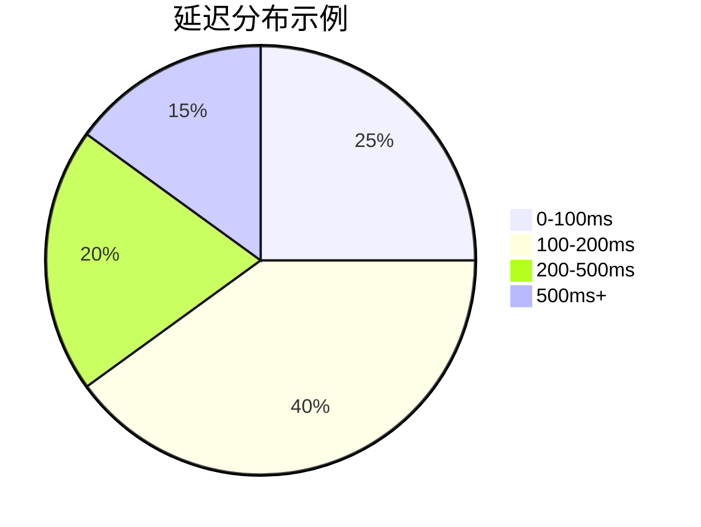

# OpenTelemetry 指标延迟计算

## 介绍

在分布式系统中，**延迟**（Latency）是衡量系统性能的关键指标之一。它表示从请求发出到收到响应所花费的时间。OpenTelemetry提供了强大的工具来收集、分析和可视化延迟指标，帮助开发者优化系统性能。

本文将介绍：
- 延迟的基本概念
- 如何使用OpenTelemetry SDK记录延迟
- 实际应用案例
- 如何解读延迟数据

## 什么是延迟？

延迟是指从客户端发起请求到接收到响应之间的时间差。在OpenTelemetry中，延迟通常以**直方图**（Histogram）形式记录，因为：
1. 可以计算平均值、百分位数（如P90、P99）
2. 能反映请求时间的分布情况
3. 适合监控SLA（服务等级协议）

## 基础代码示例

以下是一个使用OpenTelemetry JavaScript SDK记录HTTP请求延迟的示例：

```javascript
const { MeterProvider, Histogram } = require('@opentelemetry/metrics');
const meter = new MeterProvider().getMeter('latency-demo');

// 创建一个直方图指标，单位是毫秒
const latencyHistogram = meter.createHistogram('http.server.duration', {
  description: 'HTTP请求处理时间',
  unit: 'ms',
  boundaries: [0, 100, 200, 500, 1000, 2000] // 自定义桶边界
});

// 模拟记录HTTP请求延迟
function recordRequestLatency(method, path, latencyMs) {
  latencyHistogram.record(latencyMs, {
    'http.method': method,
    'http.route': path
  });
}

// 示例：记录一个GET请求耗时150ms
recordRequestLatency('GET', '/api/users', 150);
```

**输出结果**可能类似（在Prometheus中）：
```
http_server_duration_bucket{http_method="GET",http_route="/api/users",le="200"} 1
http_server_duration_sum{http_method="GET",http_route="/api/users"} 150
http_server_duration_count{http_method="GET",http_route="/api/users"} 1
```

## 关键概念详解

### 1. 直方图桶（Buckets）

OpenTelemetry使用直方图记录延迟时，数据会被分配到预定义的"桶"中。例如：
- 请求耗时95ms → 落入0-100ms桶
- 请求耗时150ms → 落入100-200ms桶



### 2. 属性（Attributes）

可以为延迟指标添加维度信息，便于筛选和分析：
```javascript
latencyHistogram.record(latency, {
  'http.method': 'POST',
  'http.status_code': '200',
  'service.name': 'user-service'
});
```

### 3. 百分位数计算

监控系统（如Prometheus）可以基于直方图数据计算：
- P50（中位数）
- P90（90%请求快于此值）
- P99（99%请求快于此值）

:::tip 最佳实践
建议始终监控P99延迟，因为它能揭示长尾问题（少量但非常慢的请求）。
:::

## 实际应用案例

### 案例：电商网站下单流程

假设我们需要监控下单API的延迟：

1. **定义指标**：
```javascript
const orderLatency = meter.createHistogram('order.process.duration', {
  description: '订单处理总时间',
  unit: 'ms'
});
```

2. **记录关键阶段**：
```javascript
// 开始计时
const startTime = Date.now();

// 模拟下单处理
await processPayment();
await updateInventory();
await sendConfirmationEmail();

// 记录总耗时
orderLatency.record(Date.now() - startTime, {
  'order.type': 'guest_checkout'
});
```

3. **分析结果**：
- 发现P99延迟高达2秒
- 进一步分解发现`sendConfirmationEmail`占用了80%时间
- 优化方案：将邮件发送改为异步处理

## 总结

通过OpenTelemetry监控延迟指标，你可以：
- 识别性能瓶颈
- 验证优化效果
- 确保符合SLA要求
- 比较不同版本/环境的性能差异

## 延伸学习

1. **练习建议**：
   - 在现有项目中添加延迟监控
   - 比较开发环境与生产环境的延迟差异
   - 尝试设置基于延迟的告警（如P99 > 1s时触发）

2. **进一步阅读**：
   - OpenTelemetry官方文档的[Metrics概念](https://opentelemetry.io/docs/concepts/metrics/)
   - 《分布式系统观测》中的延迟监控章节
   - Prometheus直方图与百分位数计算原理

:::caution 注意
延迟监控会产生少量性能开销，在生产环境中应合理配置采样率。
:::