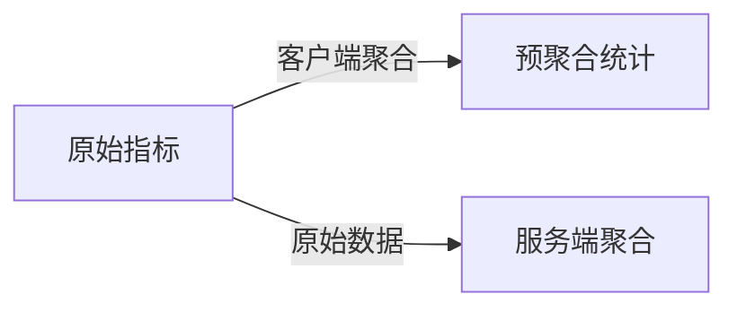

## 介绍

OpenTelemetry指标（Metrics）是监控现代分布式系统的核心工具之一，它通过数值测量（如请求数、延迟、错误率）帮助开发者理解系统行为。与日志和追踪不同，指标专注于**可聚合的时序数据**，适合长期趋势分析和告警。

:::tip 关键概念
- **指标类型**：计数器（Counter）、测量值（Gauge）、直方图（Histogram）等。
- **属性（Attributes）**：为指标添加维度（如HTTP状态码、服务名称）。
:::

---

## 1. 指标命名规范

遵循一致的命名规则可避免后续分析混乱：

### 最佳实践
- 使用`.`分隔的层级结构（如 `http.server.duration`）。
- 后缀标明单位（`_ms`、`_bytes`）。
- 避免动态属性值（如用户ID）作为指标名。

```python
# 错误示例（动态名称难以聚合）
counter = meter.create_counter("request." + user_id)

# 正确示例（使用属性区分）
counter = meter.create_counter("http.requests", description="Total HTTP requests")
counter.add(1, attributes={"user_id": user_id})
```

---

## 2. 合理使用属性

属性（Attributes）为指标提供上下文，但滥用会导致存储压力：

### 推荐策略
- **限制基数**：避免高基数属性（如IP地址）。
- **预定义常用维度**：如 `region`、`service.version`。

```go
// 高基数反例（导致指标爆炸）
histogram.Record(ctx, latency, attribute.String("user_email", email))

// 优化方案（使用低基数属性）
histogram.Record(ctx, latency, attribute.String("user_tier", "premium"))
```

---

## 3. 选择适当的聚合

OpenTelemetry支持客户端和服务端聚合，根据需求选择：



- **客户端聚合**：减少传输数据量（如Histogram的桶统计）。
- **服务端聚合**：保留原始数据供灵活分析。

---

## 4. 实际案例：监控Web服务

假设有一个API服务，需要监控请求延迟和错误：

```python
from opentelemetry import metrics
meter = metrics.get_meter("shop.api")

# 定义指标
request_latency = meter.create_histogram(
    "http.server.duration_ms",
    unit="ms",
    description="Request latency in milliseconds"
)

# 在请求处理中记录
def handle_request(request):
    start_time = time.time()
    try:
        process_request(request)
    except Exception:
        request_counter.add(1, {"status": "fail"})
    finally:
        latency = (time.time() - start_time) * 1000
        request_latency.record(latency, {"route": request.path})
```

:::note 输出示例
在Prometheus中查询：
```
http_server_duration_ms_sum{route="/checkout"} 4520
http_server_duration_ms_count{route="/checkout"} 23
```
:::

---

## 5. 避免常见陷阱

- **过度采集**：非关键指标浪费资源。
- **忽略指标过期**：定期清理无用指标。
- **缺少文档**：为每个指标添加描述字段。

:::warning
不要在生产环境启用Debug级别的指标（如每请求的详细日志），这可能导致性能问题。
:::

---

## 总结

OpenTelemetry指标的最佳实践包括：
1. 采用清晰的命名规范
2. 谨慎使用属性控制基数
3. 根据场景选择聚合策略
4. 结合业务设计监控指标

**扩展练习**：
- 为你的项目添加一个计数器，统计数据库查询次数。
- 使用Gauge类型监控内存使用情况。

**延伸阅读**：
- [OpenTelemetry官方指标文档](https://opentelemetry.io/docs/concepts/signals/metrics/)
- 《Monitoring Distributed Systems》Chapter 4