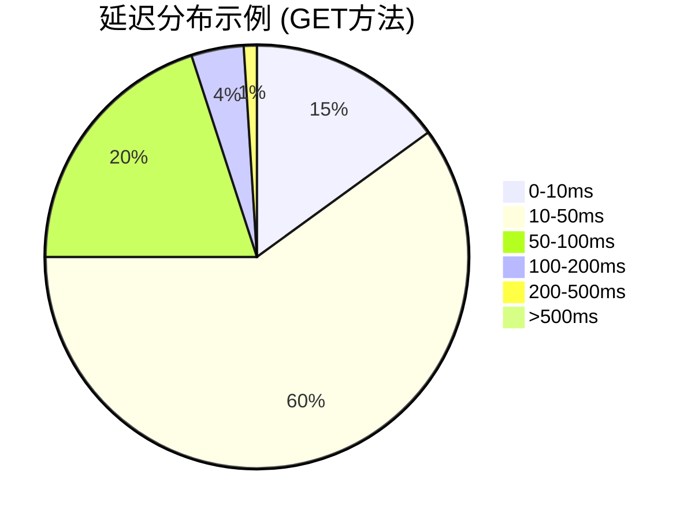

# OpenTelemetry 直方图

## 介绍

OpenTelemetry直方图（Histogram）是一种**聚合指标类型**，用于记录数值型数据的分布情况。它通过将数据划分为多个区间（称为"桶"或"buckets"），统计每个区间内数据点的数量，从而帮助开发者分析数据的分布特征（如延迟、响应大小等）。

与简单的计数器或计量器不同，直方图能回答以下问题：
- 多少请求的延迟在100ms以内？
- 数据大小的75分位数是多少？
- 是否存在异常的高值或低值？

:::tip 适用场景
直方图特别适合分析**延迟分布**、**请求大小**、**资源使用率**等需要统计分位数或百分位的场景。
:::

## 核心概念

### 1. 桶（Buckets）
直方图将数据范围划分为一系列连续的区间。例如，测量HTTP请求延迟时，可以定义以下桶边界（单位：毫秒）：
`[0, 100, 200, 500, 1000, 2000]`

一个延迟为`150ms`的请求会被计入`(100, 200]`这个桶。

### 2. 统计值
直方图自动计算以下衍生指标：
- **总和**（Sum）：所有记录值的总和
- **计数**（Count）：记录值的总数
- **桶计数**（Bucket Counts）：每个区间内的数据点数量

### 3. 分位数计算
通过桶计数可以估算分位数（如P50、P90），但精度取决于桶的边界设计。

## 代码示例

### 创建直方图（Python）
```python
from opentelemetry import metrics
from opentelemetry.sdk.metrics import MeterProvider

# 初始化Meter
provider = MeterProvider()
metrics.set_meter_provider(provider)
meter = metrics.get_meter("histogram.example")

# 定义直方图（桶边界为[0,5,10,25,50,100]）
request_latency = meter.create_histogram(
    name="http.server.duration",
    description="HTTP请求延迟分布",
    unit="ms",
    boundaries=[0, 5, 10, 25, 50, 100]
)

# 记录数据
request_latency.record(3, attributes={"method": "GET"})
request_latency.record(7, attributes={"method": "GET"})
request_latency.record(30, attributes={"method": "POST"})
```

### 输出示例
在Prometheus中，直方图会导出为以下格式的指标：
```
http_server_duration_bucket{le="5",method="GET"} 1
http_server_duration_bucket{le="10",method="GET"} 2
http_server_duration_bucket{le="25",method="GET"} 2
http_server_duration_bucket{le="50",method="GET"} 2
http_server_duration_bucket{le="100",method="GET"} 2
http_server_duration_bucket{le="+Inf",method="GET"} 2
http_server_duration_sum{method="GET"} 10
http_server_duration_count{method="GET"} 2
```

## 桶边界设计原则

1. **覆盖预期范围**：确保包含最小/最大值（如`+Inf`桶捕获所有高值）
2. **关键阈值**：包含SLA目标值（如`200ms`）
3. **指数增长**：常用对数间隔（如`[1,2,5,10,20,50,...]`）

:::caution 警告
不合理的桶边界会导致：
- 精度不足（桶太少）
- 资源浪费（桶太多）
:::

## 实际案例：API监控

### 场景描述
监控Web API的响应延迟，要求：
- 统计P99延迟
- 区分GET/POST方法
- 设置SLA告警（>500ms）

### 实现方案
```python
api_latency = meter.create_histogram(
    name="api.latency",
    boundaries=[0, 10, 50, 100, 200, 500, 1000],
    unit="ms"
)

# 在请求处理逻辑中记录
start_time = time.time()
# ... 处理请求 ...
duration = (time.time() - start_time) * 1000
api_latency.record(duration, attributes={"method": request.method})
```

### 可视化分析
通过以下PromQL计算P99延迟：
```
histogram_quantile(0.99, sum(rate(api_latency_bucket[5m])) by (le))
```



## 总结

OpenTelemetry直方图提供了：
- 数据分布的可视化能力
- 精确的分位数估算
- 灵活的维度划分（通过Attributes）

## 扩展练习

1. 在本地部署Prometheus，尝试查询直方图数据
2. 修改桶边界，观察对分位数计算的影响
3. 对比直方图与摘要（Summary）指标的差异

## 附加资源

- [OpenTelemetry官方文档](https://opentelemetry.io/docs/concepts/signals/metrics/#histogram)
- [Prometheus直方图指南](https://prometheus.io/docs/practices/histograms/)