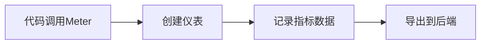

# OpenTelemetry 测量器

## 介绍

OpenTelemetry测量器（`Meter`）是用于生成**指标（Metrics）**的核心工具。它允许开发者定义和记录应用程序的运行时数据（如请求计数、响应时间、错误率等），并通过可视化仪表盘监控系统健康状态。与日志和追踪不同，指标提供的是聚合后的数值数据，适合长期趋势分析。

:::note 关键术语
- **测量器（Meter）**: 创建指标的工具。
- **指标（Metric）**: 数值数据点（如CPU使用率）。
- **仪表（Instrument）**: 具体的测量方式（如计数器、直方图）。
:::

## 测量器的工作原理

1. **创建测量器**：通过OpenTelemetry SDK获取`Meter`实例。
2. **定义仪表**：选择适合的仪表类型（如计数器、测量仪）。
3. **记录数据**：在代码中插入指标记录逻辑。
4. **导出数据**：将数据发送到后端（如Prometheus）。



## 代码示例

### 初始化测量器

```javascript
const { MeterProvider } = require('@opentelemetry/metrics');
const meter = new MeterProvider().getMeter('my-service-meter');

// 定义一个计数器
const requestCounter = meter.createCounter('requests', {
  description: '统计HTTP请求次数',
});
```

### 记录指标

```javascript
// 在HTTP请求处理中递增计数器
app.get('/api', (req, res) => {
  requestCounter.add(1, { route: '/api' });
  res.send('Hello World');
});
```

**输出结果**（在Prometheus中的指标）：
```
requests_total{route="/api"} 42
```

## 常用仪表类型

| 类型            | 用途                          | 示例场景               |
|-----------------|-----------------------------|-----------------------|
| **Counter**     | 只增不减的累计值              | 请求次数、错误计数      |
| **UpDownCounter**| 可增减的累计值                | 并发连接数             |
| **Histogram**   | 记录值的分布（如百分位数）      | 响应时间分布           |
| **Gauge**       | 瞬时值测量                    | CPU使用率             |

## 实际案例：监控Web服务

假设需要监控一个Node.js服务的以下指标：
1. 请求总数
2. 平均响应时间
3. 活跃用户数

```javascript
const meter = new MeterProvider().getMeter('web-service');

// 定义仪表
const requestCount = meter.createCounter('http_requests');
const responseTime = meter.createHistogram('http_response_time');
const activeUsers = meter.createUpDownCounter('active_users');

// 中间件记录指标
app.use((req, res, next) => {
  const start = Date.now();
  requestCount.add(1);
  activeUsers.add(1);

  res.on('finish', () => {
    responseTime.record(Date.now() - start, { status: res.statusCode });
    activeUsers.add(-1);
  });
  next();
});
```

## 总结

- **测量器**是OpenTelemetry指标系统的入口点。
- 通过不同类型的**仪表**（如计数器、直方图）记录数据。
- 指标数据需导出到监控后端（如Prometheus、Datadog）才能可视化。

:::tip 练习
1. 在现有项目中添加一个计数器，统计登录次数。
2. 尝试使用直方图记录API响应时间，并观察P99值。
:::

## 附加资源

- [OpenTelemetry官方文档](https://opentelemetry.io/docs/concepts/metrics/)
- [Prometheus指标类型](https://prometheus.io/docs/concepts/metric_types/)