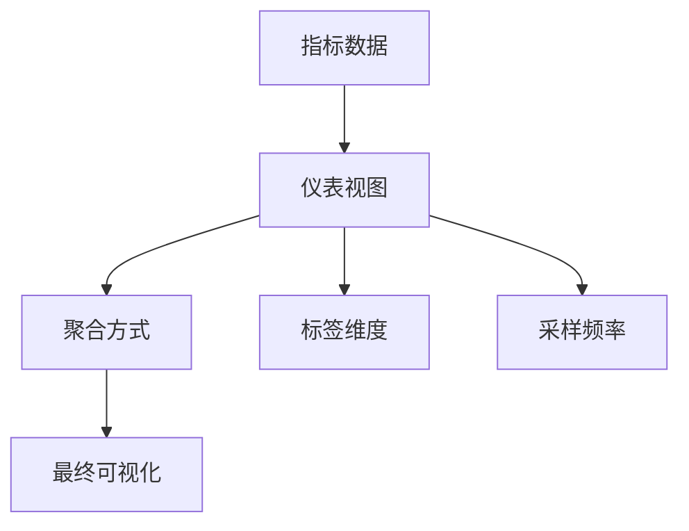

# OpenTelemetry 仪表视图

## 介绍

OpenTelemetry仪表视图（View）是用于定义如何聚合和展示指标数据的配置单元。它决定了原始指标数据如何被处理、分组和最终呈现给开发者或运维人员。仪表视图是连接原始指标数据与可视化界面的桥梁。

:::note 核心概念
- **指标（Metric）**：系统或应用程序的可测量属性（如CPU使用率、请求延迟）
- **聚合（Aggregation）**：将多个数据点合并为有意义的统计值（如平均值、总和）
- **标签（Labels）**：用于分类和过滤指标的维度
:::

## 基本组成

一个仪表视图通常包含以下要素：



## 创建仪表视图

### 基本语法示例

以下是一个创建仪表视图的Go语言示例：

```go
import (
    "go.opentelemetry.io/otel/sdk/metric"
)

view := metric.NewView(
    metric.Instrument{Name: "http.server.duration"},
    metric.Stream{
        Aggregation: metric.AggregationExplicitBucketHistogram{
            Boundaries: []float64{0, 100, 200, 500, 1000},
        },
        AttributeFilter: attribute.NewAllowKeysFilter("http.method", "http.status_code"),
    },
)
```

### 关键参数解释

1. **Instrument**：指定要处理的指标名称
2. **Aggregation**：定义如何聚合数据：
   - `Sum`：计算总和
   - `LastValue`：记录最后一个值
   - `Histogram`：创建直方图分布
3. **AttributeFilter**：控制哪些标签会被保留

## 实际应用案例

### 案例：Web应用监控

假设我们需要监控Web应用的请求延迟：

```python
# Python示例
from opentelemetry import metrics
from opentelemetry.sdk.metrics import MeterProvider, View

provider = MeterProvider(
    metric_readers=[...],
    views=[
        View(
            instrument_name="http.server.duration",
            aggregation=HistogramAggregation(),
            attribute_keys=["http.method", "http.status_code"]
        )
    ]
)
```

此配置将：
1. 收集HTTP服务器延迟指标
2. 按HTTP方法和状态码分组
3. 使用直方图展示延迟分布

## 视图匹配规则

OpenTelemetry使用以下规则匹配指标到视图：

1. **名称匹配**：首先检查仪器名称
2. **类型匹配**：验证仪器类型（计数器、直方图等）
3. **标签过滤**：应用指定的标签过滤器

:::tip 最佳实践
- 为关键业务指标创建专用视图
- 避免过度聚合导致数据细节丢失
- 使用有意义的标签维度（如地域、服务版本）
:::

## 高级配置

### 自定义聚合边界

```go
// 定义自定义直方图桶边界
view := metric.NewView(
    metric.Instrument{Name: "api.latency"},
    metric.Stream{
        Aggregation: metric.AggregationExplicitBucketHistogram{
            Boundaries: []float64{50, 100, 200, 500, 1000, 2000},
        },
    },
)
```

### 多视图配置

```java
// Java示例
SdkMeterProvider meterProvider = SdkMeterProvider.builder()
    .registerView(
        InstrumentSelector.builder()
            .setName("http.server.requests")
            .build(),
        View.builder()
            .setAggregation(Aggregation.explicitBucketHistogram(
                Arrays.asList(0.0, 50.0, 100.0, 200.0)))
            .build())
    .build();
```

## 总结

OpenTelemetry仪表视图是监控系统的重要组成部分，它允许你：

- 控制指标的聚合方式
- 决定哪些标签维度应该保留
- 优化数据收集和存储效率
- 为可视化准备数据

## 延伸学习

1. **实践练习**：
   - 为你的应用创建一个延迟监控视图
   - 实验不同的聚合方式（求和 vs 平均值）
   - 添加/移除标签观察数据变化

2. **推荐资源**：
   - OpenTelemetry官方文档中的Metrics规范
   - Prometheus的指标类型和聚合概念
   - 分布式系统监控最佳实践

:::warning 注意
仪表视图配置错误可能导致数据丢失或不准确，建议在生产环境部署前充分测试
:::