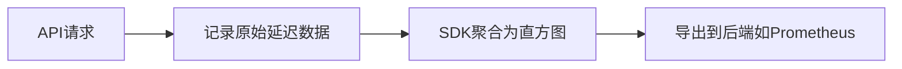

# OpenTelemetry 指标聚合

## 介绍

OpenTelemetry（简称OTel）是一个开源的观测性框架，用于生成、收集和管理遥测数据（如指标、日志和跟踪）。**指标聚合**是OpenTelemetry指标系统中的核心概念，它通过将原始测量数据合并为有意义的统计信息（如平均值、总和或分位数），帮助开发者理解系统的行为。

## 为什么需要指标聚合？

原始指标数据（如HTTP请求延迟）通常是高频且细粒度的。直接存储这些数据会占用大量资源，而聚合可以：
- **降低存储成本**：合并数据点减少存储量。
- **提高查询效率**：预计算统计值（如P99延迟）加速分析。
- **简化可视化**：聚合后的数据更适合展示趋势。

## 聚合类型

OpenTelemetry支持以下常见聚合方式：

1. **Sum**：累加所有值（如总请求数）。
2. **Last Value**：仅保留最新值（如当前内存使用量）。
3. **Histogram**：将值分桶统计（如延迟分布）。
4. **Explicit Bucket Histogram**：自定义分桶边界。

## 代码示例

以下是一个使用OpenTelemetry SDK创建并聚合指标的Python示例：

```python
from opentelemetry import metrics
from opentelemetry.sdk.metrics import MeterProvider
from opentelemetry.sdk.metrics.export import ConsoleMetricExporter, PeriodicExportingMetricReader

# 初始化指标提供者
provider = MeterProvider(metric_readers=[
    PeriodicExportingMetricReader(ConsoleMetricExporter())
])
metrics.set_meter_provider(provider)

# 创建仪表和计数器
meter = metrics.get_meter("example.meter")
request_counter = meter.create_counter(
    "http.requests",
    description="Total HTTP requests"
)

# 模拟记录指标
request_counter.add(1, {"method": "GET", "status": "200"})
request_counter.add(3, {"method": "POST", "status": "200"})
```

**输出示例**（控制台）：
```
{
  "name": "http.requests",
  "description": "Total HTTP requests",
  "data": {
    "data_points": [
      {"attributes": {"method": "GET", "status": "200"}, "value": 1},
      {"attributes": {"method": "POST", "status": "200"}, "value": 4}
    ]
  }
}
```

:::note
聚合行为由SDK自动处理。例如，`Sum`聚合器会将相同标签（如`method=GET`）的值累加。
:::

## 实际案例：监控API延迟

假设我们需要监控一个API的延迟分布：



1. **定义直方图指标**：
```python
latency_histogram = meter.create_histogram(
    "http.latency",
    unit="ms",
    description="API latency distribution"
)
```

2. **记录延迟值**：
```python
latency_histogram.record(150, {"endpoint": "/users"})
latency_histogram.record(320, {"endpoint": "/users"})
```

3. **聚合结果**（假设分桶边界为`[0, 100, 200, 500]`）：
```
Bucket counts:
  [0-100ms]: 0
  [100-200ms]: 1
  [200-500ms]: 1
```

## 总结

- 指标聚合是OpenTelemetry中优化数据存储和分析的关键机制。
- 根据场景选择合适的聚合类型（如`Sum`用于计数，`Histogram`用于分布）。
- SDK自动处理聚合逻辑，开发者只需关注记录原始数据。

## 延伸学习

1. **练习**：尝试创建一个`Last Value`指标，模拟监控系统CPU使用率。
2. **资源**：
   - [OpenTelemetry官方文档](https://opentelemetry.io/docs/)
   - [Prometheus直方图与摘要](https://prometheus.io/docs/practices/histograms/)