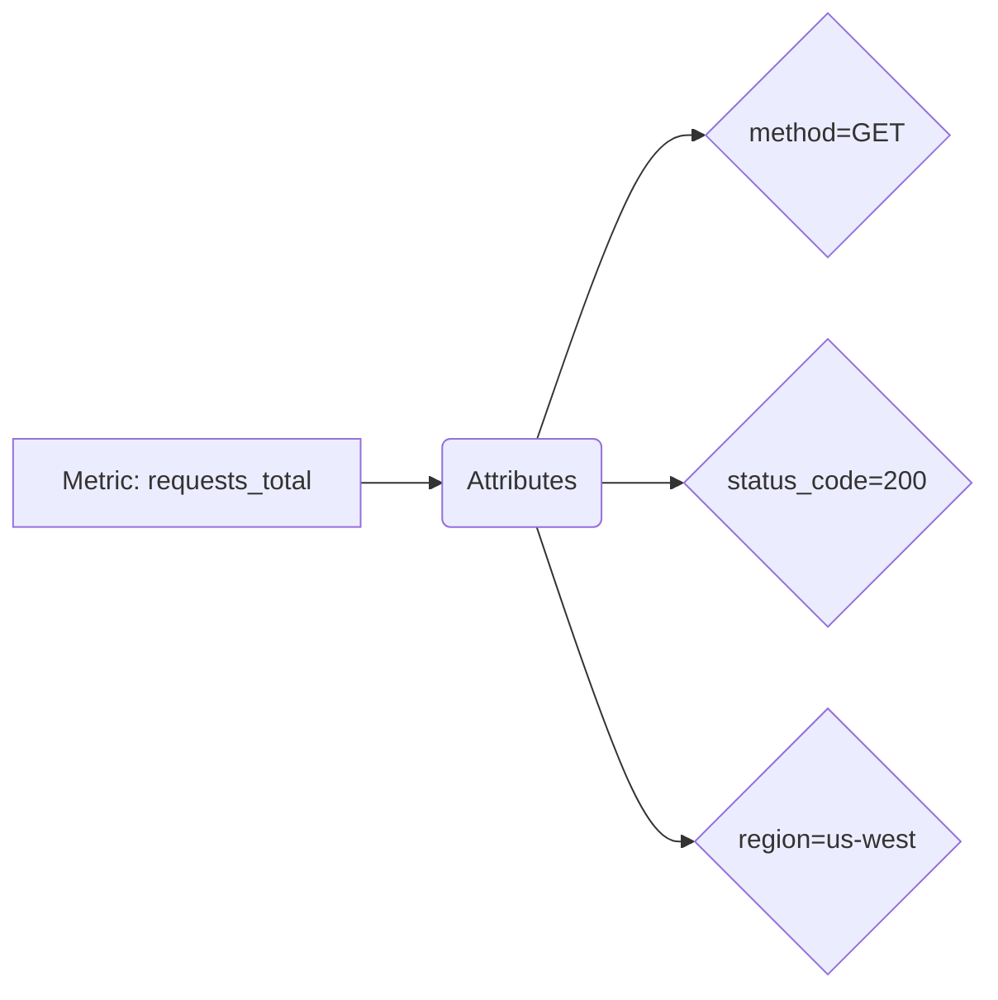

# OpenTelemetry 多维指标

## 介绍

OpenTelemetry中的**多维指标**（Multi-dimensional Metrics）是指通过附加**属性（Attributes）**来丰富基础指标的监控数据。这些属性以键值对的形式存在，允许开发者从多个维度（如环境、服务版本、用户类型等）对指标进行切片和聚合分析。例如，一个简单的请求计数指标可以扩展为按`HTTP方法`、`响应状态码`和`地域`细分的多维数据。

:::tip 为什么需要多维指标？
传统单一维度的指标（如`requests_total=100`）无法回答复杂问题，例如“哪些地区的用户遇到了最多的500错误？”多维指标通过附加上下文解决了这一问题。
:::

## 核心概念

### 1. 指标与属性的关系
- **指标（Metric）**：基础测量值（如CPU使用率、请求延迟）。
- **属性（Attributes）**：描述指标的上下文信息（如`method="GET"`, `status_code="200"`）。



### 2. 属性键值对规则
- 键（Key）：字符串类型，推荐使用蛇形命名（如`http.method`）。
- 值（Value）：字符串、数字、布尔值等基本类型。

## 代码示例

### 使用OpenTelemetry SDK记录多维指标
以下是一个Python示例，展示如何记录带有属性的计数器指标：

```python
from opentelemetry import metrics
from opentelemetry.sdk.metrics import MeterProvider

# 初始化Meter
provider = MeterProvider()
metrics.set_meter_provider(provider)
meter = metrics.get_meter("my.service")

# 创建带属性的计数器
request_counter = meter.create_counter(
    name="requests_total",
    description="Total HTTP requests"
)

# 记录指标（添加属性）
request_counter.add(1, {"http.method": "GET", "status_code": 200, "user_type": "premium"})
request_counter.add(1, {"http.method": "POST", "status_code": 500, "user_type": "guest"})
```

**输出结果示例**（在Prometheus中的表现）：
```
requests_total{http_method="GET", status_code="200", user_type="premium"} 1
requests_total{http_method="POST", status_code="500", user_type="guest"} 1
```

## 实际应用场景

### 案例：电商平台监控
假设你需要监控一个商品搜索服务的性能：

1. **基础指标**：`search_latency_ms`（搜索延迟）
2. **关键属性**：
   - `search_type`：`"keyword"`或`"category"`
   - `result_count`：返回的商品数量范围（`"0"`, `"1-10"`, `"10+"`）
   - `user_tier`：用户等级（`"free"`, `"vip"`）

```python
search_latency = meter.create_histogram(
    name="search_latency_ms",
    unit="ms",
    description="Search response time distribution"
)

# 记录延迟数据
search_latency.record(120, {
    "search_type": "keyword",
    "result_count": "10+",
    "user_tier": "vip"
})
```

:::caution 属性基数问题
避免使用高基数（高唯一性）属性值（如用户ID），这可能导致监控系统过载。建议将连续值分桶（如将延迟分为`0-100ms`、`100-500ms`等）。
:::

## 总结

- 多维指标通过属性提供丰富的监控上下文。
- 合理设计属性维度可以显著提升故障排查效率。
- 实际编码时需注意SDK的语言特定实现（Python/Java/Go等）。

## 延伸练习

1. 尝试在本地环境中创建一个记录HTTP请求大小（`request_size_bytes`）的指标，并添加`method`和`endpoint`属性。
2. 思考：如果你需要监控数据库查询性能，会选择哪些关键属性？

## 附加资源

- [OpenTelemetry官方指标文档](https://opentelemetry.io/docs/concepts/signals/metrics/)
- 推荐工具：使用Grafana或Prometheus可视化多维指标数据。