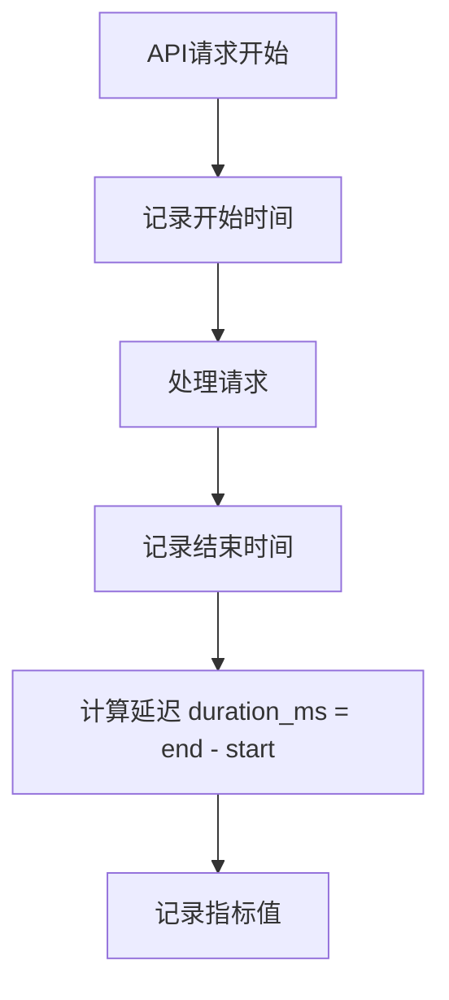

## 介绍

在OpenTelemetry中，**指标单位（Metric Units）**是描述测量值物理含义的重要元数据。它们帮助开发者明确指标的类型（如时间、长度、吞吐量等），并确保数据在可视化或分析时保持一致性和可读性。本文将详细介绍OpenTelemetry支持的单位类型、如何为指标指定单位，以及实际应用中的注意事项。

:::note
单位是可选但推荐的元数据。即使不指定单位，指标仍能正常工作，但明确的单位能提升数据的可解释性。
:::

---

## 单位的基本规则

OpenTelemetry遵循[UCUM（统一计量单位代码）标准](https://ucum.org/)，以下是核心规则：

1. **区分大小写**：`ms`（毫秒）和`Ms`（兆秒）完全不同。
2. **无复数形式**：使用`s`（秒）而非`seconds`。
3. **支持组合单位**：用点号连接，如`m.s`（米·秒）。

### 常见单位示例
| 类型       | 单位代码 | 含义          |
|------------|----------|---------------|
| 时间       | `s`      | 秒            |
| 时间       | `ms`     | 毫秒          |
| 大小       | `By`     | 字节          |
| 大小       | `KiBy`   | 千字节（1024）|
| 网络       | `B/s`    | 字节每秒      |

---

## 如何在代码中指定单位

以下示例展示如何在Go和Python中为指标添加单位：

### Go示例
```go
meter := global.Meter("example.com/metrics")
counter, _ := meter.Int64Counter(
    "http.request.duration",
    instrument.WithUnit("ms"), // 指定单位为毫秒
)
counter.Add(ctx, 150, attribute.String("route", "/users"))
```

### Python示例
```python
from opentelemetry import metrics
meter = metrics.get_meter("example.com/metrics")
counter = meter.create_counter(
    "http.request.duration",
    unit="ms",  # 指定单位为毫秒
)
counter.add(150, {"route": "/users"})
```

---

## 实际案例：API监控

假设我们需要监控Web API的以下指标：
1. 请求延迟（单位：毫秒）
2. 响应大小（单位：字节）
3. 请求速率（单位：次/秒）



对应的指标定义如下：
```go
meter := global.Meter("api.metrics")
requestLatency := meter.Float64Histogram(
    "http.request.latency",
    instrument.WithUnit("ms"),
)
responseSize := meter.Int64Histogram(
    "http.response.size",
    instrument.WithUnit("By"),
)
requestRate := meter.Float64Counter(
    "http.request.rate",
    instrument.WithUnit("1/s"),
)
```

:::tip
组合单位中的除号用`/`表示，如`MiBy/s`（兆字节每秒）。避免使用自定义单位如`req`，优先使用标准单位。
:::

---

## 总结

1. **单位的作用**：明确指标含义，避免歧义（如`ms` vs `s`）。
2. **最佳实践**：
   - 始终为指标添加单位
   - 优先使用UCUM标准单位
   - 避免发明新单位
3. **常见错误**：
   - 错误：`seconds` → 正确：`s`
   - 错误：`MB` → 正确：`MiBy`

---

## 延伸学习

1. [UCUM官方文档](https://ucum.org/ucum.html)
2. [OpenTelemetry指标规范](https://opentelemetry.io/docs/specs/otel/metrics/)
3. 练习：为磁盘I/O监控定义指标（读写延迟、吞吐量），并指定合适的单位。