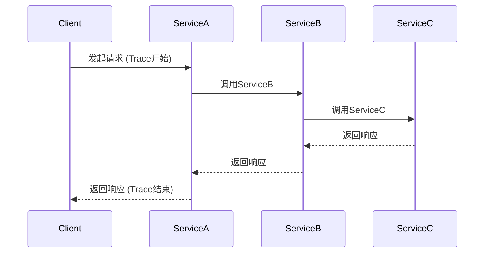

# OpenTelemetry 分布式跟踪概述

## 介绍

在现代分布式系统中，应用程序通常由多个微服务组成，这些微服务可能分布在不同的服务器甚至不同的地理位置。当一个请求从用户端发出时，它可能会经过多个服务的处理。**分布式跟踪**是一种技术，用于记录和可视化请求在系统中的完整路径，帮助开发者理解系统的行为、诊断性能问题以及优化服务间的交互。

**OpenTelemetry**是一个开源的观测性框架，提供了一套工具、API和SDK，用于生成、收集和导出遥测数据（如跟踪、指标和日志）。其中，**分布式跟踪**是OpenTelemetry的核心功能之一。

## 分布式跟踪的基本概念

### 1. 跟踪（Trace）
一个**跟踪**代表了一个完整的请求路径，从开始到结束。例如，用户访问一个电子商务网站时，从点击“购买”按钮到完成订单的整个过程就是一个跟踪。

### 2. 跨度（Span）
一个**跨度**是跟踪中的一个独立单元，代表一个操作或一段代码的执行。例如：
- 调用一个API
- 查询数据库
- 发送消息到消息队列

一个跟踪由多个跨度组成，这些跨度之间可能存在父子关系或兄弟关系。

### 3. 上下文传播（Context Propagation）
为了将多个跨度的信息关联起来，OpenTelemetry使用**上下文传播**机制。当一个请求从一个服务传递到另一个服务时，跟踪的上下文信息（如Trace ID和Span ID）会通过HTTP头或其他协议传递。

## 工作原理

以下是一个简单的分布式跟踪流程：



1. **客户端**发起请求，OpenTelemetry生成一个唯一的`Trace ID`。
2. **ServiceA**接收到请求，创建一个`Span`并记录开始时间。
3. **ServiceA**调用**ServiceB**时，将`Trace ID`和`Span ID`通过HTTP头传递。
4. **ServiceB**和**ServiceC**重复类似的操作。
5. 所有`Span`数据被收集并发送到后端（如Jaeger或Zipkin），用于可视化和分析。

## 代码示例

以下是一个使用OpenTelemetry进行分布式跟踪的简单示例（以Node.js为例）：

### 安装依赖
```bash
npm install @opentelemetry/sdk-trace-base @opentelemetry/api @opentelemetry/sdk-node
```

### 初始化跟踪
```javascript
const { NodeTracerProvider } = require('@opentelemetry/sdk-trace-node');
const { SimpleSpanProcessor } = require('@opentelemetry/sdk-trace-base');
const { ConsoleSpanExporter } = require('@opentelemetry/sdk-trace-base');

// 创建Tracer Provider
const provider = new NodeTracerProvider();

// 将Span输出到控制台（实际项目中通常使用Jaeger或Zipkin）
provider.addSpanProcessor(new SimpleSpanProcessor(new ConsoleSpanExporter()));

// 注册Provider
provider.register();
```

### 创建Span
```javascript
const { trace } = require('@opentelemetry/api');

// 获取Tracer
const tracer = trace.getTracer('my-tracer');

// 创建一个Span
tracer.startActiveSpan('main-operation', (span) => {
    console.log('执行一些操作...');
    span.end(); // 结束Span
});
```

### 输出示例
运行上述代码后，控制台会输出类似以下内容：
```json
{
  "traceId": "abc123",
  "spanId": "def456",
  "name": "main-operation",
  "kind": 0,
  "timestamp": 1620000000000,
  "duration": 100,
  "status": { "code": 0 }
}
```

## 实际应用场景

### 场景1：电子商务系统
假设一个用户下单时，请求会经过以下服务：
1. **订单服务**：创建订单
2. **库存服务**：检查库存
3. **支付服务**：处理支付
4. **物流服务**：安排配送

通过分布式跟踪，可以清晰地看到每个服务的耗时和状态，快速定位问题（如支付服务响应缓慢）。

### 场景2：微服务性能优化
通过分析跟踪数据，可以发现某些服务的调用链过长或存在冗余调用，从而优化服务间的交互逻辑。

## 总结

- **分布式跟踪**是理解和优化分布式系统的关键工具。
- **OpenTelemetry**提供了一套标准化的API和SDK，支持多种语言和后端。
- **Trace**和**Span**是分布式跟踪的核心概念。
- 上下文传播机制确保跨服务的请求能够正确关联。

## 附加资源

1. [OpenTelemetry官方文档](https://opentelemetry.io/docs/)
2. [Jaeger分布式跟踪系统](https://www.jaegertracing.io/)
3. 练习：尝试在本地搭建一个简单的微服务系统，并使用OpenTelemetry跟踪请求流。

:::tip
在实际项目中，建议将跟踪数据导出到专业的后端系统（如Jaeger或Zipkin），而不是控制台，以便更好地可视化和分析。
:::