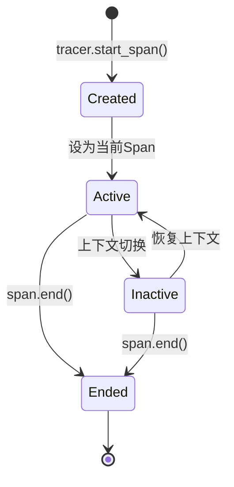

# OpenTelemetry Span生命周期

## 介绍

在分布式系统中，跟踪请求的完整路径是诊断性能问题的关键。OpenTelemetry中的**Span**是分布式跟踪的基本构建块，代表一个独立的工作单元（如HTTP请求或数据库调用）。理解Span的生命周期对于实现有效的跟踪至关重要。

Span生命周期包括以下阶段：
1. **创建**：初始化一个新的Span。
2. **配置**：添加属性、事件或状态。
3. **激活/非激活**（上下文传播）。
4. **结束**：标记Span完成并记录结果。

---

## Span的创建

Span通过**Tracer**创建。以下是一个Python示例：

```python
from opentelemetry import trace

tracer = trace.get_tracer("my.tracer.name")

# 创建Span
with tracer.start_as_current_span("my_span") as span:
    span.set_attribute("http.method", "GET")
    # 在此处执行跟踪的操作...
```

:::note
- `start_as_current_span`会自动将Span设为“当前活跃”状态。
- 使用`with`语句可确保Span在代码块结束时自动关闭。
:::

---

## Span的配置

Span可通过以下方式丰富其信息：

### 1. 属性（Attributes）
键值对，用于描述Span的上下文：
```python
span.set_attribute("user.id", "12345")
```

### 2. 事件（Events）
带时间戳的日志，记录关键时间点：
```python
span.add_event("cache.hit", {"key": "data_123"})
```

### 3. 状态（Status）
标记Span的成功或失败：
```python
from opentelemetry.trace import Status, StatusCode

span.set_status(StatusCode.ERROR, "Database timeout")
```

---

## Span的上下文传播

Span可通过**Context**在代码中传递。例如，在异步操作中手动管理上下文：

```python
from opentelemetry.context import Context

parent_span = tracer.start_span("parent")
ctx = trace.set_span_in_context(parent_span)

# 在另一个函数中恢复上下文
def child_task(ctx):
    with tracer.start_span("child", context=ctx):
        print("Child span executing")
```

---

## Span的结束

Span必须显式结束以记录其持续时间。在以下情况下会自动结束：
- 使用`with`语句（如前面的示例）。
- 调用`.end()`方法：
```python
span = tracer.start_span("manual_span")
try:
    # 执行操作...
    span.set_status(StatusCode.OK)
finally:
    span.end()  # 必须调用！
```

:::caution
未结束的Span会导致内存泄漏和跟踪数据丢失！
:::

---

## 实际案例：跟踪HTTP请求

假设我们需要跟踪一个Flask应用的请求处理：

```python
from flask import Flask
from opentelemetry.instrumentation.flask import FlaskInstrumentor

app = Flask(__name__)
FlaskInstrumentor().instrument_app(app)

@app.route("/")
def home():
    tracer = trace.get_tracer(__name__)
    with tracer.start_as_current_span("home_span") as span:
        span.set_attribute("route", "/")
        return "Hello, World!"
```

当访问`/`时，OpenTelemetry会自动：
1. 创建Span并记录HTTP方法、路径等属性。
2. 在响应返回时结束Span。

---

## 生命周期图示



---

## 总结

- **Span**是OpenTelemetry跟踪的基本单元。
- 生命周期包括创建、配置、上下文传播和结束。
- 始终确保Span被正确结束以避免资源泄漏。
- 通过属性和事件丰富Span以提高可观测性。

## 扩展练习

1. 尝试在FastAPI/Django中手动创建Span。
2. 为一个数据库查询添加自定义属性和事件。
3. 使用`Status`标记一个失败的Span。

## 附加资源

- [OpenTelemetry Python文档](https://opentelemetry.io/docs/instrumentation/python/)
- [Span API规范](https://github.com/open-telemetry/opentelemetry-specification/blob/main/specification/trace/api.md#span)