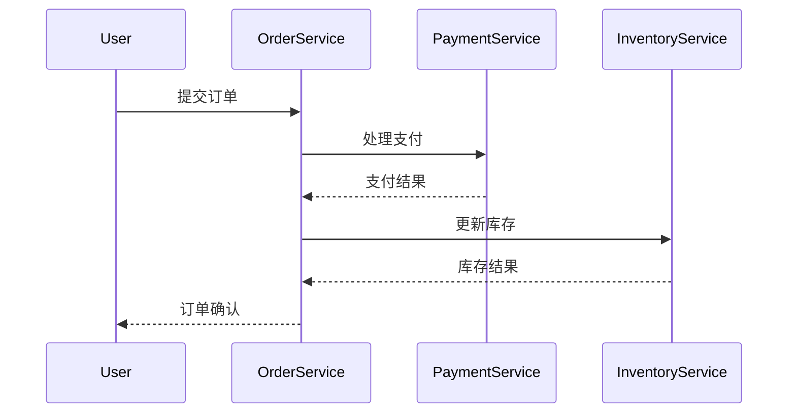

# OpenTelemetry 手动检测

## 介绍

OpenTelemetry是一个开源的观测框架，用于生成、收集和导出遥测数据（指标、日志和跟踪）。手动检测是指开发者主动在代码中添加跟踪逻辑，以获取更精细的应用程序行为洞察。与自动检测相比，手动检测提供了更高的灵活性和控制力。

:::tip 何时选择手动检测？
- 需要跟踪特定业务逻辑
- 自动检测无法覆盖的代码路径
- 需要自定义属性或事件
:::

## 核心概念

### 1. Tracer Provider

Tracer Provider是跟踪系统的入口点，负责创建Tracer实例：

```javascript
const { NodeTracerProvider } = require('@opentelemetry/sdk-trace-node');
const provider = new NodeTracerProvider();
provider.register();
```

### 2. Tracer

Tracer用于创建Span（跟踪的基本单元）：

```javascript
const { trace } = require('@opentelemetry/api');
const tracer = trace.getTracer('my-service-tracer');
```

### 3. Span

Span代表一个操作或工作单元：

```javascript
// 创建顶级Span
const span = tracer.startSpan('main-operation');

try {
  // 业务逻辑...
  span.addEvent('operation-started');
  
  // 创建子Span
  const childSpan = tracer.startSpan('sub-operation', {
    parent: span
  });
  
  // 更多业务逻辑...
  childSpan.end();
} catch (error) {
  span.recordException(error);
  span.setStatus({ code: trace.SpanStatusCode.ERROR });
} finally {
  span.end();
}
```

## 实际案例：电子商务订单处理

让我们看一个订单处理系统的例子：



对应的手动检测代码：

```javascript
async function processOrder(order) {
  // 创建订单处理Span
  const span = tracer.startSpan('process-order', {
    attributes: {
      'order.id': order.id,
      'order.total': order.total
    }
  });

  try {
    // 支付处理
    const paymentSpan = tracer.startSpan('process-payment', { parent: span });
    const paymentResult = await paymentService.process(order.payment);
    paymentSpan.setAttribute('payment.status', paymentResult.status);
    paymentSpan.end();

    // 库存更新
    const inventorySpan = tracer.startSpan('update-inventory', { parent: span });
    const inventoryResult = await inventoryService.update(order.items);
    inventorySpan.setAttribute('inventory.updated', inventoryResult.updated);
    inventorySpan.end();

    span.setStatus({ code: trace.SpanStatusCode.OK });
  } catch (error) {
    span.recordException(error);
    span.setStatus({ code: trace.SpanStatusCode.ERROR });
    throw error;
  } finally {
    span.end();
  }
}
```

## 最佳实践

1. **合理的Span命名**：使用动词-名词格式，如 `process-payment` 而非 `payment`
2. **属性设置**：添加有意义的属性，但避免敏感信息
3. **错误处理**：始终记录异常并设置Span状态
4. **资源清理**：确保在操作完成后调用 `span.end()`

:::caution 性能考虑
过度检测会影响应用性能。建议：
- 避免在高频循环中创建Span
- 对关键路径进行选择性检测
- 监控检测本身的开销
:::

## 总结

手动检测为开发者提供了精确控制跟踪数据的能力，特别适用于：
- 关键业务逻辑的深入监控
- 跨服务边界的复杂操作
- 需要自定义属性的场景

## 延伸学习

1. **练习**：为你的应用程序添加手动检测，跟踪一个核心业务流程
2. **进一步阅读**：
   - OpenTelemetry官方文档中的[手动检测指南](https://opentelemetry.io/docs/)
   - 分布式跟踪模式与最佳实践
3. **工具探索**：尝试使用Jaeger或Zipkin查看生成的跟踪数据

记住，良好的观测性始于合理的检测策略！