# OpenTelemetry 分布式跟踪可视化

## 介绍

在现代分布式系统中，一个用户请求可能涉及多个服务的协作。OpenTelemetry的分布式跟踪功能帮助我们记录请求在系统中的完整路径，而**可视化工具**则将这些复杂的跟踪数据转化为直观的图表和图形。本指南将带你了解如何通过可视化工具（如Jaeger、Zipkin或Grafana）解读跟踪数据。

:::note 关键概念
- **Span**：代表一个操作（如API调用或数据库查询）。
- **Trace**：由多个Span组成的完整请求链路。
- **可视化工具**：将原始跟踪数据转换为交互式图表。
:::

---

## 为什么需要可视化？

原始跟踪数据通常是JSON格式，难以直接分析。例如：
```json
{
  "traceId": "abc123",
  "spans": [
    {"name": "auth-service", "duration": 150},
    {"name": "payment-service", "duration": 450}
  ]
}
```

可视化工具能将其转换为：

```mermaid
gantt
    title 示例请求跟踪
    dateFormat  X
    axisFormat %s
    section 服务调用
    auth-service :a1, 0, 150ms
    payment-service :a2, after a1, 450ms
```


---

## 可视化工具实战

### 1. 使用Jaeger查看跟踪
Jaeger是流行的开源工具，支持OpenTelemetry数据。以下是一个Python示例，生成跟踪并导出到Jaeger：

```python
from opentelemetry import trace
from opentelemetry.exporter.jaeger.thrift import JaegerExporter
from opentelemetry.sdk.trace import TracerProvider
from opentelemetry.sdk.trace.export import BatchSpanProcessor

# 设置Jaeger导出器
trace.set_tracer_provider(TracerProvider())
jaeger_exporter = JaegerExporter(
    agent_host_name="localhost",
    agent_port=6831,
)
trace.get_tracer_provider().add_span_processor(BatchSpanProcessor(jaeger_exporter))

# 创建跟踪
tracer = trace.get_tracer(__name__)
with tracer.start_as_current_span("parent_span"):
    with tracer.start_as_current_span("child_span"):
        print("跟踪数据已发送到Jaeger")
```

在Jaeger UI中，你会看到：
- **服务依赖图**：展示服务间调用关系。
- **时间线视图**：精确显示每个Span的耗时。

:::tip 小技巧
在Jaeger中搜索 `tag=http.status_code=500` 可快速定位失败的请求。
:::

---

### 2. 使用Grafana Tempo
Grafana Tempo是另一种可视化选择，特别适合与指标和日志关联分析。配置示例：

```yaml
# OpenTelemetry Collector配置
exporters:
  tempo:
    endpoint: "tempo:55680"
    insecure: true
```

---

## 实际案例：电商系统故障排查

**场景**：用户下单失败，但日志没有明显错误。

1. 在可视化工具中搜索该用户的 `traceID`。
2. 发现调用链路：
   ```
   FE → API Gateway → Order Service → Payment Service (耗时2秒)
   ```
3. 展开Payment Service的Span，看到数据库查询占用了1.8秒。
4. 结论：数据库是瓶颈，需要优化查询或扩容。

:::warning 注意
可视化工具可能因采样策略丢失部分数据，生产环境建议配置适当的采样率。
:::

---

## 总结

通过可视化工具，你可以：
- 快速定位性能瓶颈
- 理解服务依赖关系
- 验证系统拓扑是否符合预期

**下一步学习**：
- 尝试在本地运行Jaeger：`docker run -d -p 16686:16686 jaegertracing/all-in-one`
- 使用OpenTelemetry自动检测库减少手动编码
- 探索将跟踪数据与日志、指标关联分析（如Grafana Loki + Tempo + Prometheus）


通过实践，你将逐渐掌握分布式系统的"全链路透视"能力！