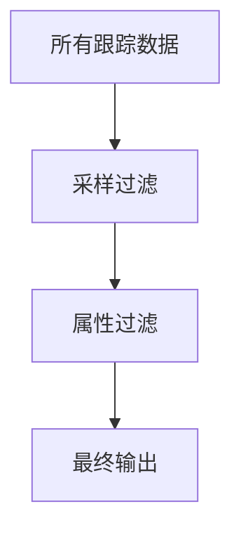

# OpenTelemetry 跟踪过滤

## 介绍

在分布式系统中，OpenTelemetry生成的跟踪数据可能非常庞大。**跟踪过滤**允许你根据特定规则筛选这些数据，只保留对你有用的信息。这不仅能减少存储成本，还能提高监控效率。本文将介绍如何在OpenTelemetry中实现跟踪过滤，适合刚接触可观测性的开发者。

## 为什么需要跟踪过滤？

1. **减少噪音**：过滤掉健康检查等低价值跟踪
2. **降低成本**：避免存储无关数据
3. **聚焦问题**：只保留关键路径的跟踪信息

## 基本过滤方法

### 1. 处理器过滤（Processor Filtering）

OpenTelemetry提供了`FilterProcessor`，可以在数据导出前进行过滤：

```python
from opentelemetry.sdk.trace.export import SimpleSpanProcessor
from opentelemetry.sdk.trace import TracerProvider
from opentelemetry.sdk.trace.export import BatchSpanProcessor
from opentelemetry.sdk.trace.export import ConsoleSpanExporter
from opentelemetry.trace import get_tracer_provider, set_tracer_provider

# 设置过滤条件：只保留持续时间大于100ms的span
span_filter = lambda span: span.duration >= 100000000  # 100ms in nanoseconds

provider = TracerProvider()
processor = BatchSpanProcessor(ConsoleSpanExporter(), span_filter)
provider.add_span_processor(processor)
set_tracer_provider(provider)
```

### 2. 采样过滤（Sampling）

采样是另一种形式的过滤，决定哪些跟踪应该被记录：

```javascript
const { NodeTracerProvider } = require('@opentelemetry/sdk-trace-node');
const { ParentBasedSampler, TraceIdRatioBasedSampler } = require('@opentelemetry/core');

// 只采样10%的请求
const sampler = new ParentBasedSampler({
  root: new TraceIdRatioBasedSampler(0.1)
});

const provider = new NodeTracerProvider({
  sampler: sampler
});
```

## 高级过滤技术

### 基于属性的过滤

```go
import (
	"go.opentelemetry.io/otel/sdk/trace"
)

// 只记录包含特定HTTP状态码的span
filter := func(span trace.ReadOnlySpan) bool {
	if attr, ok := span.Attributes().Get("http.status_code"); ok {
		return attr.AsInt64() >= 400 // 只记录错误状态
	}
	return false
}

// 创建处理器时应用过滤器
processor := trace.NewBatchSpanProcessor(exporter, trace.WithSpanFilter(filter))
```

### 组合过滤条件



## 实际应用案例

**电商网站场景**：
1. 过滤健康检查端点 (`/health`) 的跟踪
2. 只记录处理时间超过500ms的订单流程
3. 对支付服务启用100%采样（关键路径）
4. 对其他服务使用10%采样

```yaml
# OpenTelemetry Collector配置示例
processors:
  filter/health:
    spans:
      exclude:
        match_type: strict
        attributes:
          - key: http.target
            value: "/health"
  filter/slow:
    spans:
      include:
        match_type: regexp
        attributes:
          - key: http.target
            value: "^/order/.*"
        min_duration: 500ms
```

## 总结

OpenTelemetry跟踪过滤是优化可观测性数据的关键技术。通过合理配置：
- 减少不必要的数据存储
- 聚焦关键业务路径
- 平衡监控深度与系统开销

:::tip 最佳实践
1. 从宽松过滤开始，逐步收紧规则
2. 为关键业务路径保留完整跟踪
3. 定期审查过滤规则的有效性
:::

## 扩展学习

1. [OpenTelemetry官方文档 - 采样](https://opentelemetry.io/docs/concepts/sampling/)
2. [OpenTelemetry Collector处理器配置](https://github.com/open-telemetry/opentelemetry-collector-contrib/tree/main/processor/filterprocessor)
3. 练习：为你的应用设置一个过滤规则，排除所有成功的HTTP 200请求