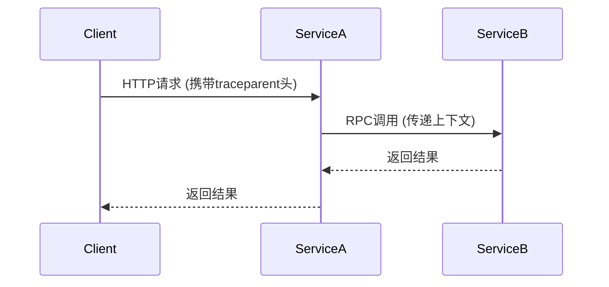

# OpenTelemetry 跟踪最佳实践

## 介绍

OpenTelemetry是一个开源的观测性框架，用于生成、收集和管理遥测数据（如跟踪、指标和日志）。**分布式跟踪**是OpenTelemetry的核心功能之一，它帮助开发者理解请求在多个服务间的流转路径和性能瓶颈。本文面向初学者，介绍OpenTelemetry跟踪的最佳实践。

:::note 关键术语
- **Span**：代表一个操作或工作单元（如HTTP请求、函数调用）。
- **Trace**：一组关联的Span，描述一个完整请求的生命周期。
- **Context Propagation**：在服务间传递跟踪上下文（如Trace ID）。
:::

---

## 1. 基础配置

### 初始化跟踪器
在代码中初始化OpenTelemetry跟踪器是第一步。以下是一个Node.js示例：

```javascript
const { NodeTracerProvider } = require('@opentelemetry/sdk-trace-node');
const { SimpleSpanProcessor } = require('@opentelemetry/sdk-trace-base');
const { JaegerExporter } = require('@opentelemetry/exporter-jaeger');

const provider = new NodeTracerProvider();
provider.addSpanProcessor(new SimpleSpanProcessor(new JaegerExporter()));
provider.register();
```

:::tip
使用环境变量（如`OTEL_SERVICE_NAME`）动态配置服务名称，避免硬编码。
:::

---

## 2. 生成有意义的Span

### 手动创建Span
为关键操作创建自定义Span以增强可观测性：

```javascript
const tracer = require('@opentelemetry/api').trace.getTracer('my-service');

function processOrder(orderId) {
  // 创建Span并记录属性
  const span = tracer.startSpan('processOrder');
  span.setAttribute('order.id', orderId);
  
  try {
    // 业务逻辑...
    span.addEvent('Order processed successfully');
  } catch (error) {
    span.recordException(error);
    span.setStatus({ code: SpanStatusCode.ERROR });
  } finally {
    span.end();
  }
}
```

### 自动检测常见库
OpenTelemetry支持自动检测流行框架（如Express、gRPC）。例如Express的自动检测：

```javascript
const { ExpressInstrumentation } = require('@opentelemetry/instrumentation-express');
const { registerInstrumentations } = require('@opentelemetry/instrumentation');

registerInstrumentations({
  instrumentations: [new ExpressInstrumentation()],
});
```

---

## 3. 上下文传播

在分布式系统中，跟踪上下文需要通过HTTP头或消息队列传递。以下是HTTP传播的示例：

```javascript
// 客户端发送请求
const { context, propagation } = require('@opentelemetry/api');
const headers = {};
propagation.inject(context.active(), headers);

// 服务端提取上下文
const incomingContext = propagation.extract(context.active(), req.headers);
const span = tracer.startSpan('handleRequest', {}, incomingContext);
```



---

## 4. 实际案例：电商订单流程

假设一个订单流程涉及以下服务：
1. **订单服务**（创建订单）
2. **库存服务**（检查库存）
3. **支付服务**（处理支付）

通过OpenTelemetry跟踪，可以清晰看到：
- 每个服务的耗时
- 错误发生在哪个环节（如库存不足）
- 跨服务的因果关系

---

## 5. 性能优化实践

### 采样策略
避免全量采集跟踪数据，推荐使用动态采样：

```javascript
const { ParentBasedSampler, TraceIdRatioBasedSampler } = require('@opentelemetry/core');

const sampler = new ParentBasedSampler({
  root: new TraceIdRatioBasedSampler(0.5), // 50%采样率
});
```

### 批量处理
使用`BatchSpanProcessor`减少网络开销：

```javascript
const { BatchSpanProcessor } = require('@opentelemetry/sdk-trace-base');
provider.addSpanProcessor(new BatchSpanProcessor(exporter));
```

---

## 总结

| 最佳实践                | 说明                          |
|-------------------------|-----------------------------|
| 为关键操作创建Span      | 提高问题定位效率              |
| 合理设置采样率          | 平衡观测开销和数据完整性      |
| 标准化属性命名          | 如`http.status_code`         |
| 记录异常和错误          | 加速故障排查                  |

---

## 延伸学习

1. **官方文档**：[OpenTelemetry Tracing](https://opentelemetry.io/docs/concepts/observability-primer/#distributed-traces)
2. **练习**：尝试在本地启动两个服务，模拟跨服务跟踪并导出到Jaeger。
3. **进阶**：探索OpenTelemetry与Prometheus/Grafana的集成。

:::caution 注意
生产环境中务必配置采样率，避免因高频跟踪导致性能下降。
:::