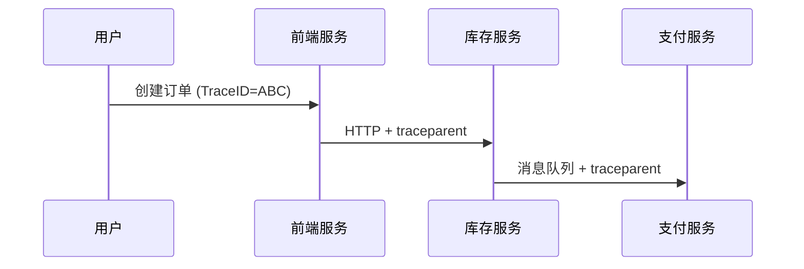

# OpenTelemetry 跟踪上下文

## 介绍

在分布式系统中，一个用户请求可能涉及多个服务的协作。**跟踪上下文（Trace Context）** 是 OpenTelemetry 的核心概念，它通过唯一的标识符（如 `TraceID` 和 `SpanID`）将跨服务的调用关联起来，形成完整的调用链（Trace）。本文将介绍跟踪上下文的组成、传递方式以及实际应用。

---

## 跟踪上下文的组成

OpenTelemetry 的跟踪上下文包含以下关键字段：
1. **TraceID**：全局唯一的跟踪标识符（16字节），用于标识整个调用链。
2. **SpanID**：单个操作的标识符（8字节），用于标识调用链中的一个步骤。
3. **TraceFlags**：控制采样行为的标志（如是否记录数据）。
4. **TraceState**：携带额外的厂商特定信息（键值对形式）。

:::note
跟踪上下文通常通过 HTTP 头（如 `traceparent` 和 `tracestate`）或消息队列的元数据在服务间传递。
:::

---

## 代码示例：生成和传递上下文

以下是一个 Node.js 示例，展示如何生成跟踪上下文并通过 HTTP 传递给下游服务：

```javascript
const { trace } = require('@opentelemetry/api');

// 1. 获取当前上下文
const tracer = trace.getTracer('my-tracer');
const span = tracer.startSpan('parent-span');

// 2. 生成跟踪上下文（traceparent 格式）
const traceparent = `00-${span.spanContext().traceId}-${span.spanContext().spanId}-01`;

// 3. 通过 HTTP 头传递
fetch('http://downstream-service', {
  headers: {
    'traceparent': traceparent,
    'tracestate': 'vendor=example'
  }
});
```

**输出**：  
下游服务收到的 HTTP 头如下：
```
traceparent: 00-4bf92f3577b34da6a3ce929d0e0e4736-00f067aa0ba902b7-01
tracestate: vendor=example
```

---

## 上下文传播的实际案例

### 场景：电商订单处理
1. 用户发起订单请求 → **前端服务**（生成 `TraceID`）
2. 前端调用 **库存服务**（通过 HTTP 头传递上下文）
3. 库存服务调用 **支付服务**（通过消息队列传递上下文）



:::tip
在异步调用（如消息队列）中，需将 `traceparent` 嵌入消息的元数据字段。
:::

---

## 总结

- **跟踪上下文** 是分布式跟踪的“粘合剂”，通过 `TraceID` 和 `SpanID` 关联跨服务操作。
- 通过标准化的头（如 `traceparent`）实现上下文传递。
- 支持同步（HTTP）和异步（消息队列）通信场景。

---

## 扩展练习
1. 尝试在本地启动两个服务，通过 HTTP 手动传递 `traceparent` 头。
2. 使用 Wireshark 或浏览器开发者工具观察请求中的跟踪头。

## 附加资源
- [OpenTelemetry Trace Context 规范](https://www.w3.org/TR/trace-context/)
- [分布式跟踪实战指南](https://opentelemetry.io/docs/concepts/observability-primer/)