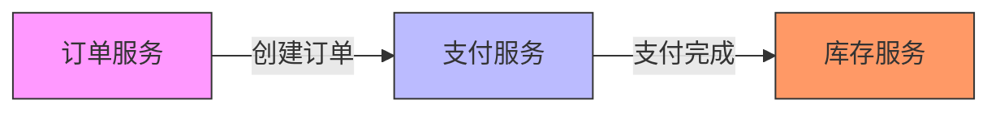

# OpenTelemetry Span属性

## 介绍

在分布式系统中，**Span**是OpenTelemetry的核心概念之一，代表一个独立的工作单元（如一次API调用或数据库查询）。**Span属性**（Attributes）是附加到Span上的键值对，用于提供关于该Span的上下文信息，例如请求参数、响应状态或业务标识符。这些属性对于调试、监控和分析分布式系统的行为至关重要。

:::tip
Span属性与日志字段类似，但专为结构化跟踪数据设计，支持高效的查询和聚合。
:::

---

## Span属性的基本用法

### 1. 添加属性
在OpenTelemetry中，可以通过Span对象的`setAttribute`方法添加属性。以下是一个Node.js示例：

```javascript
const { trace } = require('@opentelemetry/api');

// 获取当前Span
const span = trace.getActiveSpan();

// 添加属性
span.setAttribute('http.method', 'GET');
span.setAttribute('http.route', '/api/users');
span.setAttribute('user.id', '12345');
```

### 2. 属性类型
OpenTelemetry支持多种属性类型：
- 字符串（`string`）
- 数字（`number`）
- 布尔值（`boolean`）
- 字符串数组（`string[]`）

:::caution
避免存储敏感信息（如密码）或过大的数据（如完整请求体）。
:::

---

## 实际案例

### 场景：电商订单处理
假设有一个处理订单的微服务，可以通过Span属性记录关键信息：

```javascript
// 记录订单处理Span的属性
span.setAttribute('order.id', orderId);
span.setAttribute('order.amount', 99.99);
span.setAttribute('payment.method', 'credit_card');
span.setAttribute('inventory.updated', true);
```

### 可视化跟踪
在Jaeger或Zipkin等跟踪系统中，这些属性会显示为Span的元数据：



---

## 最佳实践

1. **命名规范**：使用点分隔的命名空间（如`http.status_code`）。
2. **标准化属性**：优先使用OpenTelemetry[语义约定](https://opentelemetry.io/docs/reference/specification/trace/semantic_conventions/)中的预定义属性。
3. **性能考虑**：避免高频更新属性（如循环内操作）。

:::warning
属性键名区分大小写！`user.id`和`user.ID`会被视为不同的属性。
:::

---

## 总结

Span属性是OpenTelemetry跟踪数据的重要组成部分，通过结构化元数据增强了分布式系统的可观测性。关键要点：
- 用于记录Span的上下文信息。
- 支持多种数据类型和标准化命名。
- 需遵循安全和性能最佳实践。

### 扩展练习
1. 在本地OpenTelemetry项目中添加自定义Span属性。
2. 使用Jaeger查询特定属性（如`http.status_code=500`）。

### 附加资源
- [OpenTelemetry官方文档](https://opentelemetry.io/docs/)
- [语义约定列表](https://opentelemetry.io/docs/reference/specification/trace/semantic_conventions/http/)