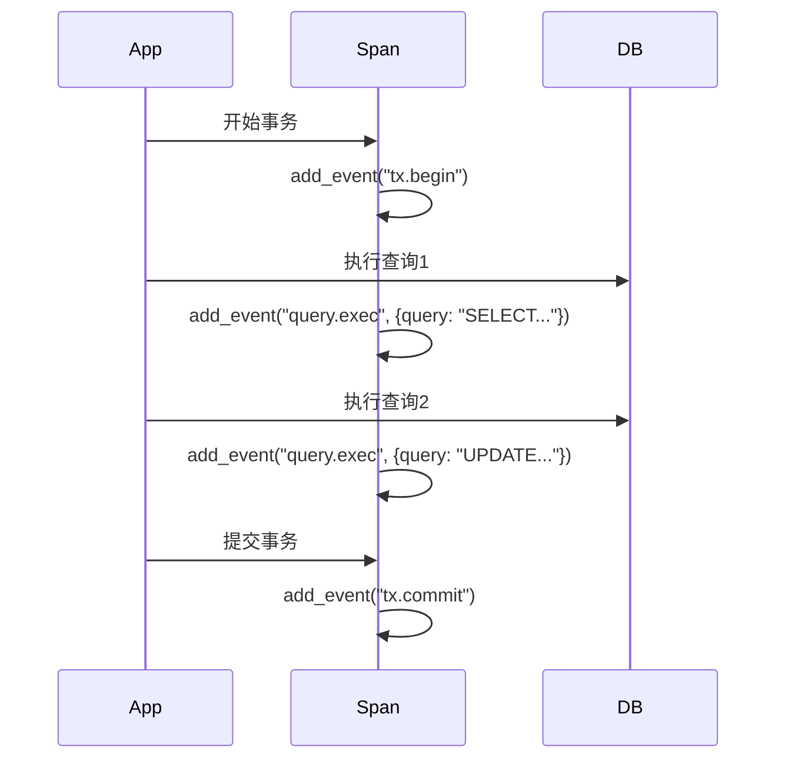

# OpenTelemetry Span事件

## 介绍

在分布式系统中，**Span事件（Span Events）**是OpenTelemetry中用于记录Span执行过程中特定时间点发生的重要操作或状态的机制。它们类似于日志，但与Span的生命周期紧密关联，能够帮助开发者更精细地分析系统行为。本文将介绍Span事件的核心概念、使用方法和实际案例。

---

## Span事件基础

### 什么是Span事件？
Span事件是附加到Span上的时间戳标记，用于记录Span执行期间发生的离散事件。例如：
- 数据库查询开始/结束
- 外部API调用
- 关键业务逻辑的执行点

与Span的属性（Attributes）不同，事件包含：
1. **时间戳**：精确到纳秒的事件发生时间
2. **名称**：描述性的事件标识
3. **可选属性**：键值对形式的附加信息

:::tip
Span事件不会影响Span的持续时间，它们只是Span时间轴上的"标记点"。
:::

---

## 代码示例

### 基本用法（Python示例）
```python
from opentelemetry import trace

tracer = trace.get_tracer("example.tracer")

with tracer.start_as_current_span("parent-span") as span:
    # 添加一个简单事件
    span.add_event("user.login", attributes={"user.id": "123"})
    
    # 带时间戳的事件（Unix纳秒时间戳）
    span.add_event("db.query", timestamp=1625097600000000000, attributes={
        "query": "SELECT * FROM users",
        "duration_ms": 45
    })
```

### 输出结果
在Jaeger等可视化工具中，事件会显示为Span时间轴上的标记点：
```text
Span: parent-span
├── Event: user.login @ 2023-07-01T12:00:00Z
│   └── Attributes: {"user.id": "123"}
└── Event: db.query @ 2021-06-30T00:00:00Z
    └── Attributes: {"query": "SELECT * FROM users", "duration_ms": 45}
```

---

## 实际应用场景

### 案例1：HTTP请求跟踪
```python
import requests

with tracer.start_as_current_span("http-request") as span:
    try:
        span.add_event("request.start", attributes={"url": "https://api.example.com"})
        response = requests.get("https://api.example.com/data")
        span.add_event("response.received", attributes={
            "status_code": response.status_code,
            "content_length": len(response.content)
        })
    except Exception as e:
        span.add_event("request.failed", attributes={"error": str(e)})
        span.record_exception(e)
```

### 案例2：数据库事务


---

## 最佳实践

1. **命名规范**：
   - 使用`domain.action`格式（如`db.query`）
   - 避免空格和特殊字符

2. **属性设计**：
   ```python
   # 推荐
   span.add_event("cache.hit", attributes={
       "key": "user:123",
       "size_kb": 42
   })

   # 不推荐
   span.add_event("Cache Hit for key user:123")
   ```

3. **性能考虑**：
   - 高频事件可能影响系统性能
   - 生产环境中建议采样或聚合事件

:::caution
避免在单个Span中添加超过100个事件，这可能导致跟踪数据过大。
:::

---

## 总结

Span事件是OpenTelemetry中强大的诊断工具，通过它们可以：
- 精确记录关键操作的时间点
- 附加丰富的上下文信息
- 在不中断Span流程的情况下插入记录

### 延伸学习
1. 尝试在您的项目中添加Span事件跟踪数据库操作
2. 比较Span事件与传统日志的优缺点
3. 使用Jaeger/Grafana可视化事件数据

通过合理使用Span事件，您将能更有效地诊断分布式系统中的问题！