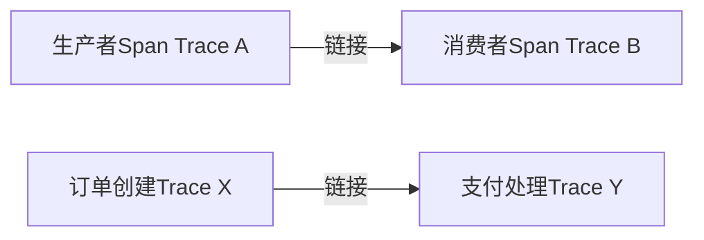

# OpenTelemetry Span链接

## 介绍

在分布式系统中，一个请求可能跨越多个服务，每个服务会生成独立的**Span**（表示一个操作的时间区间）。**Span链接（Span Links）**允许你将一个Span与另一个Span关联起来，即使它们不属于同一个Trace。这种机制特别适用于异步操作（如消息队列处理）或跨Trace的因果关联场景。

:::note
Span链接与父子Span关系的区别：
- **父子关系**：子Span是父Span的直接子操作（如HTTP调用）。
- **链接关系**：两个Span可能属于不同Trace，但存在逻辑关联（如消息生产者与消费者）。
:::

## 核心概念

### 1. 链接的作用
- **跨Trace关联**：将不同Trace的Span关联起来（例如：订单创建事件和支付事件）。
- **异步操作**：标记消息队列中生产者与消费者的Span关系。
- **批处理**：将多个独立操作的Span链接到同一个上下文。

### 2. 链接的属性
每个链接包含：
- **SpanContext**：目标Span的Trace ID、Span ID等。
- **Attributes**（可选）：描述链接的键值对（如 `{"message.id": "123"}`）。

## 代码示例

### 创建Span链接（Python示例）
以下代码展示如何从一个Span创建到另一个Span的链接：

```python
from opentelemetry import trace
from opentelemetry.trace import Link, SpanContext, TraceFlags

# 假设已有目标Span的Context（通常从跨进程传播中获取）
target_span_context = SpanContext(
    trace_id=0x5f8a5e3d3f3c3b2a1a0f0e0d0c0b0a09,
    span_id=0x0a0b0c0d0e0f1a2a,
    is_remote=True,
    trace_flags=TraceFlags(0x01)
)

# 创建当前Span并添加链接
tracer = trace.get_tracer("example.tracer")
with tracer.start_as_current_span("main-span", links=[Link(target_span_context)]):
    print("当前Span已链接到目标Span")
```

### 实际场景：消息队列
生产者发送消息时创建链接，消费者在处理时引用该链接：

```python
# 生产者
with tracer.start_as_current_span("producer") as producer_span:
    message_context = producer_span.get_span_context()
    # 将message_context注入消息（如Kafka Headers）

# 消费者（从消息中提取SpanContext）
with tracer.start_as_current_span(
    "consumer",
    links=[Link(message_context, attributes={"message.id": "123"})]
):
    print("处理消息，并链接到生产者Span")
```

## 可视化关系



## 应用场景

### 案例1：异步任务链
- **问题**：任务A触发异步任务B，两者属于不同Trace。
- **解决**：任务B的Span链接到任务A的Span，便于追踪完整流程。

### 案例2：事件溯源
- **问题**：用户注册事件（Trace 1）触发送邮件操作（Trace 2）。
- **解决**：邮件服务的Span链接到注册事件的Span。

## 总结

Span链接是OpenTelemetry中强大的工具，用于建立跨Trace或异步操作的关联。关键点：
- 适用于**非直接父子关系**但需要逻辑关联的场景。
- 链接通过**SpanContext**实现，可附加属性。
- 常见于消息队列、事件驱动架构。

## 扩展练习
1. 尝试在本地部署Jaeger，观察链接Span的展示效果。
2. 模拟一个消息队列场景，实现生产者-消费者的Span链接。

## 附加资源
- [OpenTelemetry官方文档](https://opentelemetry.io/docs/concepts/span-links/)
- 《Distributed Tracing in Practice》Chapter 4