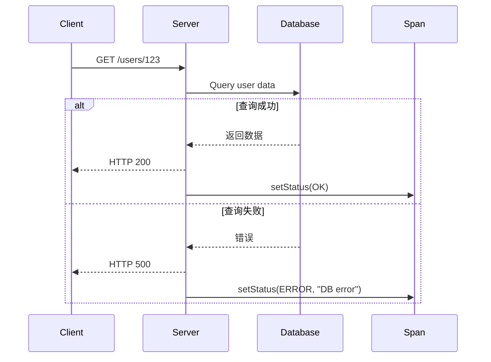

# OpenTelemetry Span状态

## 介绍

在分布式系统中，跟踪请求的流转是理解系统行为的关键。OpenTelemetry中的**Span状态（Span Status）**用于表示一个Span的执行结果（成功、失败或未设置），是Span元数据的重要组成部分。它帮助开发者快速识别操作是否成功完成，并为后续分析提供结构化数据。

Span状态包含两个属性：
1. **状态码（Status Code）**：枚举值（`Unset`、`Ok`、`Error`）
2. **状态描述（Status Description）**：可选的文字说明（仅当状态码为`Error`时建议使用）

:::tip
Span状态不同于Span的“错误标记”（通过`span.recordException()`记录）。状态是操作的整体结果，而错误标记可能包含更详细的异常信息。
:::

---

## Span状态码详解

### 1. 状态码类型
OpenTelemetry定义了三种状态码：

| 状态码       | 含义                                                                 |
|--------------|----------------------------------------------------------------------|
| `Unset` (默认) | 操作结果未知或不适用（例如：异步操作尚未完成）                       |
| `Ok`         | 操作成功完成                                                         |
| `Error`      | 操作失败（需配合描述字段提供原因）                                   |

### 2. 设置状态码
通过`span.setStatus()`方法设置状态。以下是各语言示例：

#### Python示例
```python
from opentelemetry import trace

tracer = trace.get_tracer(__name__)

with tracer.start_as_current_span("database-query") as span:
    try:
        # 模拟数据库操作
        query_database()
        span.set_status(trace.Status(trace.StatusCode.OK))
    except Exception as e:
        span.set_status(trace.Status(trace.StatusCode.ERROR, "DB connection failed"))
        span.record_exception(e)
```

#### JavaScript示例
```javascript
const { trace } = require('@opentelemetry/api');

const tracer = trace.getTracer('example');
const span = tracer.startSpan('http-request');

try {
  await fetch('https://api.example.com');
  span.setStatus({ code: trace.SpanStatusCode.OK });
} catch (error) {
  span.setStatus({ 
    code: trace.SpanStatusCode.ERROR,
    message: 'Request failed'
  });
} finally {
  span.end();
}
```

---

## 实际应用场景

### 案例：HTTP服务端跟踪
在Web服务中，通常根据HTTP响应码设置Span状态：



对应代码实现（Node.js）：
```javascript
app.get('/users/:id', async (req, res) => {
  const span = tracer.startSpan('handle-user-request');
  try {
    const user = await db.getUser(req.params.id);
    res.json(user);
    span.setStatus({ code: trace.SpanStatusCode.OK });
  } catch (err) {
    res.status(500).send('Error');
    span.setStatus({
      code: trace.SpanStatusCode.ERROR,
      message: err.message
    });
  } finally {
    span.end();
  }
});
```

:::caution
避免过度使用状态描述！仅在`Error`状态下提供简洁的关键信息（如错误类型），而非完整堆栈。
:::

---

## 总结与最佳实践

### 关键要点
1. **状态码优先级**：`Error` > `Ok` > `Unset`（一个Span的最终状态取最高优先级）
2. **描述字段**：仅用于`Error`状态，且应保持简短（例如："Timeout"、"InvalidArgument"）
3. **与异常记录的关系**：`setStatus(ERROR)`通常与`recordException()`配合使用

### 附加练习
1. 修改一个现有项目，为所有数据库操作Span添加状态码
2. 尝试在Jaeger/Zipkin中查看不同状态码的Span如何显示

### 扩展阅读
- [OpenTelemetry官方文档 - Span状态](https://opentelemetry.io/docs/concepts/signals/traces/#span-status)
- [W3C Trace Context规范](https://www.w3.org/TR/trace-context/)