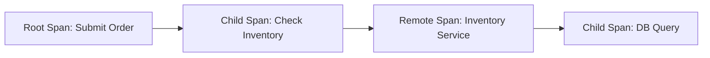

# OpenTelemetry Span种类

## 介绍

在分布式系统中，跟踪请求的流动是理解系统行为的关键。OpenTelemetry（简称OTel）通过**Span**来表示一个操作的执行单元。Span是分布式跟踪的基本构建块，它们可以嵌套或并行排列，形成完整的调用链。本文将详细介绍OpenTelemetry中的Span种类及其用途。

:::note Span是什么？
Span代表一个操作（如HTTP请求、函数调用或数据库查询）的开始和结束时间，包含操作名称、时间戳、属性和事件等元数据。
:::

---

## Span的种类

OpenTelemetry定义了三种主要的Span种类：

1. **Root Span**  
2. **Child Span**  
3. **Remote Span**  

### 1. Root Span
Root Span是调用链中的第一个Span，没有父Span。它通常表示用户请求的入口点（如API网关或前端服务）。

#### 示例代码（Python）：
```python
from opentelemetry import trace

tracer = trace.get_tracer("example.tracer")
with tracer.start_as_current_span("root_span") as span:
    span.set_attribute("http.method", "GET")
    # 执行操作...
```

#### 特点：
- 没有父Span。
- 通常包含全局唯一的Trace ID。

---

### 2. Child Span
Child Span是另一个Span的直接子节点，用于表示嵌套操作（如服务内部的函数调用或子请求）。

#### 示例代码（Python）：
```python
with tracer.start_as_current_span("parent_span") as parent:
    parent.set_attribute("service", "checkout")
    with tracer.start_as_current_span("child_span") as child:
        child.set_attribute("db.query", "SELECT * FROM orders")
        # 执行数据库查询...
```

#### 特点：
- 继承父Span的Trace ID。
- 通过`ParentSpanId`关联父Span。

---

### 3. Remote Span
Remote Span表示跨进程或跨服务的调用（如HTTP或RPC请求）。它链接两个独立的Trace上下文。

#### 示例场景：
1. 服务A调用服务B时，服务A创建一个Child Span，服务B创建一个Remote Span（作为服务A的Child Span的延续）。

#### 特点：
- 跨进程边界传递Trace上下文（通常通过HTTP头或消息头）。
- 需要显式上下文传播。

---

## 实际案例：电商订单流程

假设一个电商系统包含以下步骤：
1. 用户提交订单（Root Span）。
2. 订单服务调用库存服务（Child Span → Remote Span）。
3. 库存服务查询数据库（Child Span）。



---

## 总结

- **Root Span**：调用链的起点，无父Span。
- **Child Span**：嵌套操作，继承父Span的上下文。
- **Remote Span**：跨服务调用，需显式传播上下文。

:::tip 实践建议
1. 为关键操作（如HTTP请求、数据库调用）创建Span。
2. 使用属性（如`http.method`）丰富Span的上下文。
3. 确保跨服务调用时正确传播Trace上下文。
:::

## 附加资源
- [OpenTelemetry官方文档](https://opentelemetry.io/docs/)
- 练习：尝试在本地环境中实现一个包含Root Span和Child Span的简单跟踪示例。